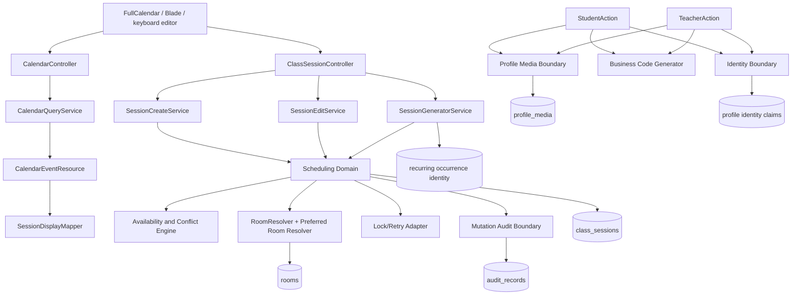

# Technical Design: Academy Scheduling and Profiles

## Overview

This design extends the existing Laravel modular monolith without introducing a second calendar, scheduler, availability engine, conflict engine, profile system, or audit store. `ClassSession` remains the persisted source of calendar truth. Existing controllers, Form Requests, Actions/Services, models, DTOs, resources, policies, route names, Blade contracts, and the persisted-session calendar lifecycle remain the public compatibility boundary.

The implementation target is MySQL/InnoDB for production correctness. SQLite remains useful for fast unit tests; any non-MySQL adapter must document its equivalent atomic locking and uniqueness behavior and must not silently weaken the production contract. This document is design-only: it does not create implementation tasks or modify application code, tests, routes, migrations, seeders, configuration, or other specifications.

**Requirement traceability:** R1.1–R1.5, R20.1–R20.7.

## Architecture

| Capability | Existing owner | Design extension | Explicit non-owner |
|---|---|---|---|
| Calendar page/feed | `CalendarController`, `CalendarQueryService`, `CalendarEventResource`, `SessionDisplayMapper` | Keep query → resource → DTO projection and zero-write behavior | Browser event store, synthetic-event service |
| Session create | `SessionCreateRequest`, `SessionCreateService`, `ClassSessionController::store` | Delegate proposal evaluation and final checks to one Scheduling Domain | Controller or browser conflict logic |
| Session edit | `SessionEditRequest`, `SessionEditService`, `ClassSessionController::update` | Preserve row lock, relation-path checks, `updated_at`, subscription sync; call the same Scheduling Domain | Calendar-only mutation path |
| Session delete/status/notes | `SessionPolicy`, existing session owner, `SessionNotesService` | Wrap accepted changes and audit in the owning transaction | Calendar feed |
| Recurrence | `RecurringSchedule`, `SessionGeneratorService`, `ClassSessionController::generate` | Add 30-day/month-block generation, occurrence identity, locks, retry, audit | Calendar projection |
| Rooms | `Room`, `RoomAction`, `RoomResolver`, `RoomOptionProvider`, `RoomController`, `RoomPolicy` | Persist capability/ownership metadata while preserving `room` snapshots | Hardcoded room strings in views/controllers |
| Student profile | `StudentRequest`, `StudentAction`, `StudentController`, `StudentPolicy`, `StudentDetailQuery` | Shared identity/media/audit primitives; Student owns Student-specific rules | Generic replacement profile CRUD |
| Teacher profile | `TeacherRequest`, `TeacherAction`, `TeacherController`, `TeacherPolicy`, `TeacherDetailQuery` | Shared identity/media/audit primitives; Teacher owns Teacher-specific rules | Generic replacement profile CRUD |
| Timeline | `StudentHistoryService` | Shared bounded history contract for Student and Teacher | View-generated events |
| System Activity | New read adapter over approved activity/audit sources | Separate operational feed | Profile Timeline |
| Audit | `AuditRecord`, `AuditRecordService` | Add accepted session/profile mutation records without removing bulk audit behavior | Controller-local audit writes |
| Storage/media | Laravel `Storage` plus new profile-media boundary | Configurable disk and managed derivatives | Raw filesystem paths or user-avatar cleanup |
| Settings | `SettingsManager`, `AppSetting`, existing config boundary | Add horizon/media/identity rule keys | Scattered `env()` reads |

Controllers authorize and translate HTTP; Form Requests validate transport fields; Actions/Services own domain mutations; Models own persistence relations/casts; DTOs/Resources expose resolved data; Blade receives query-free view data. Any compatibility adapter must document legacy input/output, canonical translation, activation condition, and retention/removal decision before implementation.

**Requirement traceability:** R1.1–R1.5, R8.1–R8.7, R17.1–R17.6, R20.1–R20.7.

## Components and Interfaces



### 3.1 Manual session create/edit flow

1. The existing Policy and Form Request authorize and validate the request. Unknown protected fields, primary keys, audit metadata, business codes, raw paths, and relation ownership fields are rejected.
2. `SessionCreateService` or `SessionEditService` builds an immutable proposal from the direct Student/Teacher/Instrument path or the legacy Enrollment path. `RelationPathResolver` remains authoritative for mixed historical rows.
3. `SchedulingDomain::evaluate()` normalizes the academy-timezone interval, resolves a preferred/fallback room, evaluates every hard constraint, and returns exactly one `AvailabilityResult`.
4. `SchedulingDomain::persist()` opens a transaction, acquires deterministic locks, reloads all affected state, repeats the authoritative evaluation, persists the accepted state, synchronizes existing counters, appends exactly one accepted audit record, and commits.
5. The existing owner returns the persisted row through its current redirect, DTO, resource, or Blade contract. The browser never derives server-owned room, status, relation, or conflict values.

### 3.2 Calendar feed/edit flow

`CalendarController::events` → `CalendarEventRequest` → `CalendarQueryService` → `CalendarEventResource` → existing event DTO/normalization. The feed reads only persisted `ClassSession` records, performs no scheduling writes, and returns zero events for an empty match. Drag, resize, drawer edit, and keyboard edit all translate to the existing session mutation owner with the persisted session ID and current `updated_at` token.

### 3.3 Profile flow

`StudentController`/`TeacherController` → existing Policy → existing Form Request → `StudentAction`/`TeacherAction` → shared `IdentityBoundary`, `BusinessCodeGenerator`, `ProfileMediaBoundary`, and `MutationAuditBoundary` inside one transaction. Detail queries eager-load/batch-load all data before constructing immutable DTOs. Blade renders DTO values only.

**Requirement traceability:** R1.1–R1.5, R5.1–R5.7, R6.1–R6.9, R8.1–R8.7, R12.1–R12.9, R15.1–R15.7, R17.1–R18.7, R20.1–R20.7.

## Data Models

```php
final readonly class SessionProposalData
{
    public function __construct(
        public ?int $sessionId,
        public ?int $enrollmentId,
        public int $studentId,
        public int $teacherId,
        public int $instrumentId,
        public string $sessionDate,       // Y-m-d in academy timezone
        public string $startTime,          // H:i:s
        public int $durationMinutes,
        public ?string $requestedRoom,
        public string $source,             // manual|calendar|recurring
        public ?string $versionToken,
    ) {}
}

final readonly class AvailabilityResult
{
    /** state is exactly AVAILABLE, CONFLICT, or INVALID. */
    public function __construct(
        public AvailabilityState $state,
        public ?RoomOptionData $resolvedRoom,
        /** @var list<AvailabilityBlockData> */ public array $blockers,
        public ?string $reasonCode,
        public string $ruleVersion,
    ) {}
}
```

`AvailabilityBlockData` contains an authorized category, stable resource/session identifier, academy-timezone interval, and localized reason key. It never exposes unrelated identity or unauthorized conflict details. Repeated evaluation against unchanged state and rule version must produce equivalent state, blockers, room, reason, and rule version.

Existing `CalendarEventData`, `SessionEditResource`, `SessionEditViewData`, `SessionDisplayData`, and `CalendarEventResource` remain compatible. Additive fields such as `room_id`, `room_resolution`, media URLs, and concurrency metadata are nullable/optional and preserve existing keys and meanings. Existing named routes remain: `admin.calendar.events`, `admin.calendar.sessions.notes.update`, `admin.sessions.store`, `admin.sessions.update`, `admin.sessions.generate`, `admin.students.*`, `admin.teachers.*`, and `admin.rooms.*`.

Compatibility adapters:

- **LegacyRoomAdapter:** translates historical `class_sessions.room`/`recurring_schedules.room` snapshots to canonical room identity without rewriting historical display values.
- **RelationPathAdapter:** resolves direct and Enrollment-backed relation paths into one proposal without changing legacy rows.
- **CalendarMutationAdapter:** translates FullCalendar start/end and keyboard fields to `SessionEditRequest` values.
- **ProfileIdentityAdapter:** handles omitted/null legacy email or national ID and Persian/Arabic digit representations.
- **BusinessCodeAdapter:** exposes `student_code`/`teacher_code` as the common `business_code` DTO concept while retaining columns and values.
- **AuditAdapter:** preserves existing bulk execution/rejected-operation records while adding accepted mutation records.

**Requirement traceability:** R1.3–R1.5, R5.1–R5.4, R6.3–R6.9, R9.1–R9.9, R12.1–R12.9, R13.1–R13.7, R17.2–R17.6, R20.1–R20.7.

## 5. Dynamic room catalog and preferred-room fallback

### 5.1 Approved catalog

Rooms are dynamic persisted records, not hardcoded strings. For this feature the approved catalog identity is limited to exactly `A101`, `A102`, and `A103`; the initial seed creates only these three active, academy-owned records and never creates `Room104`, `A104`, or any fourth equivalent. “Create room” means restoring/creating one of these approved catalog identities when absent in an environment; arbitrary new room identity expansion is outside this feature and requires a superseding business decision. Existing room identifiers referenced by sessions are immutable.

| Identifier | Display label | Capability mapping | Active | Academy-owned |
|---|---|---|---:|---:|
| `A101` | `اتاق A101` | Violin | true | true |
| `A102` | `اتاق A102` | Voice, Classical Guitar, Pop Guitar | true | true |
| `A103` | `اتاق A103` | Piano | true | true |

`rooms.name` remains the canonical identifier for compatibility with `RoomResolver` and `class_sessions.room`. Add `display_label`, capability data, and `is_academy_owned`; retain capacity and active state. A room deactivation removes it from new choices but does not remove historical display data. Room mutations remain behind `RoomAction`/`RoomPolicy`, validate field-specific identity/capability rules, and preserve all session references.

### 5.2 Resolution algorithm

`SchedulingDomain` owns room decisions. `RoomResolver` remains the exact persisted lookup/legacy normalizer and `RoomOptionProvider` remains the UI option provider. The versioned preference map is:

```text
Violin             -> A101
Voice              -> A102
Piano              -> A103
Classical Guitar   -> A102
Pop Guitar         -> A102
```

The resolver loads active, academy-owned rooms once; filters by instrument capability; orders candidates exactly `A101`, `A102`, `A103`; evaluates the preferred room first; then evaluates the complete deterministic candidate list including the preferred room if it is a valid fallback candidate. Missing, inactive, incompatible, unauthorized, or occupied preference is not a proposal failure when another room is available. No candidate returns `CONFLICT(room_unavailable)` or `INVALID` for malformed input; no synthetic calendar event is created.

An instrument without a mapping has no preference and evaluates all compatible active rooms. Preference is never mandatory. Alternatives are evaluated with the same engine but are never persisted merely by being calculated.

**Requirement traceability:** R2.1–R2.6, R3.1–R3.9, R5.6–R5.7, R6.6, R7.5–R7.6, R14.1–R14.2, R16.5–R16.7, R20.2.

## 6. One availability and conflict engine

### 6.1 Rule inputs and interval algebra

`SchedulingDomain` is the single owner of normalization, room resolution, conflict classification, and scheduling mutation decisions. Its engine evaluates, in stable order:

1. already-authorized actor and valid writable proposal;
2. Student, Teacher, Instrument, Enrollment existence and relation consistency;
3. academy operating hours and configured timezone;
4. recurring occurrence eligibility;
5. Teacher, Student, Enrollment, and Room availability;
6. active compatible academy-owned room candidates;
7. persisted ClassSession occupancy;
8. configured before/after buffers; and
9. active `Manual_Admin_Block` records.

All times are converted to the academy timezone before comparison and serialized through existing contracts. Sessions use the half-open interval `[start, end)`, where `end = start + duration`. With zero buffer, `existing.end == proposed.start` is non-overlapping. Buffers expand only comparison intervals and must be included in blocker explanations.

### 6.2 Status and blocker rules

- Any physical overlap blocks shared Teacher, Student, Enrollment, or Room unless a named, Policy-approved override explicitly applies.
- Cancelled ClassSessions become non-blocking immediately, including same-day rescheduling.
- Historical completed, attended, and in-progress sessions remain blocking; completion/attendance does not remove occupancy unless a documented business rule explicitly says so.
- A Manual Admin Block is a real persisted/configured blocker, never an artificial gap.
- Adjacent sessions are allowed whenever no explicit resource, availability, hours, duration, buffer, authorization, or block constraint prevents them.
- Every rejected adjacency reports the blocker category and stable identity; “artificial gap” is never returned as a reason.

### 6.3 Result and persistence boundary

Every authorized evaluation returns exactly one `AVAILABLE`, `CONFLICT`, or `INVALID` result. `CONFLICT` includes all applicable categories, known blocking ClassSession IDs, academy-timezone intervals, and stable reason codes, redacted by authorization. `INVALID` covers malformed/impossible rules and never appears as an available option.

Preview is read-only. Final persistence starts a transaction, locks all affected resources, reloads state, repeats the exact evaluation, rejects any non-available result, persists the selected room snapshot and canonical relation IDs, synchronizes existing counters, appends one accepted audit, and commits. The engine does not create calendar records; only a committed ClassSession can appear on the calendar.

**Requirement traceability:** R1.1–R1.2, R3.5–R3.9, R4.1–R4.9, R5.1–R5.7, R6.1–R6.7, R7.5–R7.6, R15.3–R15.7.

## 7. Calendar projection and approved editing

### 7.1 Projection contract

`CalendarQueryService` remains the only calendar-feed query owner. It preserves inclusive requested ranges, existing teacher/student/room filters, `withEnrollmentDetails()`, `orderBySchedule()`, one bounded room lookup, stable persisted IDs, and FullCalendar-compatible output. It selects only response fields and required relations.

The feed never invokes `SchedulingDomain`, `SessionCreateService`, `SessionEditService`, or `SessionGeneratorService`. A zero-row query returns zero events and performs zero writes. Every matching ClassSession is projected exactly once. Any relation/resource projection failure aborts the full response using the existing compatible error contract; partial event collections are forbidden.

### 7.2 Mutation contract

Drag, resize, drawer edit, and keyboard edit all submit the persisted session ID, proposed editable values, and current `updated_at` token to `admin.sessions.update`, which remains owned by `SessionEditRequest` and `SessionEditService`. Notes continue through `admin.calendar.sessions.notes.update` and `SessionNotesService`. On success, the owner response is re-projected and supplies server-owned room, status, relation, conflict, and updated token values. On authorization, validation, conflict, or stale-version failure, persisted state and the last authoritative event remain unchanged; the UI restores/retains it and presents a localized reason.

The keyboard path exposes explicit date, time, duration, room, status, and relation controls and uses the same proposal/result contract as drag/resize. Existing filters, named endpoints, resource fields, drawer behavior, FullCalendar architecture, RTL, and projection identity remain unchanged.

**Requirement traceability:** R1.2–R1.3, R5.1–R5.5, R6.1–R6.9, R17.1–R17.3, R18.1–R18.7, R20.1–R20.7.

## 8. Recurring generation: 30-day horizon and month blocks

### 8.1 Horizon and block semantics

`SessionGeneratorService` remains the recurring-generation owner and continues to accept its existing public call shape for compatibility. Its effective horizon is configurable with a default of **30 calendar days** (`scheduling.recurring_horizon_days = 30`), validated against a configured safe maximum. A “month block” is a bounded generation request anchored at the requested academy-local month start: it generates eligible occurrences from the block start through `min(block start + 30 days - 1 day, configured horizon end)`. A scheduler may process the block in smaller database batches, but the logical result is one 30-day block and must be resumable.

The API/service adapter accepts both the legacy `weeks` argument and the canonical `{anchor_date, horizon_days, block_key}` request. If the legacy argument is supplied, it is translated to the configured bounded horizon and never permits an unbounded run. Today is excluded only when preserving the existing “next occurrence” behavior; a month-block backfill may include the explicitly requested anchor date when the schedule is eligible.

### 8.2 Occurrence identity and generation flow

The canonical identity is `(recurring_schedule_id, enrollment_id, occurrence_date, start_time)`, represented by a deterministic `occurrence_key`. Add a unique database boundary and a status row for `pending`, `persisted`, `skipped`, or retryable failure. The attempt row is diagnostic/idempotency state only and never a calendar source.

For each active schedule, the owner acquires the schedule lock, computes eligible dates in ascending order, and processes each occurrence in a bounded transaction:

1. lock schedule, enrollment, Student, Teacher, candidate rooms, and overlapping session keys;
2. re-read the occurrence identity and return the existing ClassSession if already persisted;
3. invoke the same `SchedulingDomain` room and availability engine used by manual create/edit;
4. create one ClassSession, retain `recurring_schedule_id`, source identity, room snapshot, and canonical relation IDs;
5. write/update the attempt record and exactly one generation audit record; and
6. commit the occurrence.

Inactive schedules generate nothing. Missing resources create a controlled skipped attempt without a ClassSession or synthetic event. If a later occurrence fails, earlier committed occurrences remain committed and the retry selects only eligible unpersisted identities. Duplicate-key races re-read and treat the existing committed occurrence as success.

**Requirement traceability:** R1.1–R1.2, R5.5–R5.7, R7.1–R7.8, R12.3, R14.1–R14.2, R15.1–R15.7, R20.5–R20.7.

## 9. Student and Teacher profile model

Student and Teacher remain separate models and mutation owners with shared presentation/identity/media primitives. Additive nullable columns preserve legacy records: canonical `email`, normalized `national_id`, and media state represented by `profile_media`; existing `phone`, `parent_phone`, `bio`, `hire_date`, status, join date, notes, instruments, enrollments, subscriptions, attendance, and user-avatar relationships remain compatible.

`Student_Profile` provides full name, business code, canonical phone, optional guardian data, email, national ID state, photo state, status, notes, join date, instruments, level, enrollments, teachers, subscriptions, attendance context, Timeline, and authorized System Activity. `Teacher_Profile` provides full name, business code, canonical phone, email, national ID state, photo state, status, biography, hire/employment data, specialties/instruments, work schedule, students, Timeline, and authorized System Activity. Existing content-model fields such as teacher biography, experience, specialties, and presentation metadata are additive only; absent values use the established localized placeholder.

The existing Form Request → Action/Service → model/DTO/resource → Policy chain validates only approved writable fields and persists only after validation. `StudentDetailQuery` and `TeacherDetailQuery` construct immutable, resolved DTOs with no Blade queries. Shared identity/detail primitives may reduce duplication, but Student and Teacher business rules remain separate. Optional-field absence cannot alter unrelated identity, enrollment, avatar, or operational data.

**Requirement traceability:** R8.1–R8.7, R9.1–R9.9, R13.1–R13.7, R14.5–R14.8, R17.1–R17.6, R20.1–R20.4.

## 10. Identity normalization and global uniqueness

### 10.1 Canonical email

`CanonicalEmailNormalizer` trims and applies Unicode-aware lowercase according to the application/database comparison rule; it does not rewrite provider-specific dots or plus tags. Empty input remains null. Validation runs before claim allocation. A shared `profile_identity_claims` boundary owns uniqueness across Student and Teacher, including inactive records, with a unique `(kind, canonical_value)` key and owner identity. Updating a record may retain its own claim. Omitting email does not reject a mutation solely because a different legacy record has a duplicate/missing email.

### 10.2 Iranian phone

`IranianPhoneNormalizer` converts Persian/Arabic digits to ASCII, removes presentation spaces/separators, converts `+98`/`0098` to the local `0` form, validates the approved Iranian mobile representation (`09xxxxxxxxx`) and any explicitly retained landline form, then persists one canonical representation. Student phone, guardian phone, Teacher phone, validation, comparison, seeding, and DTO display use the same boundary. User account phone/avatar ownership remains separate.

### 10.3 Iranian national ID

`IranianNationalIdNormalizer` converts Persian/Arabic digits, removes permitted presentation separators, requires exactly ten ASCII digits, rejects uniform repeated digits, and validates the approved checksum. For digits `d0..d9`, calculate `sum(d0..d8 * 10..2) % 11`; if the remainder is below 2, `d9` equals the remainder; otherwise `d9` equals `11 - remainder`. Only the canonical ten-digit value is checked for duplicate ownership.

`national_id_required` is read through the existing settings/config boundary and applies to **new** Student/Teacher creation only when enabled. Legacy/imported rows may remain nullable or explicitly flagged; any non-null legacy value receives the same format/checksum/uniqueness validation. Backfill preserves primary keys and relationships and reports a duplicate only when normalization produces an actual canonical duplicate. A new record cannot bypass the setting because a legacy record is nullable. Database/application uniqueness prevents two active Student/Teacher records from owning the same non-null normalized ID.

**Requirement traceability:** R8.1–R8.3, R9.1–R9.9, R14.1, R15.4, R16.4, R17.3, R20.2–R20.4.

## 11. Profile media and image lifecycle

`ProfileMediaBoundary` is the only owner of managed Student/Teacher portraits. It reads a configurable Laravel Storage disk (`profile_media.disk`, defaulting through the existing filesystem configuration), never hardcodes a disk or public path in Blade, and returns storage-resolved URLs only. The implementation uses Intervention Image with the GD driver; dependency/configuration availability is a release prerequisite.

A `profile_media` record stores polymorphic owner, disk, managed original/medium/thumbnail paths, MIME, byte size, checksum, intrinsic width/height, state, and timestamps. The current media relation is owner-scoped; old user-avatar and unrelated public-storage assets are never selected for cleanup. Default-avatar DTOs always provide stable dimensions and Persian descriptive alternative text.

Upload/replace sequence:

1. Policy and Form Request validate ownership, MIME, extension, size, dimensions, and safe generated naming.
2. Intervention Image GD writes original, medium, and thumbnail to unique temporary managed paths.
3. The service verifies all writes and image metadata.
4. One DB transaction inserts the media metadata, switches the profile’s current pointer, and appends the accepted profile audit.
5. After commit, only superseded managed derivatives are deleted; cleanup failures are logged and retried without changing committed state.

If validation, GD processing, storage, metadata, database, or audit fails, newly staged files are deleted, the previous valid media remains current, and the response is a localized safe error without filesystem details. Every DTO includes resolved URLs, dimensions, and alt text; no raw path is exposed and no layout shift is permitted.

**Requirement traceability:** R8.2–R8.3, R10.1–R10.8, R12.2–R12.7, R15.1–R15.2, R17.4–R17.6, R18.1–R18.7, R20.2.

## 12. Business-code generation and repair

`BusinessCodeGenerator` replaces the current `max('id') + 1` creation strategy at the Student/Teacher owner boundary while retaining visible `S-` and `T-` prefixes and the `student_code`/`teacher_code` columns. A `business_code_sequences` row per entity type is locked in the transaction, advanced, and checked against each table’s unique constraint. Backfill starts above the maximum valid existing numeric suffix; malformed or colliding legacy codes are reported, not silently rewritten.

Create/backfill assigns exactly one non-empty code before scheduling can observe the profile. Normal update requests explicitly reject `student_code`, `teacher_code`, and common `business_code` attempts to set, replace, or clear a code, including when the current code is null. A typed repair path is the sole code-changing path and requires explicit approval, immutable before/after audit evidence, and unchanged primary key/relationships. Codes are non-secret and visible only under existing profile authorization. Concurrent allocation uses row/advisory locks, unique indexes, and bounded retry; a final collision is controlled and retryable.

**Requirement traceability:** R8.1, R13.1–R13.7, R14.1, R15.4, R15.7, R17.3, R20.2.

## 13. Timeline, System Activity, and Audit History

### 13.1 Separate read contracts

- **Timeline:** `StudentHistoryService` remains the lifecycle source and exposes a shared bounded contract for Student and Teacher. It collects only approved profile lifecycle events from authoritative persisted sources, orders newest-first by `(occurred_at DESC, stable_source_key DESC)`, includes event type, timestamp, localized description, context metadata, and source identity, and never fabricates absent events.
- **System Activity:** a separate operational read boundary projects authorized administrator/system actions with actor, action, subject, timestamp, localized summary, and source identity. It is not merged into Timeline and does not expose before/after values without audit authorization.
- **Audit History:** `MutationAuditBoundary`, extending existing `AuditRecordService`, appends immutable accepted session/profile mutation records. Bulk execution and privacy-filtered rejected-operation records remain supported but are not accepted-mutation records.

All history uses eager loading or bounded batch queries and stable ordering. Empty history renders a localized empty state; a history-source failure renders a distinct safe error state, logs a non-sensitive diagnostic, and never claims “no events.” A row missing any one of Persian localization, RTL order, accessible status text, or source record identity is hidden in full rather than partially shown.

### 13.2 Accepted-mutation audit schema and boundary

Each accepted ClassSession or Student/Teacher create/update/delete appends exactly one immutable record with subject type/ID, source, actor/system identity, action, before values, after values, changed fields, timestamp, and schema/version metadata. Recurring generation and approved calendar edits identify their source and resulting persisted state. Preview, authorization failure, validation failure, conflict, stale token, and rolled-back transaction create no accepted-mutation record.

The subject owner transaction includes the subject write, related counters/claims/media pointer, and audit insert. Audit failure rolls back the subject mutation; if rollback cannot complete, the operation fails closed and never reports success. Authorized history reads redact fields outside the actor’s permission; unauthorized actors receive no history data, actor details, before/after values, or conflict details.

**Requirement traceability:** R11.1–R11.7, R12.1–R12.9, R17.1–R17.6, R19.5–R19.8.

## 14. Database model, migrations, constraints, and query performance

### 14.1 Additive schema plan

| Table/alteration | Canonical data | Required constraints/indexes |
|---|---|---|
| `rooms` | `display_label`, capabilities JSON, `is_academy_owned`; retain `name`, capacity, active state | unique canonical name; active/ownership index; approved identities A101–A103 |
| `class_sessions` | nullable `room_id`, occurrence key/source metadata; retain room snapshot and direct/Enrollment IDs | nullable FK; date/time/status; Teacher, Student, Enrollment, Room composite access indexes; recurring identity uniqueness |
| `recurring_schedules` | nullable `room_id`, normalized time/horizon/block metadata | FK; active/weekday/time and enrollment indexes |
| `resource_availability_rules` | resource type/ID, weekday/date scope, start/end, timezone, active/source | target/time index; `end > start` check |
| `scheduling_blocks` | target type/ID, start/end, reason, active, actor | target/time/active index; `end > start` check |
| `recurring_occurrence_attempts` | schedule/enrollment/date/time identity, status, reason, session ID | unique occurrence identity; status/date indexes |
| `students`, `teachers` | nullable email/national ID, profile state; retain codes/PKs/relations | per-table identity indexes; FK preservation |
| `profile_identity_claims` | kind, canonical value, owner type/ID, state | unique `(kind, canonical_value)` and owner/kind |
| `profile_media` | owner, disk, original/medium/thumbnail, dimensions, checksum, state | owner/current indexes; one current record per owner via PostgreSQL partial uniqueness or adapter |
| `business_code_sequences` | entity type and next number | unique entity type |
| `audit_records` | subject type/ID, source, before/after, changed fields, version | subject/time/source indexes; no update/delete path |

All migrations use named foreign keys and explicit delete behavior, snake_case plural tables/columns, timestamps, and parameterized Laravel Schema/Eloquent/query-builder access. PostgreSQL constraints/indexes are canonical; MySQL/SQLite adapters document equivalent enforcement rather than silently dropping guarantees.

### 14.2 Constraint/backfill gate

Before enabling any unique/check/FK constraint, a preflight reports duplicate room identities/aliases, invalid or duplicate canonical emails/phones/national IDs, malformed/colliding business codes, orphaned room/session references, and duplicate recurring identities. The migration halts before enablement if unrelated existing records would be affected. Once blocking data is resolved, enablement proceeds automatically or requires explicit confirmation, according to deployment policy; no record is silently discarded or invalidated.

### 14.3 Eager loading and performance budgets

Calendar reads select event fields, eager-load both direct and Enrollment relation paths, batch-resolve rooms, and order by date/time/ID. Profile details select contract fields and eager-load bounded instruments/enrollments/operational relations; Timeline/System Activity and audit feeds use bounded batches and stable ordering. Blade never queries.

Representative verification budgets are: calendar feed no more than 12 SQL statements for a bounded result regardless of event count; Student/Teacher detail no more than 10 statements excluding intentionally paginated history; history query count does not grow with rendered event count. Services must not drop rows on eager-load failure and must use explicit safe errors. Query plans and measurements are evidence gates, not functional substitutions.

Raw SQL concatenation is forbidden. Any PostgreSQL-specific advisory-lock statement is isolated behind a typed adapter with bound values.

**Requirement traceability:** R2.3–R2.6, R6.1–R6.4, R8.4, R11.6–R11.7, R14.1–R14.8, R15.3–R15.5, R20.2–R20.3.

## 15. Transactions, PostgreSQL locks, and bounded retries

### 15.1 Transaction boundaries

One owning Action/Service transaction covers each logical mutation:

- session create/edit/delete, room assignment, status change, and related subscription counters;
- recurring occurrence block processing and attempt state;
- Student/Teacher identity, business code, media pointer, and profile audit;
- profile photo replacement metadata and accepted audit; and
- Manual Admin Block creation and its accepted audit.

Preview/evaluation is read-only. The final mutation repeats authoritative checks inside the transaction after locks. Any validation, authorization, conflict, stale version, constraint, media, audit, or downstream failure rolls back all related writes and preserves the last committed state.

### 15.2 Deterministic lock order

Within PostgreSQL transactions, acquire locks in this order, sorting IDs within each category: (1) typed idempotency/occurrence key advisory lock; (2) target ClassSession row; (3) RecurringSchedule row; (4) Student, Teacher, Enrollment rows; (5) candidate Room rows; (6) applicable availability/block rows; (7) subscription/counter rows; (8) profile identity claim row; (9) business-code sequence row. Re-read all affected state after locking and before final conflict decision. The same order is used by manual and recurring paths to reduce deadlocks.

PostgreSQL uses `lockForUpdate()` for rows and transaction-scoped advisory locks for typed keys such as `academy|schedule|id`, `academy|resource|id|date`, and `academy|occurrence|hash`. Keys are hashed by the adapter and passed as bound numeric values, never concatenated into executable SQL. A non-PostgreSQL deployment uses a persistent lock-key row plus row locks and documents the difference; SQLite tests do not claim production concurrency semantics.

### 15.3 Retry policy

Retry only deadlock, serialization failure, lock timeout, transient connection failure, or an occurrence duplicate race after re-reading state. Use at most three attempts with bounded 50/100/200ms backoff and configured jitter. Do not retry authorization, validation, unavailable room, conflict, impossible rule, media-format, or known duplicate-identity failures. Outcomes are explicit: `persisted`, `conflict`, `invalid`, `stale`, `retryable`, or `failed`; retryable never means success. Idempotency keys and unique constraints prevent duplicate sessions, profiles, media references, codes, and audit records.

**Requirement traceability:** R5.5, R7.3–R7.8, R12.1–R12.7, R13.5, R14.1, R15.1–R15.7.

## 16. Realistic continuous seeder and fixture behavior

The approved demo/development seeder remains the fixture owner but must call the same Room/Identity/BusinessCode/ProfileMedia/Scheduling owners as production; it must not bulk-insert sessions around invariants. Room seeding is deterministic by `A101`, `A102`, `A103` only. Reruns reconcile those records and preserve unrelated operator-created data without creating a fourth identity.

Seed regular operating sessions Saturday through Thursday only; Friday has no regular operating-day sessions. Use 30-minute lessons by default; longer duration is used only for an explicitly typed lesson exception. Fill adjacent slots whenever Teacher, Student, Room, academy-hours, and block rules permit. Every seeded gap records exactly one reason: Teacher availability, Student availability, Room availability, or Manual Admin Block.

Profiles use deterministic realistic Persian/Unicode names, canonical unique Iranian phone values, valid unique national IDs for new records, globally unique emails, default-avatar or managed-photo states, and generated business codes. Recurring schedules and sessions use the 30-day/month-block owner and occurrence identity. Reruns use stable natural keys and do not duplicate identities, rooms, occurrences, sessions, or accepted audit history. Test fixtures may remain isolated and prefixed, but must model inactive rooms, cancellation, historical completion, conflicts, adjacent slots, optional fields, legacy nullable identity, and media failure states.

**Requirement traceability:** R2.1–R2.2, R4.6–R4.8, R7.1–R7.8, R9.3–R9.9, R13.1–R13.5, R16.1–R16.7.

## 17. Authorization, security, accessibility, RTL, and responsive behavior

### 17.1 Authorization and secure input

Existing `RoomPolicy`, `SessionPolicy`, `StudentPolicy`, `TeacherPolicy`, role middleware, and route model binding remain the authorization boundary. Collection authorization occurs before protected filters/record resolution; item authorization is repeated immediately before mutation. Form Requests validate every writable field and reject unknown protected fields including primary keys, business codes, audit metadata, relation ownership, disk names, and raw file paths.

CSRF, escaped output, parameterized queries, `$fillable`, existing rate limits, and non-sensitive error responses remain mandatory. National IDs, phone numbers, raw filesystem paths, unrelated profile data, and exception details are excluded from logs and unauthorized responses. Validation/authorization failures do not create accepted-mutation audits or protected reads/writes. File upload validation covers MIME, extension, size, dimensions, safe generated naming, ownership, and configured Storage boundaries.

### 17.2 UI and accessibility contract

Profile and calendar surfaces preserve `lang="fa"`, `dir="rtl"`, semantic landmarks, logical CSS properties, Jalali date presentation, existing named navigation, FullCalendar RTL, and current drawer behavior. Every interaction has keyboard access, visible focus, semantic buttons/links, accessible labels, and text/semantic state in addition to color. Drag/resize has an equivalent non-drag edit path using the same backend contract.

Dialogs, drawers, conflict review, and photo controls use appropriate dialog semantics, focus containment, Escape handling, focus restoration, and non-pointer dismissal. Available, conflict, invalid, pending, cancelled, and completed states have Persian text/status semantics. Controls are at least 44 by 44 CSS pixels. Layouts avoid horizontal overflow at 390, 430, 768, 1024, 1366, 1600, 1920, and wider; tables become responsive cards where required. Reduced motion suppresses nonessential transitions while preserving content, focus, and feedback. Profile images always include alt text and intrinsic or fixed placeholder dimensions.

**Requirement traceability:** R5.2–R5.4, R6.8–R6.9, R8.4–R8.7, R10.5–R10.8, R11.2–R11.7, R12.8–R12.9, R17.1–R17.6, R18.1–R18.7, R20.1.

## 18. Rollout, backfill, compatibility, and rollback

1. **Preflight/report:** detect duplicate room identities/aliases, invalid or duplicate canonical identity values, malformed/colliding codes, orphaned session-room references, duplicate recurring occurrences, unsupported media states, and constraint blockers. Produce a stable report and halt before constraint enablement when unrelated data would be affected.
2. **Additive nullable phase:** add room metadata/relations, profile identity/media/claim/sequence structures, scheduling block/availability/occurrence structures, and additive audit fields. Existing routes, DTOs, pages, and old columns continue through adapters.
3. **Canonical backfill:** normalize phones/emails/national IDs only when unambiguous; populate claims and codes; preserve primary keys, relationships, historical room snapshots, user-avatar data, and persisted calendar membership. Leave unresolved imported records nullable/flagged and report them.
4. **Constraint gate:** verify no blocking duplicates/orphans, then enable unique/check/FK/index constraints. Failure aborts before enablement; it never drops or rewrites unrelated records.
5. **Feature enablement:** enable `national_id_required` for new records only after identity health is verified; switch manual/recurring owners to the Scheduling Domain; keep calendar projection unchanged; enable configured Storage/GD media only after a valid disk/driver smoke check.
6. **Backward-compatible operation:** an absent new request field applies its documented default or preserves prior behavior. An adapter preserves stable IDs, relationships, authorization outcomes, error semantics, and persisted meaning.
7. **Rollback:** disable new writes/flags first, retain adapters, and restore prior owner wiring. Routine rollback never drops legacy room/code/session columns, audit history, referenced media, or existing routes. Down migrations may remove only empty additive structures after preflight; destructive cleanup requires backup and explicit approval. If the persisted-session calendar projection cannot remain available, rollout is blocked or rolled back.

**Requirement traceability:** R1.3–R1.5, R9.6–R9.8, R12.6–R12.7, R14.3–R14.4, R15.5, R19.1–R19.8, R20.1–R20.7.

## 19. Continuous documentation maintenance

The implementation completion gate updates all seven canonical documents with requirement IDs and verification evidence:

- `Architecture.md`: owner boundaries, preserved contracts, adapters, and no-duplicate-engine decisions.
- `BusinessRules.md`: A101/A102/A103 room map, preference/fallback, interval/status rules, 30-day/month-block recurrence, identity rules, exceptions.
- `Database.md`: canonical models, nullable compatibility state, constraints, indexes, lock keys, backfill status.
- `API.md`: unchanged routes, additive DTO/resource fields, request translation, error/status semantics, migration notes.
- `History.md`: date, operational scope, rollout/backfill/rollback evidence.
- `CHANGELOG.md`: date and verification status for user-visible changes only; operational-only changes do not require a changelog entry.
- `DecisionLog.md`: non-trivial or superseding decisions with reason, status, and affected boundaries.

A contradiction with an active/frozen decision stops implementation until a superseding decision is recorded. Minor interpretation differences are recorded for resolution without silently changing ownership. Documentation is part of the implementation gate, not optional post-work.

**Requirement traceability:** R1.4–R1.5, R19.1–R19.8.

## Correctness Properties

The following properties are the design-level invariants that the implementation and verification plan must preserve:

### Property 1: Single scheduling authority
**Validates: Requirements 1.1, 5.1, 7.1**
Manual create/edit, approved calendar edits, and recurring generation use the same normalization, room-resolution, availability, conflict, and final re-evaluation path; the calendar feed remains read-only.

### Property 2: Deterministic evaluation
**Validates: Requirements 3.5, 3.6, 3.9**
Re-evaluating an unchanged proposal against unchanged state and rule version returns equivalent state, blockers, resolved room, reason, and rule version.

### Property 3: Persisted calendar truth
**Validates: Requirements 1.2, 1.3, 6.1, 6.4**
Only a committed `ClassSession` is projected as a calendar event; previews, failed mutations, skipped recurring attempts, and synthetic records never appear on the calendar.

### Property 4: Resource safety
**Validates: Requirements 4.1, 4.2, 5.6, 7.6**
No accepted session overlaps a blocking Teacher, Student, Enrollment, Room, availability rule, configured buffer, operating-hour boundary, or active `Manual_Admin_Block`; cancelled sessions are non-blocking.

### Property 5: Idempotent recurrence
**Validates: Requirements 7.1, 7.2, 7.8**
The canonical occurrence identity and uniqueness boundary ensure that retries and duplicate-key races produce at most one persisted occurrence and one accepted generation result.

### Property 6: Transactional atomicity
**Validates: Requirements 12.1, 12.7, 15.1, 15.7**
A mutation either commits its subject changes, related counters/claims/media pointer, and required accepted audit together, or leaves the last committed state unchanged.

### Property 7: Identity and code uniqueness
**Validates: Requirements 8.1, 9.1, 13.1, 14.1**
Canonical non-null identity claims and business codes are globally/table-appropriately unique, while omitted legacy nullable values remain compatible.

### Property 8: Compatibility preservation
**Validates: Requirements 1.3, 17.1, 20.1**
Existing routes, DTO/resource keys, persisted IDs, relation paths, authorization outcomes, and historical snapshots retain their meaning; additive fields remain optional.

### Property 9: History separation and authorization
**Validates: Requirements 11.1, 11.6, 19.5**
Timeline, System Activity, and Audit History remain separate read contracts, with stable ordering, bounded reads, and authorization-based redaction.

### Property 10: Media lifecycle safety
**Validates: Requirements 10.1, 10.5, 12.2**
Failed validation, processing, storage, metadata, database, or audit work cannot replace valid current media or expose raw paths.

### Property 11: Bounded performance
**Validates: Requirements 2.3, 2.6, 14.1**
Calendar, profile, and history queries remain bounded by their stated budgets and do not grow with rendered event count.

## Error Handling

| Failure class | Canonical behavior | Persistence/audit effect |
|---|---|---|
| Unauthorized/unauthenticated | Existing compatible 401/403 response, no protected data | No write; no accepted audit |
| Invalid/unknown/protected field | Existing Form Request validation shape with stable localized field reason | No write; no accepted audit |
| `CONFLICT` | Stable machine reason, all authorized blocker categories/IDs/intervals | No ClassSession write |
| `INVALID` | Stable impossible/malformed rule reason | No write |
| Stale version | Existing compatible stale/concurrency response; retain authoritative event | No write; no accepted audit |
| Missing room/resource in recurrence | Controlled skipped attempt with reason | No ClassSession or synthetic event |
| Deadlock/serialization/transient connection | Bounded retry; explicit retryable failure after exhaustion | Transaction rolls back; no duplicate audit |
| Identity/code uniqueness collision | Field-specific localized error or typed repair report | Existing records preserved |
| Media/GD/storage failure | Localized safe error; previous valid media remains | Staged files removed; no partial pointer/audit |
| Audit failure | Controlled failure and rollback; fail closed if rollback fails | No success response |
| Calendar projection failure | Existing compatible full-request error, no partial event list | Read only; no writes |
| History source failure | Distinct safe error state, non-sensitive diagnostic log | Never represented as empty history |

**Requirement traceability:** R4.7–R4.9, R5.1–R5.5, R6.4–R6.7, R7.6–R7.8, R9.2–R9.8, R10.6, R11.3–R11.7, R12.5–R12.9, R14.3–R14.8, R15.1–R15.7, R17.2–R17.6, R20.2–R20.7.

## Testing Strategy

Validation is documentation-defined only; no application tests are run as part of this formatting change. The implementation verification plan should include:

- **Contract and compatibility checks:** existing named routes, request/response shapes, DTO/resource keys, persisted IDs, relation paths, authorization outcomes, and zero-write calendar-feed behavior.
- **Scheduling properties:** deterministic results, half-open interval and buffer rules, cancelled-session behavior, blocker redaction, preferred-room fallback, adjacent-slot handling, and final in-transaction re-evaluation.
- **Concurrency and recurrence checks:** PostgreSQL lock ordering, bounded retry outcomes, stale-version preservation, occurrence uniqueness, resumable 30-day/month-block generation, and duplicate-key idempotency. SQLite tests must not claim production concurrency semantics.
- **Profile and media checks:** canonical phone/email/national-ID normalization, global claims, business-code allocation/repair authorization, transactional audit behavior, managed derivatives, stable default-avatar dimensions, and failure cleanup.
- **History, performance, and projection checks:** Timeline/System Activity/Audit separation, authorization redaction, stable ordering, bounded query budgets, eager-loading behavior, complete projection failure handling, and no partial event lists.
- **Accessibility and responsive checks:** Persian/RTL semantics, keyboard alternatives for drag/resize, focus and dialog behavior, localized status text, intrinsic image dimensions, reduced motion, touch targets, and the documented viewport sizes.
- **Rollout and rollback checks:** preflight blocking conditions, additive/backfill compatibility, constraint-gate failure behavior, feature-flag disablement, adapter retention, and safe removal of only empty additive structures.