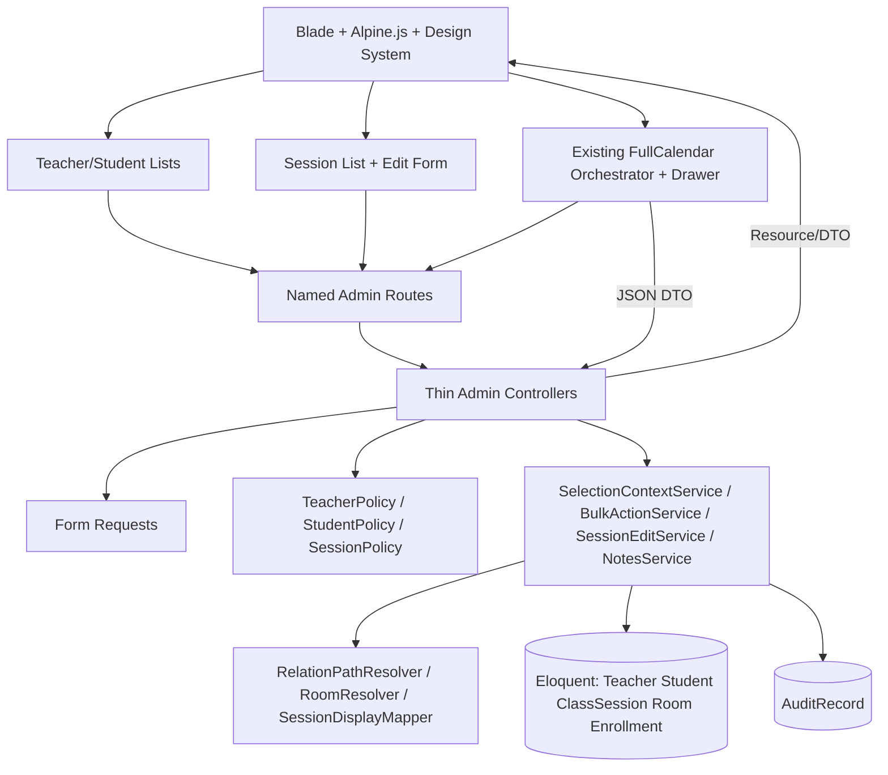
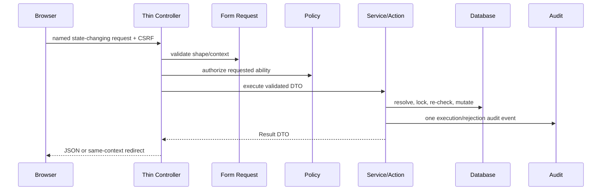

# Design Document: Admin Bulk Selection, Session Editing and Real Calendar Data

## Overview

این طراحی ادامه‌ی مشخصه‌ی موجود `admin-bulk-selection-actions` است و هیچ مشخصه‌ی موازی ایجاد نمی‌کند. دامنه‌ی طراحی سه مسیر به‌هم‌پیوسته دارد: عملیات انتخاب و تغییر وضعیت/حذف استاد و شاگرد، ویرایش جلسه و یادداشت، و تقویم FullCalendar با داده‌ی واقعی `ClassSession` و `Room`.

هدف، افزودن capability بدون شکستن قراردادهای موجود `admin.teachers.index`، `admin.students.index`، `admin.sessions.index` و `admin.calendar.events` است. FullCalendar، orchestrator، drawer، فیلترها و الگوی Blade فعلی `admin-calendar-module` reuse می‌شوند؛ این مشخصه فقط قرارداد داده، مجوز، ویرایش و stateهای جدید را به آن‌ها اضافه می‌کند.

### Research findings from the repository

- `ClassSession` در `app/Models/ClassSession.php` دارای مسیرهای `enrollment` و direct برای student/teacher/instrument است و `room` یک string nullable است؛ relation به `Room` ندارد.
- `ScopesForSessionFilters::scopeWithEnrollmentDetails()` هر دو مسیر را eager-load می‌کند، اما `CalendarEventResource` فعلی ابتدا enrollment و سپس direct را fallback می‌کند و تعارض شناسه‌ها را رد نمی‌کند.
- `ClassSessionController` در index از pagination و فیلترهای موجود استفاده می‌کند، در create/store اتاق‌های `A101/A102/A103` را hardcode کرده و routeهای edit/update ندارد.
- `CalendarController` و `resources/js/calendar/*` معماری FullCalendar فعلی را فراهم کرده‌اند؛ `admin-calendar-module/design.md` منبع reuse است، نه دلیل بازطراحی FullCalendar.
- `TeacherPolicy`، `StudentPolicy` و `SessionPolicy` توانایی‌های `update/delete` را فراهم می‌کنند؛ bulk authorization به همین policyها delegate می‌شود و به role یا وضعیت UI متکی نیست.
- migration فعلی `class_sessions.room` را `string(20)` و `notes` را `text nullable` تعریف می‌کند و migration `rooms` نام را unique و `is_active` را boolean تعریف می‌کند.

### Design principles

1. Controllerها فقط orchestration، policy invocation، redirect/JSON response و DTO mapping انجام می‌دهند.
2. Form Request مرز اعتبارسنجی است؛ Action/Service مرز business rule و transaction است؛ Resource/DTO مرز پاسخ و view data است.
3. هیچ query در Blade، هیچ inline style/handler، و هیچ mock/fake/sample/default داده‌ی تولیدی وجود ندارد.
4. برای تغییرات چندمرحله‌ای transaction استفاده می‌شود؛ bulk itemها transaction مستقل دارند تا موفقیت‌های معتبر rollback نشوند.
5. همه‌ی مسیرها named، همه‌ی queryها parameterized و همه‌ی مقادیر نمایشی از داده‌ی persisted یا placeholder/error قراردادی می‌آیند.

## Architecture

### High-level architecture



### Low-level request boundaries

- **List GET**: Controller builds a `ListQueryContext` through a query service; service returns paginated rows plus `BulkRowViewData`, room options and signed `Filter_Context` token. Blade only renders.
- **Bulk POST**: `BulkRequest` validates shape, controller authorizes collection entry, `BulkActionService` resolves current records from IDs or server-side filter snapshot, authorizes each item, locks/re-reads each item, executes one item transaction, aggregates `BulkResult`, then writes one audit event.
- **Session edit GET/PUT**: route model binding resolves `ClassSession`; `SessionEditRequest` validates fields; `SessionEditService` loads all persisted relations and room, resolves one `Relation_Path`, checks conflicts, updates a whitelist in one transaction and returns `SessionEditResource`/redirect data.
- **Notes PATCH**: `UpdateSessionNotesRequest` is authorized before validation/resolution work; `SessionNotesService` normalizes, compares `updated_at`, updates only `notes` in a transaction, and returns the new persisted value and version.
- **Calendar GET**: existing FullCalendar feed remains the caller; `CalendarEventRequest` validates date/filter range; `CalendarQueryService` eager-loads all required relations, detects relation conflicts, resolves rooms in one explicit parameterized batch query, and maps only real sessions to `CalendarEventResource`.

### Data flow and transaction policy



**Transaction rules:** malformed/unauthorized/invalid-context requests stop before item processing and mutate no record; each valid item is processed in its own transaction with `lockForUpdate()` and fresh dependency/state checks; the aggregate audit record is written after processing in a separate short transaction (or joined transaction only when the existing audit implementation guarantees it cannot roll back successful item outcomes). Session edit, notes update and derived subscription counter updates use one transaction per request.

### Named route map

| Method | Path | Named route | Responsibility |
|---|---|---|---|
| GET | `/admin/teachers` | `admin.teachers.index` | Existing list plus selection context |
| GET | `/admin/students` | `admin.students.index` | Existing list plus selection context |
| POST | `/admin/teachers/bulk/preview` | `admin.teachers.bulk.preview` | Resolve signed all-filtered count only; no mutation |
| POST | `/admin/students/bulk/preview` | `admin.students.bulk.preview` | Resolve signed all-filtered count only; no mutation |
| POST | `/admin/teachers/bulk` | `admin.teachers.bulk` | One validated teacher bulk request |
| POST | `/admin/students/bulk` | `admin.students.bulk` | One validated student bulk request |
| GET | `/admin/sessions` | `admin.sessions.index` | Existing session list, room-aware filters and edit links |
| GET | `/admin/sessions/{session}/edit` | `admin.sessions.edit` | Authorized edit form |
| PUT/PATCH | `/admin/sessions/{session}` | `admin.sessions.update` | Authorized session edit |
| PATCH | `/admin/calendar/sessions/{session}/notes` | `admin.calendar.sessions.notes.update` | Authorized drawer notes save |
| GET | `/admin/calendar` | `admin.calendar.index` | Existing FullCalendar page |
| GET | `/admin/calendar/events` | `admin.calendar.events` | Real persisted FullCalendar events |

All state-changing routes remain inside the existing `auth` and `role:admin` groups and use CSRF. Route model binding is used for `Teacher`, `Student` and `ClassSession`; bulk endpoints intentionally receive IDs/context through a Form Request and do not trust client model objects.

## Components and Interfaces

### Backend controllers

#### `TeacherController` / `StudentController`
- Keep `index()` thin and preserve existing filters, sorting and pagination.
- Delegate list construction to `TeacherListQuery`/`StudentListQuery` and provide `BulkListViewData` (row IDs, abilities, current context token, options).
- Do not calculate protected dependencies, transitions or selection rules in Blade.

#### `AdminBulkActionController`
- `preview(BulkPreviewRequest $request, string $entityType): JsonResponse`: authorize `viewAny`, validate signed context, return server count and context fingerprint; never mutate.
- `store(BulkRequest $request, string $entityType): JsonResponse|RedirectResponse`: request has exactly one action and entity; authorize at the boundary, pass `BulkCommand` to service, return `BulkResultResource` or localized same-context redirect.
- It never loops records, calls `save/delete`, or decides dependency/status semantics.

#### `ClassSessionController`
- Add `edit(ClassSession $session)` and `update(SessionEditRequest $request, ClassSession $session)`.
- `edit()` authorizes `SessionPolicy@update`, obtains an eager-loaded `SessionEditViewData` from service and returns the existing dashboard layout.
- `update()` delegates to `SessionEditService` and redirects to `admin.sessions.index` preserving the validated filter/sort/page query context.
- Existing `create/store` are migrated to the same `RoomOptionProvider` and Form Request contract when implemented; no hardcoded rooms remain.

#### `CalendarController`
- `index()` passes real teachers, students, instruments and a `RoomOptionSet` to the existing `x-calendar-layout`.
- `events(CalendarEventRequest $request)` delegates query, relation validation and transformation; it catches known integrity exceptions for 409 and unexpected exceptions for generic 500.
- `updateNotes(UpdateSessionNotesRequest $request, ClassSession $session)` authorizes through `SessionPolicy@update` before service invocation and returns `SessionNotesResource`.

### Form Requests and commands

- `BulkPreviewRequest`: entity, mode and signed `Filter_Context`; rejects page in all-filtered snapshot and invalid/expired signature.
- `BulkRequest`: `action` enum (`activate|deactivate|delete`), `entity` enum (`teacher|student`), `mode` (`current_page|all_filtered`), unique integer IDs when current-page mode, signed immutable context when all-filtered mode, and optional request id/idempotency key if the existing browser contract supports it.
- `SessionEditRequest`: whitelist exactly `student_id`, `teacher_id`, `instrument_id`, `session_date`, `start_time`, `duration_minutes`, `status`, `room`, `notes`, plus `updated_at` concurrency token and signed return-context fields. It rejects `enrollment_id`, `session_fee`, `discount`, `recurring_schedule_id` if present rather than silently ignoring them.
- `UpdateSessionNotesRequest`: authorization uses the bound session before notes rules are evaluated; accepts nullable `notes`, schema/config-derived length rules, and `updated_at` token. It normalizes only in the service so validation and persistence share the same contract.
- `CalendarEventRequest`: existing `start/end` ISO `Y-m-d`, inclusive order, maximum ۹۲ days, optional existing teacher/student/instrument IDs and `room` validated against a persisted `Room` name including inactive rooms.

Each Form Request returns Laravel field-specific 422 JSON for JSON clients and the existing localized validation redirect for Blade forms. Duplicate IDs are rejected at validation; an ID that existed at selection but disappeared before execution is handled as a per-item concurrent skip, not substituted.

### Policy/Gate contract

`BulkAuthorizationService` maps `activate` and `deactivate` to `Gate::allows('update', $record)` and `delete` to `Gate::allows('delete', $record)`. It maps entity type to `TeacherPolicy` or `StudentPolicy`, and calls `viewAny` before query resolution. Thus a disabled UI can never grant permission. If a future policy needs distinct abilities, the mapping is the only seam to replace with `bulkUpdate`/`bulkDelete`; controllers and UI remain unchanged.

`SessionPolicy@update` is required for edit and notes mutation. Calendar event viewing uses `SessionPolicy@viewAny`; the drawer edit control is rendered only from a server-provided `can_update_notes` flag, but the PATCH endpoint authorizes again. No role middleware or Alpine condition is a substitute for policy authorization.

### Services and Actions

| Class | Responsibility | Transaction boundary |
|---|---|---|
| `TeacherListQuery` / `StudentListQuery` | Existing filters, sort whitelist, pagination and row view data | Read-only |
| `SelectionContextService` | Canonical filter snapshot, signing, expiry, entity/page invalidation and server query reconstruction | Read-only |
| `BulkActionService` | Request-wide validation handoff, per-item authorization/dependency/state evaluation, result aggregation and audit orchestration | One transaction per item |
| `StatusTransitionAction` | Enum-driven active/inactive transition; same-state write is success; paused/graduated/unknown raw status fails | Item transaction |
| `ProtectedDependencyChecker` | Parameterized `exists()` checks for enrollments, subscriptions, invoices, attendances, class sessions and converted leads | Inside item transaction |
| `DeleteTeacherAction` / `DeleteStudentAction` | Permanent delete only after dependency and policy checks; no cascade side effects | Item transaction |
| `SessionEditService` | Loads relations/room, resolves path, protected-field check, conflict check, update and derived counters | One request transaction |
| `SessionNotesService` | Normalize notes, compare `updated_at`, persist nullable value and return new version | One request transaction |
| `CalendarQueryService` | Date/filter query, eager-loading, relation conflict detection and room map | Read-only; explicit room batch query |
| `RelationPathResolver` | Chooses enrollment or direct tuple; rejects missing/conflicting identities | Pure/domain |
| `RoomResolver` | Maps legacy string to `resolved_active`, `resolved_inactive`, or `unresolved_legacy` | One parameterized batch lookup |
| `AuditRecordService` | One execution record or one rejected-operation event, aggregate results and privacy filtering | Short audit transaction |

### Resources and DTOs

- `BulkRowViewData`: `id`, display data, `allowed_actions`, `selectable`, stable entity key.
- `BulkCommand`: immutable entity/action/mode, IDs or signed context, actor, filter snapshot and request fingerprint.
- `BulkItemResultData` and `BulkResultData`: stable ID, `succeeded|skipped|failed`, localized reason category/message, counts, selection reference and context fingerprint.
- `SessionEditViewData`: persisted session scalar values, relation choices, active `RoomOptionSet`, historical room resolution, policy flags and return context.
- `SessionEditResource`: persisted editable fields, protected-field metadata, relation display DTO, room resolution and `updated_at`; never exposes sensitive fields unnecessarily.
- `SessionNotesResource`: `session_id`, normalized nullable `notes`, `notes_display`, `updated_at`, `can_update` and localized message.
- `CalendarEventResource`: keeps the existing FullCalendar-compatible shape, adds `room_resolution`, `room_id` when resolved, `can_update_notes`, status label and the notes version token. It must remain query-free.
- `RoomOptionData`: persisted `id`, `name`, `is_active`, and mode (`filter|session_input`); no synthetic IDs.

### Bulk selection UI and state

The reusable Blade structure is:

```text
resources/views/components/admin/bulk-selection/
  toolbar.blade.php
  confirmation-dialog.blade.php
  result-summary.blade.php
resources/views/admin/teachers/index.blade.php
resources/views/admin/students/index.blade.php
```

The existing list table owns row markup; the reusable component receives DTOs and named endpoints. Each visible row has one semantic checkbox only when `selectable=true`. The header checkbox operates on current visible selectable IDs. Alpine state contains `entity`, `selectedIds`, `mode`, `filterContext`, `page`, `sort`, `pending`, `dialogOpen`, and `result`; it is not persisted to localStorage/sessionStorage and is reset on entity/filter/sort/page/refresh/logout changes.

The state machine is:

```text
empty -> current_page_selected -> all_filtered_pending -> submitted
  |             |                      |                  |
  +-------------+----------------------+------------------+
                         cleared/result/error
```

`All_Filtered_Mode` is offered only after all selectable visible rows are selected. Preview sends the signed context (entity + filters + sort, never page), displays server-resolved count, and confirmation sends one bulk request. The server re-runs the query and authorization; the browser never sends every matching ID.

The confirmation dialog is rendered only for `delete` with at least one existing target. It uses semantic dialog markup, `x-trap`, Escape, backdrop/close controls, and an `aria-live` region. Result summary announces selected count, indeterminate/disabled state, complete/partial status, per-item reasons, and recovery action.

### Session list and edit UI

The existing `admin.sessions.index` table remains the entry point. Add a named edit link per authorized row and pass an eager-loaded `SessionDisplayData` collection. Replace the hardcoded room filter with all relevant persisted `Room` records (active and inactive); unknown legacy strings are display-only and are not options. The edit form uses semantic labels and existing Button/Card/Table variants, RTL logical layout and no inline presentation code.

The edit form sends only the editable field set. It shows active room options for replacement and, when the persisted value maps to an inactive room, displays that value as historical and allows it to remain unchanged. A legacy unknown value is shown as unavailable raw text, never as a fake option.

### Calendar reuse and notes drawer

The current `resources/js/calendar/calendar-app.js`, `fullcalendar.js`, `filters.js`, `sidebar.js` and `drawer.js` remain the orchestrator/module boundaries. No new FullCalendar engine or alternate event store is introduced. Extend the existing drawer module with an Alpine notes state:

```text
persistedNotes: string|null
 draftNotes: string
 persistedVersion: string|null   // ClassSession.updated_at token
 saving: boolean
 saveError: string|null
 canEditNotes: boolean
```

On open, the drawer receives the server event DTO and stores the persisted value/version. On save, it disables duplicate submission and sends `PATCH admin.calendar.sessions.notes.update` with `notes` and `updated_at`. Success replaces `persistedNotes`, clears the draft/error, announces the result, and asks the orchestrator to refetch or replace only the affected event from the server. A 409 keeps the last persisted value authoritative, retains the draft for explicit retry and explains that the session changed. 403/422/500 follow the same retryable error state without presenting the draft as saved.

Blade uses the existing calendar component structure (`calendar-layout`, `calendar-header`, `week-sidebar`, `day-timeline`, `event-drawer`, `event-filters`). `role=dialog`, `aria-modal`, heading linkage, `x-trap`, Escape and focus restoration are retained. On coarse pointers all controls are at least 44 CSS pixels; required RTL breakpoints are handled by existing calendar CSS and reduced-motion media rules.

## Data Models

### Existing persisted models and invariants

`Teacher`, `Student`, `ClassSession`, `StudentEnrollment`, `Subscription`, `Invoice`, `ClassAttendance`, `Lead` and `Room` remain the persisted sources. Existing `$fillable`/casts are retained. Status transitions use `TeacherStatusEnum` and `StudentStatusEnum`; `paused` and `graduated` are never normalized to `active` or `inactive` by a bulk action.

`ClassSession` editable whitelist:

```text
student_id, teacher_id, instrument_id, session_date, start_time,
duration_minutes, status, room, notes
```

Protected on every edit, including an explicit client attempt:

```text
enrollment_id, session_fee, discount, recurring_schedule_id
```

`updated_at` is a concurrency token, not an editable domain field. A request that includes a protected field fails validation before persistence; it is not silently discarded.

### `Room` / legacy `ClassSession.room` compatibility

For this scope, **no migration of `class_sessions.room` is required**. The current string is retained as the historical value and remains the persisted source for the event’s room text. `Room` is authoritative for option validity and resolution by exact `name` match.

`RoomResolver` receives a batch of non-null session room strings and one `Room::whereIn('name', $names)` query. It returns:

| Condition | `Room_Resolution` | Display/input behavior |
|---|---|---|
| exact match to active `Room` | `resolved_active` | selectable for new/replacement and shown with ID/name |
| exact match to inactive `Room` | `resolved_inactive` | historical/filterable, not selectable for new/replacement |
| no match | `unresolved_legacy` | show persisted raw string as unavailable; never create option/fallback |
| null | `null` | localized empty placeholder only |

For a create or replacement request, the submitted room must match an active `Room.name`; an unknown literal and inactive room are 422. An edit that leaves an existing inactive or unresolved value unchanged is allowed so historical data is not destroyed. If a valid `Room.name` is longer than the legacy `class_sessions.room` storage capacity (currently `string(20)`), the service rejects the request with a room-specific error rather than truncating the name.

If a future approved migration is required, it is additive only: introduce nullable `room_id` with a foreign key, backfill exact matches in batches, retain the original `room` string for historical/unresolved values, deploy dual-read/dual-write, and remove the old column only after an explicit data-inventory decision. No `migrate:fresh`, `db:wipe`, destructive rewrite or forced conversion of unresolved historical values is permitted. The current design must work without this migration.

### Relation_Path resolution and conflict algorithm

`RelationPathResolver` always receives the three persisted identity tuples, not just names:

```text
enrollmentTuple = enrollment ?
  (enrollment.student_id, enrollment.teacher_id, enrollment.instrument_id) : null
 directTuple = (class_sessions.student_id, class_sessions.teacher_id,
                class_sessions.instrument_id)
```

Algorithm:

1. If `enrollment_id` is non-null but the enrollment is missing, return a data-integrity failure; do not fall back to direct names.
2. If enrollment exists, compare every non-null direct FK with its enrollment counterpart. Any mismatch is `RelationConflict` and returns 409 from API/edit paths. Log only `class_session_id`, `enrollment_id`, direct IDs and enrollment IDs.
3. If enrollment exists and all present direct IDs are null/equal, choose the entire enrollment tuple as one canonical path. Never take student from enrollment and teacher/instrument from direct.
4. If enrollment is null, require the direct tuple and its three eager-loaded records to form one complete path; missing records produce a field-specific integrity error (422 for edit input, 409 for persisted calendar inconsistency).
5. For edit, load submitted student/teacher/instrument records before evaluating the tuple. An enrollment-backed session may receive only a tuple equal to its enrollment tuple because `enrollment_id` is protected. A direct session may receive any existing, conflict-free tuple.
6. Return a `ResolvedRelationPath` containing path type, stable IDs and models. Resource/Blade layers consume this DTO and never independently fallback.

This makes the conflict observable, prevents mixed names, and keeps legacy enrollment-generated sessions compatible with manually created direct sessions.

### Session validation and conflicts

- IDs use `exists` rules and are loaded before service evaluation.
- `session_date` is ISO date; `start_time` is `H:i` between 15:00 and 21:30; duration is integer 30–120; status is `SessionStatusEnum`; these numeric/time limits are the existing requirement contract.
- Room is validated through `RoomResolver` and the active `Room` record, not an `in:A101,...` rule.
- When student, teacher, instrument, date, time, duration or room changes, `ConflictDetectionService` is called again, excluding the current session ID. Teacher/student/room conflicts use the existing interval-overlap semantics.
- The service locks/re-reads the session in the transaction, checks `updated_at` if supplied, and rolls back all permitted fields plus any derived subscription counter on failure.

### Notes normalization and schema-derived length

`SessionNotesNormalizer` applies Unicode-aware boundary whitespace trim, converts the resulting empty string to `null`, and preserves meaningful internal whitespace/content. It does not interpret HTML. `UpdateSessionNotesRequest` obtains the maximum from the existing schema/configuration contract: if a configured numeric limit exists, it applies it; otherwise the `text nullable` schema is treated according to the database driver’s text capacity and no invented numeric limit is introduced. The same resolver is used by request and service.

The notes endpoint uses `updated_at` as an optimistic token. A conditional update with a stale token returns 409; no last-write-wins overwrite occurs. If the token is absent only where the existing client contract cannot provide it, the service uses `lockForUpdate()` and re-reads before writing; the new drawer contract always sends it.

### Audit model

No audit model is present in the current repository, so the feature requires one additive migration/model (without changing domain records): `audit_records` with actor ID, event type (`execution|rejected_operation`), entity type/action, selection mode, context fingerprint, aggregate counts, item reason categories/IDs, timestamps and a JSON metadata field with a strict privacy allowlist. Phone, notes, credentials, raw request payloads and arbitrary model attributes are never stored. One accepted request produces exactly one execution record; one rejected request produces exactly one rejected-operation event; canceled confirmation produces neither.

### Response schemas

**Bulk response**

```json
{
  "data": {
    "entity": "student",
    "action": "deactivate",
    "mode": "current_page",
    "selection_reference": "opaque-stable-reference",
    "context_fingerprint": "sha256-token",
    "total": 3,
    "succeeded": 2,
    "skipped": 0,
    "failed": 1,
    "outcome": "partial_success",
    "items": [
      {"id": 12, "status": "succeeded", "reason": null},
      {"id": 13, "status": "failed", "reason": {"category": "protected_dependency", "message": "..."}}
    ]
  }
}
```

`total = succeeded + skipped + failed`; each processed ID appears at most once. A valid request with no item details still includes stable selection metadata.

**Calendar event response**

```json
{
  "id": 42,
  "title": "نام شاگرد — نام ساز",
  "start": "2026-07-14T16:00:00",
  "end": "2026-07-14T16:30:00",
  "status": "scheduled",
  "statusLabel": "...",
  "studentName": "...",
  "teacherName": "...",
  "instrumentName": "...",
  "room": "Room A",
  "roomResolution": "resolved_active",
  "canUpdateNotes": true,
  "extendedProps": {
    "enrollment_id": 15,
    "duration_minutes": 30,
    "notes": null,
    "notes_updated_at": "2026-07-14T12:00:00Z",
    "session_date": "2026-07-14"
  }
}
```

The API returns an array/Resource collection on 200, 422 for range/filter validation, 409 for relation conflict, and generic 500 without SQL/stack/credentials. A no-result array is an honest empty result.

## Correctness Properties

*A property is a characteristic or behavior that should hold true across all valid executions of a system—essentially, a formal statement about what the system should do. Properties serve as the bridge between human-readable specifications and machine-verifiable correctness guarantees.*

### PBT applicability and property reflection

این مشخصه یک قابلیت صرفاً UI یا CRUD نیست: selection state، transition، aggregate result، relation resolution، room resolution و notes normalization رفتارهای خالص با فضای ورودی گسترده دارند و برای PBT مناسب‌اند. Render/layout، policy wiring، Eloquent I/O، audit persistence و FullCalendar integration با تست‌های مثال‌محور، integration و smoke پوشش داده می‌شوند؛ PBT برای خود سرویس خارجی/DB اجرا نمی‌شود.

Prework معیارها نشان داد که چند معیار زیرمجموعه‌ی یک invariant بزرگ‌تر هستند. بنابراین count/action visibility زیر `Selection_Set` و header state، و status/result classification زیر properties جامع‌تر ادغام شدند. مثال‌های UI (dialog، focus، responsive)، migration/configuration و side effectهای audit به property مستقل تبدیل نشدند. Propertyهای conflict detection و conflict observability جدا مانده‌اند چون اولی جلوگیری از event mixed-path را و دومی لاگ ID-only و قرارداد 409 را می‌سنجد.

برای PHP domain helpers از Eris (با نسخه‌ی سازگار و pin‌شده در زمان implementation) و برای state/formatterهای JavaScript از `fast-check` موجود با نسخه `4.3.0` استفاده می‌شود. هر property حداقل ۱۰۰ iteration دارد و تست دارای tag دقیق زیر است:

```text
Feature: admin-bulk-selection-actions, Property N: <property text>
```

### Property 1: Selection-context isolation

**For every** `Selection_Set`, only a row with at least one authorized `Bulk_Action` is selectable; while the current page and immutable `Filter_Context` remain loaded, the set retains the same entity and IDs, and any page/filter/sort/entity/refresh/logout/new-session transition clears it and discards `All_Filtered_Mode`. No identifier from the old context can execute under the new context.

**Validates: Requirements 1.1, 1.3, 1.6, 2.3, 2.4, 2.5, 2.6**

### Property 2: Header selection invariant

**For every** visible row set and selectable subset, selecting all selectable rows produces a checked, non-indeterminate header; clearing produces an unchecked, non-indeterminate header; and a strict non-empty subset produces an indeterminate header. Non-selectable rows are never added.

**Validates: Requirements 1.1, 1.2, 1.5, 1.7**

### Property 3: Enum-driven status action idempotence

**For every** valid Teacher or Student and requested `active`/`inactive` status, applying the accepted action twice produces the requested final status, classifies both accepted applications as succeeded, writes the requested value on each application, and never changes `paused` or `graduated` students. A raw status outside the relevant Enum always fails and remains unchanged.

**Validates: Requirements 3.3, 3.4, 3.5, 3.6, 3.7, 3.8, 3.9, 3.10**

### Property 4: Protected-dependency deletion invariant

**For every** selected Teacher or Student, a delete attempt with any `Protected_Dependency` preserves that entity and all related records; an eligible entity without a protected dependency is removed only after authorization, without deleting unrelated records. The confirmation-warning predicate is true only when at least one selected item currently exists.

**Validates: Requirements 4.2, 4.5, 4.6, 4.7, 4.8**

### Property 5: Malformed-request atomicity

**For every** bulk request containing an unsupported action/entity, empty selection, duplicate/wrong-entity/unknown identifier, invalid or tampered `Filter_Context`, or failed authorization, the persisted database state before and after handling is identical and no item-resolution mutation is performed.

**Validates: Requirements 2.7, 2.8, 5.1, 5.2, 5.3, 5.4, 5.5, 5.6, 5.7, 5.8, 6.6**

### Property 6: Bulk-result conservation

**For every** accepted `Bulk_Request`, `total = succeeded + skipped + failed`, each processed stable identifier occurs at most once, and every requested status write that completes—including a write for an already-correct status—is represented as `succeeded`. All-success is `complete_success`; any failure/skip, including all-failed/all-skipped, is `partial_success`.

**Validates: Requirements 3.7, 3.11, 3.12, 3.13, 6.1, 6.2, 6.3, 6.4**

### Property 7: Session edit protected-field and failure invariant

**For every** `Session_Edit_Request`, `enrollment_id`, `session_fee`, `discount` and `recurring_schedule_id` remain unchanged; an attempt to submit any protected field fails. A valid, conflict-free and consistent permitted-field edit persists only the whitelist, while any validation, authorization, relation, room, conflict or concurrency failure leaves the complete original `ClassSession` snapshot unchanged.

**Validates: Requirements 7.2, 7.5, 7.6, 7.7, 7.8, 7.9, 7.10**

### Property 8: Session notes normalization and optimistic round trip

**For every** notes input accepted by the existing schema/configuration contract, normalization followed by save/read returns the normalized nullable value; every whitespace-only input becomes the contract’s empty value and displays `بدون یادداشت`. A stale `updated_at` token never overwrites the persisted value: the last persisted value remains authoritative while the draft remains available for explicit retry.

**Validates: Requirements 8.1, 8.2, 8.3, 8.4, 8.5, 8.6, 8.7, 8.8, 11.6, 11.7**

### Property 9: Calendar source consistency

**For every** Calendar_Event returned by `Calendar_API`, its ID identifies one persisted `ClassSession` in the requested range, and date, start, duration-derived end, status, notes, room and `Room_Resolution` equal values from that same record. Student, teacher and instrument values come from exactly one `Relation_Path`; a conflict produces no event.

**Validates: Requirements 9.1, 9.2, 9.3, 9.4, 9.5, 9.6, 9.7, 11.1, 11.2**

### Property 10: Calendar filter scoping

**For every** valid teacher, student, instrument or persisted Room_Record filter, every returned Calendar_Event satisfies that filter against persisted relations or the exact room string. An invalid room filter is rejected and never broadens into an unscoped query.

**Validates: Requirements 9.1, 9.8, 10.7, 10.8**

### Property 11: Room-option referential validity

**For every** `Room_Option_Set` entry, its ID and name identify one persisted `Room`. Inactive records may appear for historical/filter lookup but never as a new/replacement selectable option; unknown legacy strings remain display-only `unresolved_legacy` values and never become synthetic options.

**Validates: Requirements 10.1, 10.2, 10.3, 10.4, 10.5, 10.6, 10.9, 10.10**

### Property 12: No fabricated fallback data

**For every** null, empty, unresolved or failed data condition, rendered output is either the persisted raw value marked unavailable, a localized placeholder, or a localized error state. It never contains a person, instrument, session, room or status inferred from a default/mock/sample record. A status error indicator appears only when rendering the persisted status actually fails.

**Validates: Requirements 7.13, 7.14, 8.5, 8.8, 8.9, 9.9, 9.10, 9.11, 10.5, 10.6, 11.2, 11.8, 12.12**

### Property 13: Authorization non-mutation and ordering

**For every** Admin_User lacking the relevant Policy/Gate ability for Teacher/Student status, deletion, session edit or notes update, the endpoint returns forbidden and leaves all relevant persisted records unchanged. For notes, authorization is evaluated before notes resolution, validation or mutation; UI state never grants access.

**Validates: Requirements 5.1, 5.2, 5.3, 5.8, 8.10, 11.3**

### Property 14: Audit completeness and privacy

**For every** accepted or rejected bulk request, exactly one corresponding execution audit record or rejected-operation event exists, with actor/action/context and aggregate outcome data; no audit payload contains phone numbers, notes, credentials, raw request data or other sensitive fields. A canceled confirmation creates neither event.

**Validates: Requirements 4.9, 4.10, 4.11, 4.12, 4.13**

### Property 15: Relation-conflict observability

**For every** persisted ClassSession whose enrollment and direct identity tuples conflict, `Calendar_API` returns the defined 409 integrity response, emits no mixed-path event, and writes an administrative-review diagnostic containing only stable session/enrollment/direct relation IDs needed for diagnosis.

**Validates: Requirements 9.6**

## Error Handling

### Backend error contract

| Condition | Response | Mutation behavior |
|---|---:|---|
| Unauthenticated state change | 401 or existing auth redirect | no selection resolution or mutation |
| Policy/Gate denial | 403 | no mutation; notes denied before validation |
| Form Request/schema/context error | 422 | atomic no mutation |
| Empty selection | 422 with recovery metadata | no mutation |
| Disappeared item after valid selection | item `skipped:not_found` | other items continue |
| Relation conflict | 409 with stable session ID | no mixed output; edit preserves original |
| Missing bound session | 404 | no replacement creation |
| Inactive/unknown replacement room | 422 on `room` | original session preserved |
| Scheduling conflict | 422 on relevant field | request transaction rolls back |
| Stale notes/session version | 409 | persisted value wins; draft is retryable |
| Protected dependency | item `failed:protected_dependency` | record and related data preserved |
| Mixed item outcome | 200/303 partial result | successful item transactions remain committed |
| Invalid/oversized calendar range | 422 JSON field errors | no events/fallback |
| Unexpected query/resource exception | generic 500 JSON | no SQL, stack, secret or PII |

Unknown identifiers supplied as structurally invalid/tampered input are request-level 422 and cause no item processing. A record that was valid when the signed context was created but disappeared after selection is a concurrent per-item `skipped` result; this distinction prevents substitution while preserving useful partial outcomes.

### Client error and recovery behavior

- Bulk request failure keeps current list context, clears only an executed selection, and exposes a retry/reselect action according to whether the server accepted item processing.
- Calendar feed failure preserves the last successfully rendered real events and shows a retry control; an empty successful feed renders the existing localized empty state.
- Drawer notes 403/422/409/500 keeps the drawer open, keeps persisted notes as the displayed authoritative value, retains draft separately, disables duplicate submission only while pending, and uses an `aria-live` announcement.
- Null fields show localized placeholders; unknown legacy room shows its persisted raw value plus unavailable indicator; no fallback entity is inserted.
- Reduced-motion preference disables nonessential transitions while preserving state and focus behavior.

## Testing Strategy

### Backend unit and feature tests

- `SelectionContextServiceTest`: canonical snapshot excludes page, signing/expiry, entity isolation, and invalidation.
- `StatusTransitionActionTest`: enum matrix, same-state write, paused/graduated rejection and unknown raw status.
- `BulkActionServiceTest`: per-item authorization/dependency checks, lock/re-read behavior, result conservation, partial success and audit privacy.
- `RelationPathResolverTest`: enrollment-only, direct-only, equal duplicated IDs, missing path and every conflicting tuple.
- `RoomResolverTest`: active/inactive/unresolved/null classification and option identity preservation.
- `SessionEditServiceTest`: protected-field rejection, room validation, conflict rerun, optimistic token and transaction rollback.
- `SessionNotesServiceTest`: Unicode trim, null conversion, schema/config length boundary, stale token and HTML-safe output DTO.
- `CalendarEventResourceTest`: query-free mapping from a preloaded DTO, duration end time, status and notes version.

Property tests use Eris for PHP domain services and fast-check 4.3.0 for existing calendar JavaScript pure helpers. Every property runs at least 100 cases and includes the exact design-property tag. Database-bound properties use in-memory/domain doubles or transaction-isolated fixtures; they do not make 100 external service calls.

### Integration and security tests

- Named route coverage for bulk preview/execution, `admin.sessions.edit/update`, notes update and `admin.calendar.events`.
- Authentication, CSRF, policy bypass attempts, wrong-entity IDs, duplicate IDs, tampered context and authorization-before-resolution assertions.
- Eager-loading/query-count checks for session list and calendar; the Resource must not lazy-load. Room resolution is one explicit parameterized batch query.
- Per-item transactions verify one protected failure does not rollback unrelated eligible success, while session edit/notes/derived counter changes rollback together.
- Audit integration verifies exactly one execution/rejection event, no event on cancel, and privacy allowlist.
- Calendar integration verifies one event per persisted matching session, no mock/fake data, 409 conflict logging, 422 range/room validation, generic 500 and last-real-events client recovery.

### Browser/accessibility/visual smoke tests

Use the existing Blade components and calendar JavaScript rather than a second UI harness. Verify:

- Selection checkbox semantics, header indeterminate state, all-filtered preview, confirmation cancel/confirm exactly-once behavior, live result/error announcements and context clearing.
- Session edit named entry, persisted values, inactive/unknown room display and same filter/page redirect.
- Drawer `role=dialog`, `aria-modal`, heading, `x-trap`, Escape/backdrop/close focus restoration, notes busy/retry/success states and event refresh.
- RTL/Persian labels, semantic labels/controls, Design System tokens, no inline style/JS, no client-only persisted session/room data.
- Touch targets and no horizontal overflow at 390, 430, 768, 1024, 1366, 1600 and 1920 widths; reduced-motion behavior is checked separately.

### Acceptance-to-test traceability

The 15 correctness properties cover the universal logic in Requirements 1–12. Criteria classified as EXAMPLE/EDGE_CASE are covered by focused unit/browser tests; INTEGRATION criteria by feature/database/security tests; SMOKE criteria by route/static/configuration/visual checks. This keeps PBT away from UI layout, simple CRUD side effects, external/database wiring and one-shot configuration while preserving complete acceptance coverage.