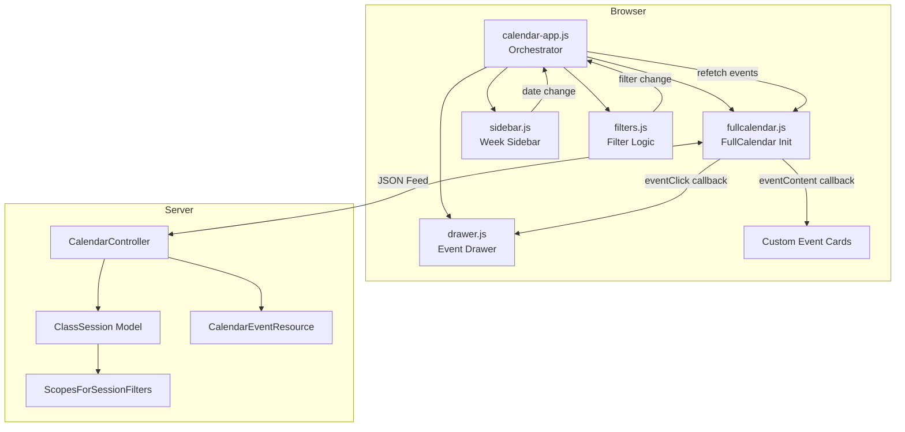
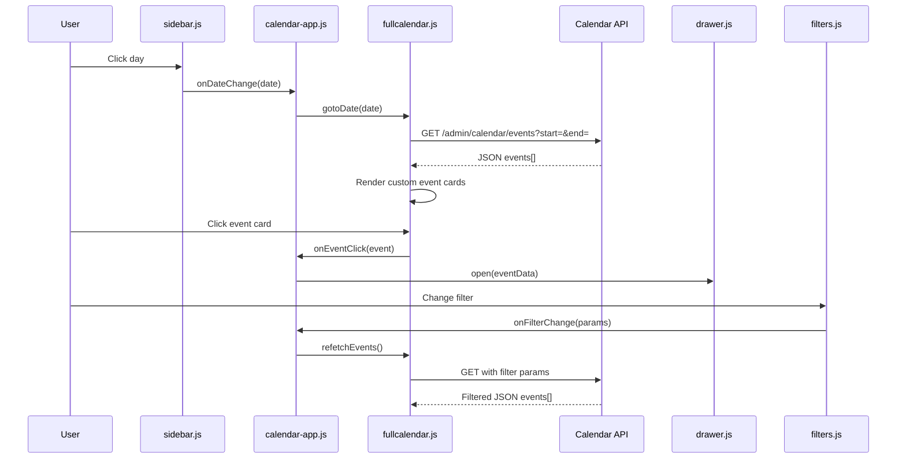

# Design Document: Admin Calendar Module

## Overview

This design replaces the existing server-rendered weekly HTML table calendar (`admin/calendar.blade.php`) with a modular, client-side FullCalendar-based day-view calendar. The new module uses FullCalendar's `timeGridDay` view, fetching events via a dedicated JSON API endpoint, rendering custom event cards with glass styling, and providing an event detail drawer — all within the project's dark premium design system, RTL layout, and Persian (Jalali) locale.

### Key Design Decisions

1. **FullCalendar as rendering engine**: Leverages the already-installed `@fullcalendar/core`, `@fullcalendar/timegrid`, `@fullcalendar/daygrid`, `@fullcalendar/interaction`, and `@fullcalendar/list` packages for professional time-grid rendering with minimal custom layout code.

2. **ES Module orchestrator pattern**: A single entry point (`calendar-app.js`) imports and initializes all sibling modules. No cross-imports between sibling modules — all communication flows through the orchestrator.

3. **Alpine.js for drawer state**: The event drawer uses Alpine.js with `@alpinejs/focus` (`x-trap`) for state management and focus trapping, consistent with the project's existing drawer/modal patterns.

4. **Dedicated JSON API endpoint**: Replaces the server-rendered grid with a lightweight API endpoint that returns FullCalendar-compatible event objects, enabling client-side date navigation without full page reloads.

5. **Jalali date handling on the client**: Persian day/month names and Jalali-formatted dates are computed client-side using a lightweight conversion utility (mirroring the existing `App\Helpers\Jalalian` PHP class), allowing FullCalendar to display Persian locale data without external i18n packages.

6. **Design System compliance**: All colors, spacing, radius, shadows, and motion values reference existing CSS custom properties from `design-tokens.css`, `semantic-tokens.css`, and `admin/tokens.css`. Zero hardcoded values.

## Architecture

### High-Level Architecture Diagram



### Module Communication Flow



### File Structure

```
resources/
├── js/
│   └── calendar/
│       ├── calendar-app.js      # Orchestrator — imports & initializes all modules
│       ├── fullcalendar.js      # FullCalendar configuration & lifecycle
│       ├── sidebar.js           # Week sidebar render & day click handling
│       ├── drawer.js            # Event drawer open/close/content
│       ├── filters.js           # Filter state management & debounce
│       └── utils/
│           └── jalali.js        # Client-side Jalali date conversion
├── css/
│   └── admin/
│       └── calendar.css         # All calendar-specific styles (BEM)
└── views/
    └── admin/
        └── calendar/
            ├── index.blade.php          # Main page (extends layouts.dashboard)
            └── components/
                ├── calendar-layout.blade.php
                ├── calendar-header.blade.php
                ├── week-sidebar.blade.php
                ├── day-timeline.blade.php
                ├── event-drawer.blade.php
                └── event-filters.blade.php
```

### Vite Configuration

A new entry point is added to `vite.config.js`:

```javascript
input: [
    'resources/css/app.css',
    'resources/js/app.js',
    'resources/js/charts/dashboard.js',
    'resources/js/calendar/calendar-app.js',  // New entry
]
```

FullCalendar is lazy-loaded via dynamic `import()` inside `fullcalendar.js` to produce a separate chunk that doesn't block initial page render.

## Components and Interfaces

### 1. CalendarController (PHP)

**Location**: `app/Http/Controllers/Admin/CalendarController.php`

```php
class CalendarController extends Controller
{
    public function index(): View
    public function events(CalendarEventRequest $request): JsonResponse
}
```

- `index()`: Returns the calendar Blade view with server-side data (teachers, students, instruments, rooms) for filter dropdowns.
- `events()`: Returns JSON array of FullCalendar-compatible event objects.

### 2. CalendarEventRequest (PHP)

**Location**: `app/Http/Requests/Admin/CalendarEventRequest.php`

Validates:
- `start` — required, date format `Y-m-d`
- `end` — required, date format `Y-m-d`, after_or_equal:start
- Date range span ≤ 92 days
- `teacher_id` — optional, integer, exists:teachers,id
- `student_id` — optional, integer, exists:students,id
- `room` — optional, string
- `instrument_id` — optional, integer, exists:instruments,id

### 3. CalendarEventResource (PHP)

**Location**: `app/Http/Resources/CalendarEventResource.php`

Transforms a `ClassSession` model into FullCalendar event format:

```php
[
    'id' => $this->id,
    'title' => $studentName . ' — ' . $instrumentName,
    'start' => $this->session_date->format('Y-m-d') . 'T' . $startTime,
    'end' => $this->session_date->format('Y-m-d') . 'T' . $endTime,
    'status' => $this->status->value,
    'studentName' => $studentName,
    'teacherName' => $teacherName,
    'instrumentName' => $instrumentName,
    'room' => $this->room,
    'extendedProps' => [
        'enrollment_id' => $this->enrollment_id,
        'session_fee' => $this->session_fee,
        'duration_minutes' => $this->duration_minutes,
        'notes' => $this->notes,
        'session_date' => $this->session_date->toDateString(),
    ],
]
```

### 4. JavaScript Modules

#### calendar-app.js (Orchestrator)

```javascript
export default async function initCalendarApp(containerEl) {
    const calendar = await initFullCalendar(containerEl, { onEventClick, onDateChange });
    const sidebar  = initSidebar(sidebarEl, { onDaySelect });
    const filters  = initFilters(filtersEl, { onFilterChange });
    const drawer   = initDrawer(drawerEl);
    // Wire modules together through callbacks
}
```

#### fullcalendar.js

```javascript
export default async function initFullCalendar(el, callbacks) {
    const { Calendar } = await import('@fullcalendar/core');
    const timeGridPlugin = await import('@fullcalendar/timegrid');
    // Configure and return calendar instance
}
```

Configuration:
- `initialView`: `'timeGridDay'`
- `slotDuration`: `'00:30:00'`
- `slotMinTime`: `'08:00:00'`
- `slotMaxTime`: `'22:00:00'`
- `allDaySlot`: `false`
- `nowIndicator`: `true`
- `expandRows`: `true`
- `height`: `'auto'`
- `direction`: `'rtl'`
- `firstDay`: `6` (Saturday)
- `headerToolbar`: `{ start: 'prev,next today', center: 'title', end: '' }`
- `events`: function returning fetch from `/admin/calendar/events`
- `eventContent`: custom render callback returning HTML for event cards

#### sidebar.js

```javascript
export default function initSidebar(el, { onDaySelect }) {
    // Renders 7 Persian week days (Saturday–Friday)
    // Handles day click → calls onDaySelect(date)
    // Updates active state on selected day
}
```

#### drawer.js

```javascript
export default function initDrawer(el) {
    return {
        open(eventData) { /* Populate and show drawer */ },
        close() { /* Hide and restore focus */ },
    };
}
```

Drawer uses Alpine.js `x-data` with `x-trap` for focus management. The drawer element exists in Blade with `x-show`, `x-transition`, and `@keydown.escape`.

#### filters.js

```javascript
export default function initFilters(el, { onFilterChange }) {
    // Listens to select changes with 300ms debounce
    // Emits consolidated filter params via onFilterChange callback
}
```

### 5. Blade Components

| Component | Responsibility |
|-----------|---------------|
| `calendar-layout` | Grid container: sidebar + main timeline area |
| `calendar-header` | Jalali date display, prev/next/today navigation |
| `week-sidebar` | 7-day Persian week strip with day buttons |
| `day-timeline` | FullCalendar mount point + skeleton loader |
| `event-drawer` | Slide-out detail panel with Alpine.js state |
| `event-filters` | Filter dropdowns with labels |

## Data Models

### ClassSession (Existing — No Changes)

The `ClassSession` model already has all required fields and scopes:

| Field | Type | Usage |
|-------|------|-------|
| `id` | integer | Event identifier |
| `enrollment_id` | integer (nullable) | Links to enrollment |
| `student_id` | integer (nullable) | Direct student link |
| `teacher_id` | integer (nullable) | Direct teacher link |
| `instrument_id` | integer (nullable) | Direct instrument link |
| `session_date` | date | Day of the session |
| `start_time` | datetime | Session start time |
| `duration_minutes` | integer | Duration for computing end time |
| `status` | SessionStatusEnum | scheduled/completed/cancelled/missed |
| `room` | string (nullable) | Room identifier |
| `session_fee` | integer | Fee in Rials |
| `notes` | text (nullable) | Session notes |

### Existing Scopes (No Changes)

- `scopeForDateRange($start, $end)` — filters by date range
- `scopeForTeacher($teacherId)` — filters by teacher (enrollment path + direct)
- `scopeForStudent($studentId)` — filters by student (enrollment path + direct)
- `scopeForInstrument($instrumentId)` — filters by instrument (enrollment path + direct)
- `scopeWithEnrollmentDetails()` — eager loads enrollment.student, enrollment.teacher, enrollment.instrument, student, teacher, instrument

### API Response Schema

```json
{
    "id": 42,
    "title": "علی محمدی — ویولن",
    "start": "2025-07-14T09:00:00",
    "end": "2025-07-14T09:30:00",
    "status": "scheduled",
    "studentName": "علی محمدی",
    "teacherName": "نازنین حسینی",
    "instrumentName": "ویولن",
    "room": "A101",
    "extendedProps": {
        "enrollment_id": 15,
        "session_fee": 5000000,
        "duration_minutes": 30,
        "notes": null,
        "session_date": "2025-07-14"
    }
}
```

### Route Registration

```php
Route::middleware(['auth', 'role:admin'])->prefix('admin/calendar')->name('admin.calendar.')->group(function () {
    Route::get('/', [CalendarController::class, 'index'])->name('index');
    Route::get('/events', [CalendarController::class, 'events'])->name('events');
});
```


## Correctness Properties

*A property is a characteristic or behavior that should hold true across all valid executions of a system — essentially, a formal statement about what the system should do. Properties serve as the bridge between human-readable specifications and machine-verifiable correctness guarantees.*

### Property 1: Session transformation completeness

*For any* valid ClassSession with associated student, teacher, and instrument (via enrollment or direct relations), transforming it through CalendarEventResource SHALL produce an object containing all required fields: `id` (integer), `title` (non-empty string), `start` (valid ISO 8601 datetime), `end` (valid ISO 8601 datetime where end = start + duration_minutes), `status` (one of scheduled/completed/cancelled/missed), `studentName`, `teacherName`, `instrumentName`, `room`, and `extendedProps` with `enrollment_id`, `session_fee`, `duration_minutes`, `notes`, and `session_date`.

**Validates: Requirements 1.9, 4.4**

### Property 2: Persian week computation

*For any* valid date, computing the Persian week SHALL produce exactly 7 consecutive dates where the first date is a Saturday (day of week = 6), the last date is a Friday (day of week = 5), and the originally selected date is always contained within the resulting 7-day range.

**Validates: Requirements 3.2, 3.7, 9.5**

### Property 3: Day navigation correctness

*For any* current date displayed in the calendar, navigating to the next day SHALL produce exactly currentDate + 1 day, and navigating to the previous day SHALL produce exactly currentDate - 1 day.

**Validates: Requirements 3.5**

### Property 4: API validation rejects invalid date parameters

*For any* string that does not match the YYYY-MM-DD format (including empty strings, non-numeric strings, partial dates, and malformed ISO strings), the Calendar API SHALL return HTTP 422 with a JSON body containing field-specific validation error messages when that string is provided as `start` or `end` parameter.

**Validates: Requirements 4.2, 4.6**

### Property 5: API validation rejects reversed date range

*For any* pair of valid dates where start is strictly after end, the Calendar API SHALL return HTTP 422 with a validation error indicating start must be before or equal to end.

**Validates: Requirements 4.7**

### Property 6: API validation rejects oversized date range

*For any* pair of valid dates where the difference between end and start exceeds 92 days, the Calendar API SHALL return HTTP 422 with a validation error indicating the maximum allowed range has been exceeded.

**Validates: Requirements 4.8**

### Property 7: Filter scoping correctness

*For any* valid teacher_id filter applied to the Calendar API, all returned event objects SHALL have `teacherName` corresponding to that teacher. The same invariant applies independently for student_id (all results match that student), room (all results match that room), and instrument_id (all results match that instrument).

**Validates: Requirements 4.3**

### Property 8: Time range formatting

*For any* valid start time (HH:MM in 24h format) and duration in minutes (1–480), the time range formatter SHALL produce a string in the format "HH:MM–HH:MM" where the second time equals start_time + duration_minutes, both using Western digits (0-9) and 24-hour format.

**Validates: Requirements 5.3, 9.4**

### Property 9: Status-to-style mapping completeness

*For any* valid SessionStatus value (scheduled, completed, cancelled, missed), the status-to-style mapping function SHALL return a defined, non-empty color/class value — sky for scheduled, emerald for completed, red for cancelled, orange for missed — with no undefined or fallback case reached.

**Validates: Requirements 5.6, 6.4**

### Property 10: Active filter count

*For any* combination of the 4 filter states (teacher, student, room, instrument) where each can be either at default ("all"/empty) or a selected value, countActiveFilters SHALL return the exact number of filters with non-default values (an integer from 0 to 4).

**Validates: Requirements 7.5**

### Property 11: Western digit output in date/time formatting

*For any* valid date or time value, the Jalali date formatter and time formatter SHALL produce output strings containing only Western digits (0-9), never Persian/Arabic numerals (۰-۹), while Persian text (month/day names) may use any Unicode characters.

**Validates: Requirements 9.2, 9.4**

### Property 12: Persian locale name mapping

*For any* day of the week (0–6 mapping to Saturday through Friday), getPersianDayName SHALL return the correct Persian name from the canonical set (شنبه، یکشنبه، دوشنبه، سه‌شنبه، چهارشنبه، پنجشنبه، جمعه). *For any* Jalali month number (1–12), getJalaliMonthName SHALL return the correct name from the canonical set (فروردین through اسفند).

**Validates: Requirements 9.3, 9.6**

### Property 13: Event aria-label format

*For any* event with a student name and session status, the constructed aria-label SHALL follow the exact format "{studentName} – {statusLabel}" where statusLabel is one of: scheduled, completed, cancelled, missed.

**Validates: Requirements 10.3**

### Property 14: Jalali full date format

*For any* valid date, the Jalali full-format function SHALL produce a string containing exactly four components: a Persian weekday name, a numeric day-of-month (Western digits), a Persian month name, and a 4-digit Jalali year (Western digits), in that order.

**Validates: Requirements 3.1**

## Error Handling

### API Error Responses

| Scenario | HTTP Status | Response Format |
|----------|-------------|-----------------|
| Missing `start` or `end` param | 422 | `{ "errors": { "start": ["..."] } }` |
| Invalid date format | 422 | `{ "errors": { "start": ["..."] } }` |
| `start` after `end` | 422 | `{ "errors": { "start": ["..."] } }` |
| Range exceeds 92 days | 422 | `{ "errors": { "end": ["..."] } }` |
| Invalid `teacher_id` (non-existent) | 422 | `{ "errors": { "teacher_id": ["..."] } }` |
| Unauthenticated request | 401 | Redirect to login |
| Unauthorized (non-admin role) | 403 | Redirect or error page |
| Server error | 500 | Generic JSON error (no sensitive data) |

### Client-Side Error Handling

1. **FullCalendar initialization failure**: Display inline error message inside the calendar container with a "retry" button. Log error to console in development only.

2. **Event feed fetch failure** (network error or non-200 response):
   - Display toast/inline error: "خطا در بارگذاری جلسات" (Error loading sessions)
   - Preserve last successfully loaded events on screen
   - Show retry button
   - Implement exponential backoff for automatic retries (max 3 attempts)

3. **Empty state** (no events for selected day/filters):
   - Display centered message: "جلسه‌ای برای نمایش وجود ندارد" (No sessions to display)
   - Show active filter count if filters are applied
   - Offer "clear filters" shortcut if filtered

4. **Drawer data missing fields**:
   - Null/empty `notes` → display "بدون یادداشت" placeholder
   - Missing relations (no student/teacher) → display "—" dash
   - Never show empty or broken layout sections

### Graceful Degradation

- If JavaScript fails to load entirely, the page shows the skeleton placeholder with a message suggesting a page refresh
- Network timeouts (>5s) trigger the error state with retry option
- Invalid event data from API (missing required fields) is silently skipped during rendering, not crashing the calendar

## Testing Strategy

### Unit Tests (PHPUnit)

**Backend (Feature tests)**:
- `CalendarControllerTest` — test the `events` endpoint:
  - Returns 200 with valid params
  - Returns correct event structure
  - Applies filters correctly (teacher, student, room, instrument)
  - Returns 422 for invalid/missing dates
  - Returns 422 for reversed range
  - Returns 422 for >92 day range
  - Respects auth middleware (401/403)
  - Handles sessions with null enrollment (direct relations)

- `CalendarEventResourceTest` — test the JSON resource:
  - Transforms complete session correctly
  - Handles null optional fields (notes, room)
  - Computes end time from start_time + duration_minutes

### Property-Based Tests (fast-check)

**Library**: [fast-check](https://github.com/dubzzz/fast-check) for JavaScript property tests.

**Configuration**: Minimum 100 iterations per property test.

Each property test is tagged with:
```javascript
// Feature: admin-calendar-module, Property {N}: {property_text}
```

**Properties to implement**:

1. **Property 1** — Session transformation: Generate arbitrary valid session data objects, verify output contains all required fields with correct types.
2. **Property 2** — Persian week computation: Generate arbitrary dates, verify 7-day output starts Saturday, ends Friday, contains input date.
3. **Property 3** — Day navigation: Generate arbitrary dates, verify next = +1 day, prev = -1 day.
4. **Property 4** — Invalid date rejection: Generate non-date strings, verify 422 response.
5. **Property 5** — Reversed range rejection: Generate date pairs where start > end, verify 422.
6. **Property 6** — Oversized range rejection: Generate date pairs >92 days apart, verify 422.
7. **Property 7** — Filter scoping: Generate sessions with known teacher/student/room, apply filter, verify all results match.
8. **Property 8** — Time range formatting: Generate valid HH:MM times and durations, verify output format.
9. **Property 9** — Status mapping: For all 4 statuses, verify non-empty mapped value.
10. **Property 10** — Active filter count: Generate combinations of 4 boolean flags, verify count.
11. **Property 11** — Western digit output: Generate dates, verify no Persian numerals in numeric output.
12. **Property 12** — Persian locale names: For all 7 days and 12 months, verify correct name.
13. **Property 13** — Aria-label format: Generate student names and statuses, verify format.
14. **Property 14** — Jalali full date format: Generate dates, verify output has all 4 components.

### Integration Tests

- End-to-end test: page loads, FullCalendar renders, clicking day updates timeline
- Filter interaction: selecting filter triggers debounced API call
- Drawer: clicking event opens drawer, Escape closes it, focus returns
- Responsive: sidebar layout changes at breakpoints

### Accessibility Tests

- Tab order verification (sidebar → filters → calendar → drawer)
- Screen reader announcement for event cards
- Focus trap in drawer
- aria-current="date" on today
- Contrast ratios for status colors against dark backgrounds

### Performance Tests

- API response time benchmark: <200ms for 50 sessions
- Bundle size check: FullCalendar chunk is separate from main bundle
- No CLS: container has stable dimensions before data loads
- Debounce verification: rapid filter changes produce single API call

