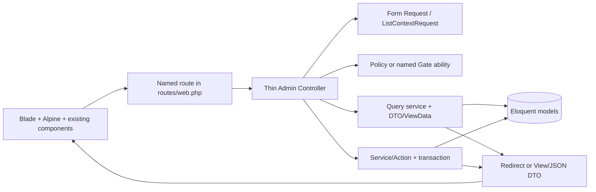

# Design Document: Admin Operational UX Baseline

## Overview

این طراحی برای **Priority 1** است: یک Baseline تست پاک و قابل تکرار، و تکمیل UX عملیاتی پنل مدیریت موجود Parsian Music. طراحی روی Laravel 12، Blade، Alpine.js، Vite، Eloquent و پوسته‌های موجود `dark`/`glass` بنا می‌شود؛ معماری جدید، بازطراحی بصری یا migration تخریبی پیشنهاد نمی‌کند.

مسیر واقعی routeهای admin در `routes/web.php` ثبت شده است؛ `routes/admin.php` منبع route نیست و نباید به‌عنوان route group جدید استفاده شود. کنترلرهای موجود در `app/Http/Controllers/Admin/` حفظ می‌شوند، اما orchestration را به Query/Service/Actionهای کوچک واگذار می‌کنند. Blade فقط ساختار و binding داده را رندر می‌کند و JavaScript فقط state تعاملی UI را مدیریت می‌کند.

### Design goals

- سبز و reproducible شدن `php artisan test`، `npm run test:js` و `npm run build` با timeout هرکدام ۳۰۰ ثانیه.
- رفتار یکسان فهرست‌های عملیاتی: search/filter، sort whitelist، صفحه‌بندی ۲۰تایی، count، empty/error/loading و حفظ context.
- تکمیل detail/form فقط در مرزهای مورد نیاز؛ اتاق، ساز و enrollment فهرست+فرم باقی می‌مانند و detail ساختگی دریافت نمی‌کنند.
- Policy/Gate، Form Request، transaction و eager loading به‌عنوان مرزهای اجباری.
- استفاده مجدد از componentهای موجود و حفظ parity در دو theme، بدون تغییر فایل‌های token یا پیاده‌سازی‌های frozen.

### Non-goals and frozen boundaries

- bulk selection/execution/result/audit، session editing، real calendar data، notes و room contract متعلق به `admin-bulk-selection-actions` هستند؛ این سند فقط integration point و invariant مشترک را مشخص می‌کند.
- calendar rendering متعلق به `admin-calendar-module` است؛ این سند فقط baseline و state/feedback integration را مصرف می‌کند.
- login UI، Teacher Hero/Profile UI و فایل‌های frozen requirements تغییر نمی‌کنند.
- notification architecture، mobile API/workflow، visual redesign و Priority 3–5 خارج از دامنه‌اند.

## Architecture

### Layered request flow



**Controller boundary:** route model binding، `authorize`/Gate invocation، فراخوانی Request/Query/Action، ساخت View/redirect/JSON و flash result. Controller نباید query ترکیبی، حلقه mutation، validation inline یا business rule داشته باشد.

**Request boundary:** تمام ورودی‌های فرم و mutation با Form Request؛ List Context با یک normalizer/DTO مشترک. نام، جست‌وجو و مقادیر Persian/Arabic قبل از query یا persistence normalize می‌شوند. مقدار خام کاربر مستقیماً وارد `orderBy` یا query string نمی‌شود.

**Domain boundary:** Service/Action مالک business rule، relation resolution، dependency check، conflict check و transaction است. هر mutation بیش از یک رکورد یا یک رکورد به‌همراه relation در یک transaction انجام می‌شود. قرارداد session/calendar و bulk از owner خود مصرف می‌شود، نه بازتعریف.

**View boundary:** Controller/ViewModel/DTO داده کامل و eager-loaded را به Blade می‌دهد. هیچ query در Blade، business logic در Blade/JavaScript، inline style/handler، رنگ/spacing hardcode یا داده mock/sample/fallback برای رکورد عملیاتی مجاز نیست.

### Existing integration points

| موجودیت/سطح | قرارداد موجود | تصمیم این طراحی |
|---|---|---|
| Route registration | `routes/web.php` با prefix/name و middleware role | حفظ routeهای named؛ route inventory تمام `admin.*` را با status test می‌کند. |
| Shell/theme | `layouts/dashboard.blade.php` و `admin-shell.js` | مصرف cookie `pm_admin_theme`، marker `data-admin-theme`، Alpine و focus؛ بدون تغییر token/theme structure. |
| Empty/loading | `x-dashboard.empty-state` و `x-ui.loading-state` | استفاده با variant/context؛ markup per-page ساخته نمی‌شود. |
| Alert/modal | `x-ui.alert` و `x-modal`، flash partial فعلی | یک Feedback_Channel مشترک روی این primitives ساخته/یکپارچه می‌شود؛ flashهای hardcode حذفِ دامنه‌ای می‌شوند. |
| Sort/pagination | `admin/partials/sort-th` و UI pagination | خروجی Query DTO همان پارامترهای canonical را تولید می‌کند؛ sort فقط از whitelist می‌آید. |
| Calendar | `resources/js/calendar/*` و `admin.calendar.*` | فقط مصرف DTO، loading/error/feedback و refetch؛ FullCalendar و drawer مالک `admin-bulk-selection-actions`/calendar specs هستند. |

### Operational screen ownership

- **Record_Detail:** teacher، student، invoice و lead. برای teacher باید entry point شکسته‌ی `admin.teachers.show` و view missing تکمیل شود؛ student history باید با شناسه پایدار `student_history` و order deterministic رندر شود.
- **List + Form:** teacher، student، instrument، room، enrollment، invoice، lead و user. برای rooms/instruments/enrollments detail route جدید ساخته نمی‌شود.
- **Session/calendar:** فقط integration با contract مالک؛ edit/update و notes به `admin-bulk-selection-actions` واگذار می‌شود.
- **Settings، shell، CRM lead behavior، demo data:** قراردادهای owner خود را مصرف می‌کنند و این سند route/persistence موازی ایجاد نمی‌کند.

### List Context contract

`ListContext` immutable DTO و شامل این فیلدها است:

```text
entity, search, filters, sort, direction, page, per_page,
normalized_query, context_fingerprint
```

- `per_page` پیش‌فرض و contract ثابت: `20`؛ مقدار تنها از allow-list معتبر پذیرفته می‌شود.
- `search` trim و با mapping واحد equivalent Persian/Arabic normalize و سپس به حداکثر ۱۰۰ کاراکتر بریده می‌شود.
- filterها typed و allow-listed هستند؛ مقدار ناشناخته ignore/validation error قراردادی می‌گیرد و query unscoped نمی‌شود.
- sort برای هر list whitelist مستقل دارد؛ direction فقط `asc|desc` است؛ fallback صریح دارد.
- هر order یک unique key پایدار (در حالت فعلی `id`) را به‌عنوان tie-breaker اضافه می‌کند.
- لینک pagination، sort، clear و form redirect تمام context معتبر را با query parameters حفظ می‌کند؛ clear همه search/filterها را حذف و به default context بازمی‌گرداند.
- page نامعتبر به نزدیک‌ترین page معتبر یا empty page با HTTP 200 می‌رسد و سایر context را نگه می‌دارد.

### Query and performance contract

برای هر list یک `*ListQuery` یا معادل آن وجود دارد که `ListContext` را مصرف، filter/sort را map و `paginate(20)` را با `withQueryString()` اجرا می‌کند. relationهای رندرشده در همان query `with(...)`/`withCount(...)` می‌شوند؛ query داخل Blade ممنوع است. برای session از relation contract موجود (`enrollment` و direct relationها) استفاده می‌شود و ترکیب دو مسیر متعارض به mapper واگذار نمی‌شود.

Queryهای مرتبط از Eloquent/Query Builder و binding استفاده می‌کنند؛ raw SQL و string concatenation ممنوع است. تست query count باید نشان دهد با افزایش rows تعداد query رشد خطی ندارد. list پیش‌فرض و detailهای عملیاتی در test environment باید زیر ۲ ثانیه پاسخ دهند.

## Components and Interfaces

### Backend interfaces

| Interface | مسئولیت | مرز خروجی |
|---|---|---|
| `ListContextNormalizer` | normalize search/filter/sort/page/per-page و ساخت fingerprint | `ListContext` immutable |
| `*ListQuery` | اجرای list query، eager loading، count و pagination | paginator + row DTO + applied context |
| `RecordQuery`/`*DetailQuery` | بارگذاری detail با relationهای مورد نیاز | detail ViewData؛ بدون query در view |
| `RecordFormRequest`ها | authorize اولیه و validation field-specific | validated input / localized errors |
| `RecordAction`/`*Service` | create/update/delete/status/attach/assign و domain rules | result DTO، transaction boundary |
| `FeedbackChannel` | success/error/validation واحد و قابل اعلام | `role=status|alert` + dismiss/live region |
| `AuthorizationLayer` | `viewAny/view/create/update/delete` و abilityهای action | Policy/Gate decision؛ UI هرگز منبع مجوز نیست |

Controllerهای `TeacherController`, `StudentController`, `ClassSessionController`, `RoomController`, `InstrumentController`, `StudentEnrollmentController`, `InvoiceController`, `LeadController` و `UserController` thin می‌مانند. متدهای موجودی که Request عمومی و `$request->validate()` دارند به Form Request معادل منتقل می‌شوند؛ نام route و redirect contract تا حد ممکن ثابت می‌ماند.

### Authorization flow

1. middleware فعلی `auth` و `role` coarse boundary هستند؛ نقش مستقل secretary اضافه نمی‌شود و persona منشی از policy به `admin` نگاشت می‌شود.
2. controller با `$this->authorize()` یا `Gate::authorize()` ability نام‌دار را برای `viewAny/view/create/update/delete` و actionهای غیر CRUD ارزیابی می‌کند.
3. Policyهای موجود (`TeacherPolicy`, `StudentPolicy`, `SessionPolicy`, `EnrollmentPolicy`, `InvoicePolicy`, `LeadPolicy`, `UserPolicy`) حفظ و methodهای مورد نیاز missing با contract مشخص تکمیل می‌شوند؛ `Room` و `Instrument` نیز policy نام‌دار خواهند داشت.
4. endpoint state-changing حتی در صورت نبود کنترل UI، مستقیم هم policy را enforce می‌کند؛ unauthorized قبل از mutation HTTP 403 و unauthenticated HTTP 401 یا login redirect قراردادی می‌گیرد.
5. CSRF روی تمام browser mutationها فعال است. تست route assertion ترتیب authorization-before-mutation را با actor مجاز/غیرمجاز بررسی می‌کند.

### Forms and transaction policy

Form Request هر entity فیلدهای required، type/max، numeric bounds، enum، relationship existence، uniqueness و date ordering را validate می‌کند. normalize یکسان در Request و Action از اختلاف validation/persistence جلوگیری می‌کند و فیلدهای invalid با old input و خطای مرتبط برمی‌گردند.

- create/update یک رکورد ساده: Action پس از authorization و validation، persistence را انجام می‌دهد.
- تغییر رکورد و relation، attach/detach، payment، status transition چندمرحله‌ای یا هر bulk item: یک transaction؛ failure rollback کامل همان scope.
- bulk و session/calendar مطابق transaction و concurrency contract مالک `admin-bulk-selection-actions` باقی می‌مانند.
- destructive action فقط پس از Confirmation_Dialog، سپس یک request و disable شدن trigger اجرا می‌شود؛ cancel هیچ request/audit/mutation ندارد.
- protected field یا nonexistent model با 404/422 قراردادی رد می‌شود و هیچ replacement record ساخته نمی‌شود.

### Shared UI state contract

هر screen از componentهای موجود استفاده می‌کند:

- **Empty_State:** `x-dashboard.empty-state` با دو mode: بدون filter («رکوردی ثبت نشده») و با context («نتیجه‌ای مطابق فیلتر نیست»)، همراه create یا clear action بر اساس Policy.
- **Loading_State:** `x-ui.loading-state` در submit/async request؛ trigger disabled، duplicate submit ممنوع، state ظرف ۲۰۰ms قابل مشاهده.
- **Error_State:** variant خطای shared alert با پیام localized، retry/return path، بدون SQL/stack/path/token/PII؛ آخرین داده معتبر در async failure باقی می‌ماند.
- **Feedback_Channel:** یک wrapper مشترک برای success، failure و validation که از `x-ui.alert`/existing token variants استفاده می‌کند. success `role=status`، failure `role=alert`، field error با `aria-describedby`/`aria-invalid`؛ حداقل ۴ ثانیه visible و dismissible، validation تا correction/navigation باقی می‌ماند.
- **Confirmation_Dialog:** `x-modal` یا variant مشترک با heading id، `role=dialog`، `aria-modal=true`، `x-trap`، Escape، backdrop semantic، focus restore و explicit confirm/cancel. نام entity، action و consequence را نشان می‌دهد.

Alpine فقط stateهای UI مانند `pending`, `dialogOpen`, `feedback`, `lastRequestId` و focus را نگه می‌دارد. submit و permission/business decisions server-side هستند. پاسخ‌های قدیمی با request/version guard کنار گذاشته می‌شوند تا state جدید overwrite نشود.

### Bulk integration only

فهرست teacher/student فقط integration pointهای زیر را مصرف می‌کند: row/header selection component، selected count، context fingerprint، endpoint و result DTO مالک `admin-bulk-selection-actions`. این سند component دوم یا endpoint bulk جدید تعریف نمی‌کند. تغییر search/filter/sort/page/entity/refresh selection را پاک می‌کند؛ duplicate/stale ID در count شمرده نمی‌شود. Policy resolution، execution، partial result، audit، deletion dependency و idempotence کاملاً متعلق به spec مالک است.

### Accessibility, RTL and responsive contract

- layout با semantic HTML، یک `h1`، heading order، native `a/button/input/select/checkbox` و `aria-current=page` ساخته می‌شود؛ icon-only control نام accessible دارد.
- focus ring موجود و token-based حفظ می‌شود؛ dialog/drawer focus trap، Escape و restore focus دارد؛ نتیجه async live region را به‌روزرسانی می‌کند بدون پرش focus.
- `lang/dir` از dashboard layout حفظ می‌شود؛ spacing/border/inset با logical properties و اعداد/تاریخ با direction صریح رندر می‌شوند.
- breakpointهای رسمی: 390، 430، 768، 1024، 1366، 1600، 1920. زیر 768 list به stacked record یا container scroll داخلی تبدیل می‌شود؛ document overflow حداکثر ۱px؛ coarse pointer target حداقل 44×44.
- container حداکثر 1600px است؛ مقدار طولانی wrap/truncate accessible می‌شود؛ overlayها داخل viewport یا scroll داخلی دارند.
- هر دو `data-admin-theme=dark|glass` با component variant و token فعلی تست می‌شوند. هیچ تغییر در token names/values/selector structure، رنگ hardcode، `!important` جدید، redesign یا CSS per-page theme rule مجاز نیست. reduced motion باید state را حفظ و motion غیرضروری را حذف کند.

## Data Models

### Persisted models and DTOs

مدل‌های موجود `User`, `Teacher`, `Student`, `Instrument`, `TeacherInstrument`, `StudentEnrollment`, `ClassSession`, `ClassAttendance`, `Room`, `Subscription`, `Invoice`, `InvoiceItem`, `InvoicePayment` و `Lead` منبع persisted هستند. `$fillable`، casts و Enumهای موجود حفظ می‌شوند؛ فیلدهای جدید بدون migration/approval این سند ساخته نمی‌شوند. پول integer و مقدارهای ثابت Enum-backed باقی می‌مانند.

برای جلوگیری از coupling view به Eloquent، DTO/ViewDataهای زیر contract مشترک هستند:

- `OperationalRowData`: stable id، label fields، status، relation labels، `allowed_actions` و `selectable`.
- `OperationalListData`: paginator، `ListContext`، total matching count، filter options، sort whitelist، empty-mode و policy flags.
- `RecordDetailData`: persisted scalar/relation values، localized absent placeholders، action permissions و stable section identifiers.
- `RecordFormData`: old/persisted normalized values، options، validation metadata و return context.
- `FeedbackData`: type، localized message، affected entity/action، request/version id و dismissibility.

Detail queryها باید relation path را از persisted data انتخاب کنند؛ نام یا status محاسبه‌شده‌ی بدون منبع ذخیره‌شده به‌عنوان record fact رندر نمی‌شود. absent value فقط placeholder قراردادی است.

### Factory and seeder contract

وضعیت فعلی فقط factoryهای `User`, `Teacher`, `Student`, `Instrument`, `Lead` را دارد. Baseline implementation باید factoryهای `TeacherInstrument`, `Enrollment/StudentEnrollment`, `ClassSession`, `Attendance/ClassAttendance`, `Room`, `Subscription`, `Invoice`, `InvoiceItem`, `InvoicePayment` را با naming موجود پروژه اضافه/تکمیل کند و برای همه‌ی مدل‌های requirements default persistable بسازد.

هر Enum-backed status state factory method داشته باشد: `StudentStatusEnum`, `TeacherStatusEnum`, `EnrollmentStatusEnum`, `SessionStatusEnum`, `AttendanceStatusEnum`, `InvoiceStatusEnum`, `PaymentStatusEnum`, `LeadStatusEnum` و `RoleEnum` در صورت کاربرد. User stateهای دقیق `super_admin`, `admin`, `teacher`, `student` لازم است. Parent supplied باید reuse شود؛ نبود parent فقط یک parent لازم ایجاد کند. state مستقل و state دارای deletion dependency جدا باشند و کمینه‌ی dependency لازم را بسازند.

Test seeder باید deterministic و idempotent باشد: اجرای دوباره duplicate key یا رشد نامحدود نداشته باشد. Factory count=25 دقیقاً ۲۵ رکورد non-conflicting تولید کند. `DemoSeeder` و داده‌ی development منبع تست نیستند؛ تست‌ها از `RefreshDatabase`/SQLite in-memory و factory یا seeder idempotent استفاده می‌کنند.

### Ownership matrix

| دامنه | وضعیت | منبع مالک | اقدام این طراحی |
|---|---|---|---|
| baseline commands, route inventory, test isolation/quarantine | Owned here | this spec | contract و verification |
| list context و operational list UX | Owned here | this spec | shared query/DTO/component contract |
| teacher/student/invoice/lead detail و forms | Owned here | this spec | missing route/view و flow contract |
| instrument/room/enrollment list+form | Owned here | this spec | بدون detail ساختگی |
| bulk selection/execution/result/audit | Superseded | `admin-bulk-selection-actions` | فقط integration |
| session edit/update، notes، real rooms/calendar data | Superseded | `admin-bulk-selection-actions` | فقط integration |
| calendar rendering engine/drawer composition | Superseded | `admin-calendar-module` | consume existing JS/DTO |
| scheduling stabilization | Superseded | `scheduling-phase1-stabilization`, `scheduling-stabilization` | عدم تکرار |
| settings, CRM lead behavior, admin shell, demo data | Superseded | `admin-settings*`, `crm-ui-lead-management`, `admin-shell-layout-fix`, `demo-data-system` | preserve owner contract |
| login, Teacher Hero/Profile visual، token/theme files | Frozen | approved baseline | byte-preservation gate |
| visual redesign roadmap، notification architecture، mobile API/workflow | Deferred/excluded | future approved spec | اجرا نمی‌شود |

### Canonical route/view decisions

- `admin.teachers.show` به method/view موجود متصل و با policy `view` تکمیل می‌شود؛ nonexistent model همان route model binding 404 و shared Error_State دارد.
- `admin.students.show` از timeline persisted و deterministic استفاده می‌کند و section id `student_history` را حفظ می‌کند.
- calendar فقط `admin.calendar.index` و `resources/views/admin/calendar/index.blade.php` را canonical می‌داند؛ view موازی `resources/views/admin/calendar.blade.php` در implementation یا repurpose مستند می‌شود، بدون دو target rendered.
- route inventory تمام named routeهای `admin.` را استخراج می‌کند و برای هر route، controller method + view/redirect/JSON target و authorized status را assertion می‌کند. routeهایی که owner دیگر دارد فقط contract خود را consume می‌کنند.

## Correctness Properties

*A property is a characteristic or behavior that should hold true across all valid executions of a system—essentially, a formal statement about what the system should do. Properties bridge requirements and executable correctness checks.*

PBT برای pure normalizer، context serializer، filter/sort model، factory input generator و state reducer مناسب است. Policy wiring، Eloquent persistence، browser layout، theme parity و side-effectهای feedback با feature/integration/snapshot/browser test پوشش داده می‌شوند و به‌عنوان PBT برای سرویس خارجی تکرار نمی‌شوند. Property reflection انجام شد: filter pagination و deterministic ordering در یک property جامع ادغام شدند؛ selection count و stale ID در یک invariant؛ form round-trip و normalization در یک property؛ و no-op/idempotence جدا ماند چون value آزمون مستقل دارد.

هر property test که با `fast-check` موجود (`4.3.0`) اجرا می‌شود حداقل ۱۰۰ iteration دارد و کامنت test باید دقیقاً این قالب را داشته باشد: `Feature: admin-operational-ux-baseline, Property N: <property text>`. عملیات DB/browser در propertyها mock یا fixture-isolated هستند؛ اجرای واقعی فقط در example/integration انجام می‌شود.

### Property 1: Canonical List Context

**For all** valid search, filter, sort, direction, page and page-size inputs, normalization produces one canonical `ListContext`; equivalent whitespace/Persian-Arabic forms produce the same normalized value, search is at most ۱۰۰ characters, sort is whitelisted, direction is `asc|desc`, and serialization/deserialization preserves the context.

**Validates: Requirements 5.2, 5.3, 5.4, 5.5, 5.6, 5.7, 5.8, 5.11**

### Property 2: Filtered Pagination and Stable Ordering

**For all** persisted record sets and valid `ListContext` values, the union of all pages equals exactly the matching records, no record appears on two pages, every result satisfies the context, and repeated submission returns the same order using the unique-key tie-breaker.

**Validates: Requirements 5.4, 5.5, 5.6, 5.7, 5.10, 5.12, 5.13, 5.14, 5.15, 16.1**

### Property 3: Selection Set Invariant

**For all** selection sets and list-context transitions, the displayed count equals the number of distinct selectable IDs; duplicate/stale/non-selectable IDs are excluded, and any search/filter/sort/page/entity/refresh transition clears the set before mutation.

**Validates: Requirements 9.3, 9.5, 9.7**

### Property 4: Bulk Result Conservation and Idempotence

**For all** valid bulk result resolutions, `succeeded + skipped + failed` equals the resolved selection size and each resolved ID occurs at most once; applying the same action twice to the same persisted state yields the same final state as applying it once.

**Validates: Requirements 9.6, 9.8, 9.11**

### Property 5: Authorization Non-Mutation

**For all** operational actions, actors without the named Policy/Gate ability or a valid CSRF token receive the documented forbidden/CSRF response and the persisted database snapshot is unchanged; no protected record is mutated by a hidden or directly submitted control.

**Validates: Requirements 6.3, 6.9, 9.4, 10.1, 10.5, 10.6, 10.7, 10.8, 10.9, 10.10, 10.11**

### Property 6: Form Normalization Round Trip

**For all** valid Record_Form inputs, the Action persists values after the canonical normalization contract and re-rendering the edit form displays exactly those persisted normalized values; whitespace and accepted Persian/Arabic equivalents do not create alternate stored values.

**Validates: Requirements 6.5, 6.6, 6.7, 6.11, 6.13**

### Property 7: Invalid Form Atomicity

**For all** invalid, unauthorized, nonexistent-target or failed multi-step form submissions, the response contains field/action-specific feedback and the complete pre-request persisted snapshot remains unchanged.

**Validates: Requirements 6.7, 6.8, 6.9, 6.10, 7.6, 7.7, 7.8, 7.9**

### Property 8: Factory Persistability and Parent Reuse

**For all** required factory models and each valid Enum state, a default factory record satisfies database/Form contract; when a required parent is supplied it is reused exactly once, and count `25` creates exactly 25 valid records without identifier conflicts.

**Validates: Requirements 4.1, 4.2, 4.3, 4.4, 4.5, 4.6, 4.7, 4.9, 4.10**

### Property 9: Test Data Idempotence and Isolation

**For all** clean test processes and test execution orders, deterministic test seeders produce the same set; database/filesystem/env/cookie/browser state cannot change another test’s result.

**Validates: Requirements 1.5, 1.6, 1.7, 1.8, 1.9, 1.10, 4.8**

### Property 10: Frozen Area Immutability

**For all** changes delivered by this specification, every path in the Frozen_Area preservation set remains byte-identical and no indirect cascade/theme selector/token change is introduced unless an explicit approval record is present.

**Validates: Requirements 13.3, 13.4, 13.5, 13.6, 13.7, 14.1, 14.2, 14.3, 14.4, 14.5, 14.6, 14.7, 14.8**

### Property 11: Context-Preserving Feedback State

**For all** request sequences on one screen, a newer completion supersedes older pending feedback, exactly one success/Error_State replaces Loading_State, persisted last-good data remains visible on async failure, and duplicate confirmation sends no more than one request.

**Validates: Requirements 7.4, 7.5, 7.6, 7.7, 7.8, 7.9, 7.10, 8.1, 8.2, 8.3, 8.4, 8.5, 8.6, 8.7, 8.8, 8.9, 8.10, 8.11**

UI focus, WCAG contrast, viewport overflow, browser route rendering and ۲-second latency are not reduced to string PBT: they receive deterministic Playwright/browser, accessibility, query-count and smoke assertions at the required viewport/theme matrix.

## Error Handling

| وضعیت | پاسخ | رفتار UI |
|---|---|---|
| unauthenticated | HTTP 401 یا login redirect قراردادی | هیچ protected record یا empty-success جعلی رندر نمی‌شود. |
| unauthorized/policy denial | HTTP 403 | action control omit/disable؛ Feedback_Channel پیام localized؛ persisted state unchanged. |
| invalid CSRF | documented CSRF response | mutation/audit انجام نمی‌شود؛ retry/return path. |
| invalid form/filter/context | HTTP 422 با field errors | old input و context معتبر حفظ؛ Error_State/field association. |
| missing model/route binding | HTTP 404 | shared not-found Error_State؛ replacement ساخته نمی‌شود. |
| relation/conflict/concurrency | contract owner: 409 یا field-specific 422 | آخرین persisted value authoritative؛ draft فقط برای retry نگه داشته می‌شود. |
| unexpected server/database failure | HTTP 500 یا redirect error قراردادی | Error_State بدون SQL، stack، path، credential، token یا PII. |
| timeout | Baseline command fail یا async retry state | command/timeout/last output در baseline؛ re-enable + retry در UI. |

Feedback message طول success بین ۱۰–۱۶۰ و failure بین ۱۰–۲۰۰ کاراکتر، localized و دارای entity/action یا recovery path است. `role=status` برای موفقیت، `role=alert` برای failure، و validation با `aria-invalid` و `aria-describedby` رندر می‌شود. خطای async داده‌ی persisted آخرین render موفق را با placeholderهای جعلی جایگزین نمی‌کند.

## Testing Strategy

### Baseline gate

قبل از اعلام completion، با processهای جدا و timeout 300s اجرا می‌شود:

```text
php artisan optimize:clear
php artisan test
npm run test:js
npm run build
```

خود gate باید command، exit status، passed/failed/skipped count، first actionable failure و test identifier را ثبت کند. timeout gate failure است، نه success. Verification دوبار در clean process اجرا می‌شود؛ counts و quarantine identifiers/reasons باید یکسان باشند. `phpunit.xml` و قرارداد Unit/Feature، SQLite in-memory و `node --test` حفظ می‌شوند.

### Test layers

1. **Unit/PHP:** ListContextNormalizer، DTO mapping، policy ability map، normalization، error mapper و action rules با PHPUnit؛ query builder inputها با whitelist/parameter binding بررسی می‌شوند.
2. **Feature/PHP:** هر named `admin.*` route با authorized actor status/redirect/JSON target دارد؛ teacher show، student history/empty، canonical calendar view، Form Request، Policy-before-write، transaction rollback، eager-load و query-count assertions پوشش داده می‌شوند.
3. **JavaScript unit/property:** state reducerهای list/feedback/dialog و formatterهای pure با `fast-check@4.3.0`؛ هر property حداقل ۱۰۰ run و tag design property دارد. business rule به JS منتقل نمی‌شود.
4. **Browser/Playwright:** keyboard/Enter/Space، focus ring/trap/restore، live region، confirmation cancel/confirm، Empty/Loading/Error، responsive widths `390,430,768,1024,1366,1600,1920`، هر دو theme و no-horizontal-overflow.
5. **Smoke/integration:** `npm run build`، canonical Vite entrypoints، theme cookie fallback، route inventory و factory/seeder schema. notification/mobile/frozen visual redesign تست جدید دریافت نمی‌کنند.
6. **Performance/security:** list/detail query count bounded، default response زیر ۲ ثانیه در test environment، no raw concatenated query، no unescaped notes، CSRF، Policy و عدم افشای اطلاعات حساس.

### Quarantine strategy

`tests/js/properties/filter-scoping.property.test.js` اکنون به `TEST_ADMIN_PHONE`، `TEST_ADMIN_PASSWORD` و server running وابسته است. assertions و فایل حذف نمی‌شوند. تست در ابتدای اجرا فقط وقتی هر سه prerequisite contract (به‌همراه base URL قابل دسترس) حاضر نیستند با skip صریح، reason حداکثر ۲۰۰ کاراکتر و gap identifier ثابت خارج می‌شود؛ وقتی همه حاضرند، همان assertions اجرا می‌شوند. skip inventory در default output و دو اجرای baseline ثابت می‌ماند. هیچ test با `migrate:fresh`/`db:wipe` اجرا نمی‌شود.

تست flaky پس از سه اجرای متوالی متفاوت، یا nondeterministic به علت network/server/credential/time/order، ابتدا علت را حذف می‌کند و اگر ممکن نبود با همین quarantine metadata خارج می‌شود. پس از رفع dependency و سه اجرای موفق متوالی، به default suite برمی‌گردد. frozen preservation tests matcher خود را برای سبز شدن تضعیف نمی‌کنند.

## Requirements-to-Verification Map

| Requirement | Verification |
|---|---|
| 1 Baseline | command gate، timeout reporter، دو clean run، PHPUnit/JS config و isolation tests |
| 2 Broken behavior | route inventory، teacher/student feature tests، canonical calendar view test، 404/exception tests |
| 3 Quarantine | explicit node skip metadata، stable skip inventory، order/repeat runs |
| 4 Test data | factory state/persistability/count tests، idempotent seeder test |
| 5 Lists | ListContext unit/PBT، feature filter/sort/pagination/count/query-count/performance tests |
| 6 Detail/forms | route/view tests، Form Request، Policy-before-write، rollback و normalization round-trip |
| 7 States | Blade/component contract و Playwright async/empty/error/loading tests |
| 8 Feedback/dialog | shared component contract، ARIA/live-region، keyboard/focus و exactly-one-request browser tests |
| 9 Bulk integration | contract/invariant tests فقط؛ execution/result/audit از owner spec مصرف و regression-test می‌شود |
| 10 Authorization | policy map، unauthorized/CSRF/non-mutation feature tests و named ability spy/assertion |
| 11 A11y | semantic markup، keyboard/focus/ARIA/contrast tests در browser matrix |
| 12 RTL/responsive | Playwright viewport matrix، `dir=rtl`، overflow، touch-target و overlay containment assertions |
| 13 Theme parity | dark/glass browser/snapshot matrix، token byte-preservation و invalid-cookie fallback |
| 14 Frozen preservation | byte hash/path/cascade preservation gate با approval exception check |
| 15 Scope reconciliation | ownership matrix review، route/task inventory و regression tests بدون duplicate owner behavior |
| 16 Performance/discipline | query bound، response timing، static checks، optimize:clear و full Baseline_Gate |

## Implementation Sequence

1. ثبت/بررسی frozen baseline و route inventory بدون تغییر frozen files.
2. تثبیت test isolation و quarantine؛ اجرای Baseline_Gate برای ثبت failureهای واقعی.
3. ایجاد ListContext/DTO/query seams و Form Request/Policy coverage برای owned lists/forms.
4. تکمیل teacher show و student history contract، سپس detail/form shared states و Feedback_Channel.
5. تکمیل factories/test seeder و route/feature/browser tests.
6. فقط integration pointهای bulk/calendar و owner regression checks.
7. اجرای `php artisan optimize:clear` و کل Verification_Command_Set؛ هر failure completion را متوقف می‌کند.

این ترتیب با Blueprint → Implementation → Review/Frozen پروژه سازگار است و هیچ مرحله‌ای login، Teacher Hero/Profile، token/theme، notification یا mobile scope را تغییر نمی‌دهد.
