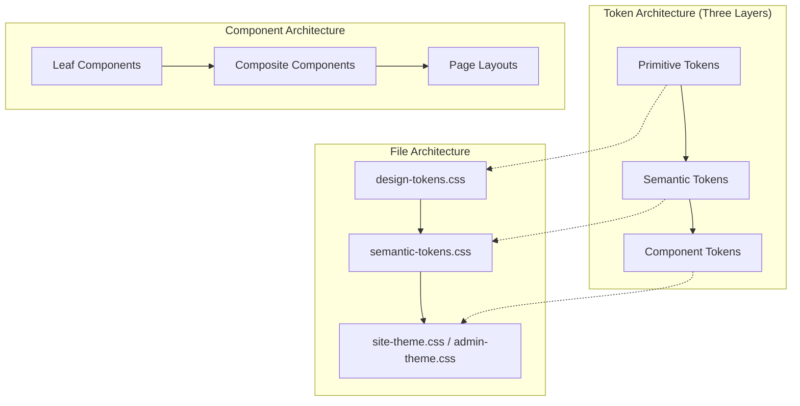
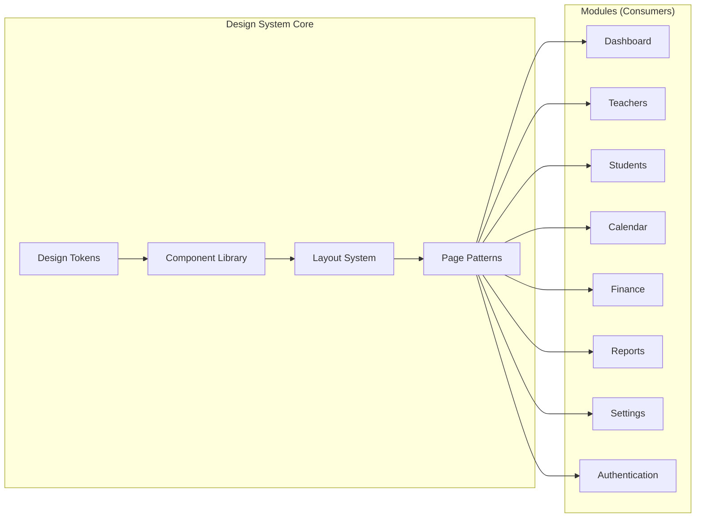
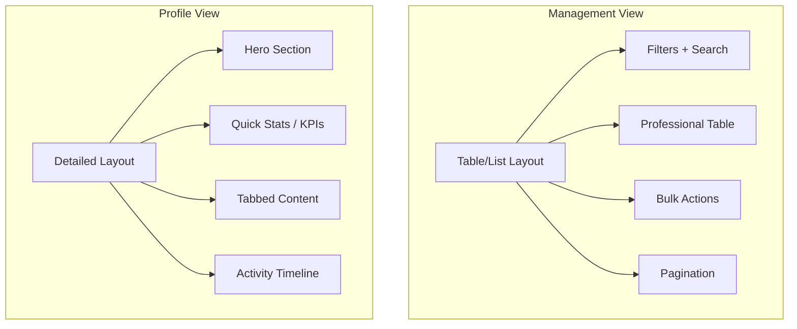
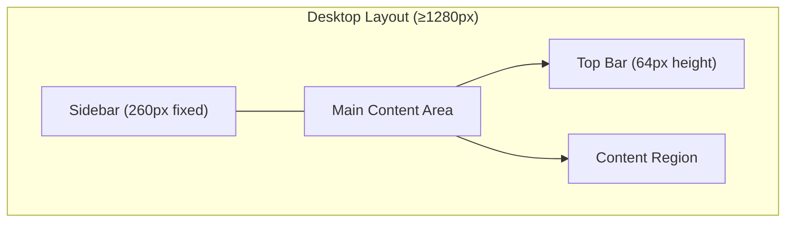
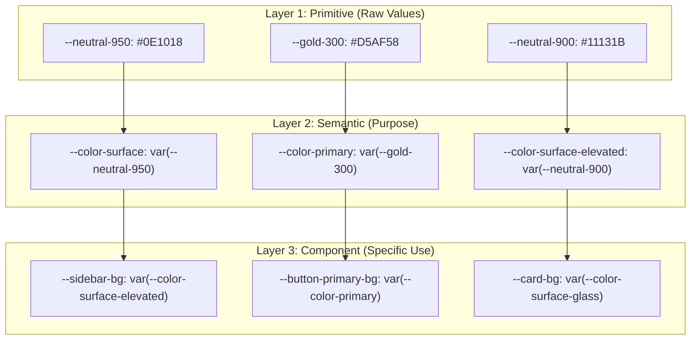
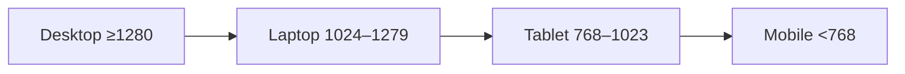

# Design Document: Apple Design System — Parsian Music Academy

## Overview

This document is the **single source of truth** for the visual language, interaction patterns, and architectural foundation of the Parsian Music Academy admin panel. It formalizes every design decision into a reusable, token-driven system that ensures visual consistency across all current and future modules (Dashboard, Teachers, Students, Calendar, Finance, Reports, Settings, Authentication).

The design philosophy is Apple-inspired — premium, calm, minimal, and information-dense — delivering a native macOS application feel within the browser. Every surface, animation, and interaction must communicate luxury and professionalism while remaining functionally dense for academy administrators.

This is an **architectural specification only**. It documents the design language and UI architecture. It does NOT contain implementation code, Blade templates, or Tailwind utility classes.

---

## Architecture

### System Layers



### Module Architecture



### Two View Patterns Per Module

Every module implements exactly two view patterns:



---

## 1. Design Principles

### Core Philosophy

| Principle | Description | Anti-Pattern |
|-----------|-------------|--------------|
| Apple-Inspired | Native macOS feel, not a website | Generic Bootstrap admin |
| Premium | Every pixel communicates quality | Cheap gradients, stock patterns |
| Calm | Low-contrast, warm, restful surfaces | Bright colors, high saturation |
| Minimal | Only essential UI elements visible | Cluttered toolbars, excessive chrome |
| Information-Dense | Maximum data in minimum space | Wasteful whitespace, oversized cards |
| Luxury | Gold accents, glass surfaces, soft shadows | Flat design without depth |
| Professional | Functional density for power users | Toy-like interfaces |

### Music Academy Identity

The design system carries the academy's identity through:
- **Warm gold** as the sole accent color (musical instrument warmth)
- **Dark cinematic backgrounds** (concert hall atmosphere)
- **Glass surfaces** (premium instrument display cases)
- **Soft, elegant motion** (musical tempo — never jarring)
- **Typography hierarchy** (sheet music clarity)

### Reference Applications

| Reference | What We Take | What We Reject |
|-----------|--------------|----------------|
| Linear | Information density, keyboard shortcuts, speed | Cold blue aesthetic |
| Notion | Clean typography, content-first layout | Over-simplification |
| Apple Settings | Section grouping, toggle patterns, sidebar nav | Light theme |
| macOS Finder | Sidebar navigation, file browser patterns | File system metaphor |

### Design Commandments

1. No component may visually touch another component
2. Gold is accent only — never a large surface
3. Glass must remain subtle — avoid exaggerated glassmorphism
4. Animations feel native to macOS — no flashy/bouncy motion
5. Every interactive element has visible keyboard focus
6. RTL-first — design for Persian, adapt for LTR
7. Desktop-first — the admin panel is primarily used on desktop
8. All values from tokens — zero magic numbers

---

## 2. Layout System

### Grid Foundation

| Property | Value | Token |
|----------|-------|-------|
| Base unit | 8px | `--space-1` |
| Column grid | 12 columns | — |
| Gutter | 16px (mobile) / 24px (desktop) | `--space-2` / `--space-3` |
| Content max-width | 1536px | `--container-xl` |

### Responsive Breakpoints

| Name | Range | Token | Columns | Gutter |
|------|-------|-------|---------|--------|
| Mobile | < 768px | — | 4 | 16px |
| Tablet | 768–1023px | `--container-sm` | 8 | 20px |
| Laptop | 1024–1279px | `--container-md` | 12 | 24px |
| Desktop | ≥ 1280px | `--container-lg` | 12 | 24px |

Test widths: 390, 430, 768, 1024, 1366, 1600, 1920

### Admin Panel Layout Structure



| Region | Spec |
|--------|------|
| Sidebar | Fixed 260px width, full viewport height, macOS Finder style |
| Top Bar | 64px height, sticky, contains search + notifications + profile |
| Content Area | Fluid, fills remaining width, scrollable |
| Content Padding | 24px on desktop, 16px on mobile |
| Panel Spacing | 16–24px gap between panels |
| Card Spacing | Minimum 16px gap — no touching allowed |
| Section Spacing | 32px between major sections |
| Internal Padding | 20–24px within cards/panels |

### Sidebar (macOS Finder-Inspired)

| Property | Value |
|----------|-------|
| Width | 260px (desktop), collapsed 64px (laptop), drawer (mobile) |
| Background | `--neutral-900` with subtle glass |
| Border-right | `--glass-border-light` |
| Item height | 40px |
| Item padding-inline | 16px |
| Item radius | `--radius-xs` (8px) |
| Active item | Gold text + subtle gold background (8% opacity) |
| Hover | Surface elevation shift |
| Section headers | Uppercase, `--text-xs`, `--text-secondary`, 24px margin-top |
| Icon size | `--icon-sm` (20px) |
| Transition | `--duration-fast` with `--ease-standard` |

### Top Bar

| Property | Value |
|----------|-------|
| Height | 64px |
| Background | `--neutral-950` with glass blur |
| Position | Sticky top: 0 |
| Border-bottom | `--glass-border-light` |
| Z-index | `--z-sticky` (20) |
| Elements | Search input, Notification bell, Profile avatar, Quick actions |
| Search width | 320px max |

### Vertical Rhythm

All vertical spacing follows the 8px grid:
- Between label and input: 8px (`--space-1`)
- Between form fields: 16px (`--space-2`)
- Between card sections: 16px (`--space-2`)
- Between cards: 16–24px (`--space-2` to `--space-3`)
- Between page sections: 32px (`--space-4`)
- Page top padding: 24px (`--space-3`)

---

## 3. Color System (Design Tokens)

### Three-Layer Token Architecture



### Primitive Color Tokens

| Token | Value | Usage |
|-------|-------|-------|
| `--gold-100` | #F8E7B5 | Lightest gold, hover states |
| `--gold-200` | #F4D28B | Light gold, button gradient top |
| `--gold-300` | #D5AF58 | **Primary accent**, borders, active states |
| `--gold-400` | #B98D36 | Dark gold, pressed states |
| `--neutral-950` | #0E1018 | Page background (deepest) |
| `--neutral-900` | #11131B | Elevated surfaces |
| `--neutral-850` | #1C2230 | Cards, panels |
| `--text-primary` | #FFFFFF | Headings, primary content |
| `--text-secondary` | #CFC7B2 | Warm muted text |
| `--text-tertiary` | rgba(255,255,255,0.70) | Placeholder, disabled |
| `--success-500` | #10B981 | Success states |
| `--error-500` | #EF4444 | Error states |
| `--warning-500` | #F59E0B | Warning states |
| `--info-500` | #3B82F6 | Informational states |

### Semantic Color Tokens

| Token | Maps To | Purpose |
|-------|---------|---------|
| `--color-primary` | `--gold-300` | Primary brand/accent |
| `--color-primary-hover` | `--gold-200` | Primary hover |
| `--color-primary-active` | `--gold-400` | Primary pressed |
| `--color-surface` | `--neutral-950` | Page background |
| `--color-surface-elevated` | `--neutral-900` | Raised panels |
| `--color-surface-glass` | `--glass-bg` | Glass panels |
| `--color-border` | `--glass-border` | Default borders |
| `--color-border-light` | `--glass-border-light` | Subtle borders |
| `--color-border-focus` | `--gold-300` | Focus ring color |
| `--color-text` | `--text-primary` | Primary text |
| `--color-text-muted` | `--text-secondary` | Secondary text |
| `--color-text-disabled` | `--text-tertiary` | Disabled text |

### Glass Effect Tokens

| Token | Value | Purpose |
|-------|-------|---------|
| `--glass-bg` | rgba(10,12,18,0.42) | Standard glass background |
| `--glass-bg-panel` | rgba(10,12,18,0.25) | Lighter glass for panels |
| `--glass-overlay` | rgba(0,0,0,0.45) | Modal/drawer overlay |
| `--glass-blur` | 32px | Full blur effect |
| `--glass-blur-light` | 16px | Subtle blur |
| `--glass-border` | rgba(213,175,88,0.18) | Golden glass border |
| `--glass-border-light` | rgba(213,175,88,0.12) | Subtle golden border |

### Color Usage Rules

1. **Background hierarchy**: `--neutral-950` → `--neutral-900` → `--neutral-850` (deeper = further back)
2. **Gold usage**: Accent borders, active states, primary buttons, icons — never large surfaces
3. **Glass usage**: Overlays, elevated cards, modals — always with border for edge definition
4. **Text contrast**: Primary text on any surface must meet WCAG AA (4.5:1 minimum)
5. **Status colors**: Used only in badges, alerts, and status indicators — never as decorative
6. **Opacity layering**: Glass surfaces stack; opacity values are calibrated for 2-3 layer maximum

---

## 4. Typography

### Font Family

| Property | Value |
|----------|-------|
| Primary font | Vazirmatn |
| Weights available | Light (300), Regular (400), Medium (500), SemiBold (600), Bold (700) |
| Fallback | system-ui, -apple-system, sans-serif |
| Loading strategy | `font-display: swap` with `preconnect` |
| Direction | RTL (Persian-first) |

### Type Scale

| Level | Size Token | Size | Weight | Line Height | Letter Spacing | Usage |
|-------|-----------|------|--------|-------------|---------------|-------|
| Display | — | 48px | Bold (700) | 1.1 | -0.02em | Dashboard hero numbers |
| H1 | `--text-4xl` | 40px | Bold (700) | 1.2 | -0.01em | Page title |
| H2 | `--text-3xl` | 32px | SemiBold (600) | 1.25 | -0.01em | Section headers |
| H3 | `--text-2xl` | 26px | SemiBold (600) | 1.3 | 0 | Card headers |
| H4 | `--text-xl` | 22px | Medium (500) | 1.35 | 0 | Sub-section headers |
| H5 | `--text-lg` | 18px | Medium (500) | 1.4 | 0 | Panel titles |
| H6 | `--text-md` | 16px | Medium (500) | 1.4 | 0 | Group labels |
| Subtitle | `--text-base` | 15px | Regular (400) | 1.5 | 0 | Descriptions below headings |
| Body | `--text-base` | 15px | Regular (400) | 1.6 | 0 | Paragraph text |
| Body Small | `--text-sm` | 13px | Regular (400) | 1.5 | 0 | Table cells, metadata |
| Caption | `--text-xs` | 12px | Regular (400) | 1.4 | 0.01em | Timestamps, help text |
| Label | `--text-sm` | 13px | Medium (500) | 1.3 | 0.01em | Form labels, column headers |

### Typography Rules

1. **Hierarchy clarity**: Every page section must have clear heading → subtitle → body flow
2. **Weight progression**: Headings bold/semibold → Labels medium → Body regular → Captions regular
3. **Color progression**: Heading = `--text-primary`, Subtitle = `--text-secondary`, Help text = `--text-tertiary`
4. **RTL numeral display**: Persian digits for dates/labels; Western digits for data values
5. **Responsive scaling**: Use `clamp()` for Display and H1 levels on smaller viewports
6. **Maximum line length**: Body text should not exceed 72ch for comfortable reading
7. **Heading spacing**: Headings have `margin-bottom` 8px to their subtitle/content

---

## 5. Glass & Elevation System

### Elevation Levels

| Level | Use Case | Background | Blur | Border | Shadow Token |
|-------|----------|------------|------|--------|-------------|
| Level 0 | Page background | `--neutral-950` solid | None | None | `--shadow-none` |
| Level 1 | Sidebar, Content area | `--neutral-900` solid | None | `--glass-border-light` | `--shadow-sm` |
| Level 2 | Cards, Panels | `--neutral-850` or `--glass-bg` | `--glass-blur-light` | `--glass-border` | `--shadow-md` |
| Level 3 | Dropdowns, Popovers | `--glass-bg` | `--glass-blur` | `--glass-border` | `--shadow-lg` |
| Level 4 | Modals, Drawers | `--glass-bg` | `--glass-blur` | `--glass-border` | `--shadow-xl` |
| Level 5 | Toast notifications | `--glass-bg` | `--glass-blur` | `--glass-border` | `--shadow-xl` |

### Border Radius Scale

| Token | Value | Usage |
|-------|-------|-------|
| `--radius-xs` | 8px | Buttons (small), badges, chips, inputs |
| `--radius-sm` | 12px | Buttons (standard), dropdowns |
| `--radius-md` | 18px | Cards, panels |
| `--radius-lg` | 28px | Large cards, sections |
| `--radius-xl` | 40px | Hero elements, large panels |
| `--radius-full` | 50% | Avatars, circular buttons |

### Shadow Scale

| Token | Value | Usage |
|-------|-------|-------|
| `--shadow-none` | none | Flat elements |
| `--shadow-sm` | 0 2px 8px rgba(0,0,0,0.15) | Subtle lift (sidebar items) |
| `--shadow-md` | 0 10px 30px rgba(0,0,0,0.25) | Cards at rest |
| `--shadow-lg` | 0 20px 60px rgba(0,0,0,0.35) | Elevated panels |
| `--shadow-xl` | 0 40px 120px rgba(0,0,0,0.45) | Modals, drawers |
| `--shadow-button` | 0 10px 30px rgba(213,175,88,0.35) | Primary button glow |
| `--shadow-button-hover` | 0 14px 40px rgba(213,175,88,0.5) | Button hover glow |
| `--shadow-input-focus` | 0 0 0 4px rgba(213,175,88,0.12) | Focus ring shadow |

### Glass Rules

1. Glass is **always subtle** — never exaggerated glassmorphism
2. Glass surfaces must have a defined border for edge clarity
3. Maximum 3 glass layers stacked (beyond that, opacity becomes unreadable)
4. Blur is performance-expensive: use `--glass-blur-light` (16px) for frequently-rendered items
5. Full blur (`--glass-blur` 32px) reserved for modals and overlays
6. `prefers-reduced-motion: reduce` disables blur and increases opacity for accessibility
7. Glass backgrounds use cool-tinted black (rgba(10,12,18)) not pure black

---

## 6. Motion System

### Duration Tokens

| Token | Value | Usage |
|-------|-------|-------|
| `--duration-instant` | 100ms | Tooltip show, icon color change |
| `--duration-fast` | 200ms | Button hover, toggle, focus ring |
| `--duration-normal` | 300ms | Dropdown open, tab switch, panel expand |
| `--duration-slow` | 500ms | Modal enter, drawer slide, page transition |
| `--duration-slower` | 800ms | Complex entrance animations |

### Easing Curves

| Token | Value | Usage |
|-------|-------|-------|
| `--ease-standard` | cubic-bezier(0.22, 1, 0.36, 1) | Default for all transitions |
| `--ease-enter` | cubic-bezier(0, 0, 0.2, 1) | Elements entering view |
| `--ease-exit` | cubic-bezier(0.4, 0, 1, 1) | Elements leaving view |
| `--ease-bounce` | cubic-bezier(0.68, -0.55, 0.265, 1.55) | **Never use** (exists for edge cases only) |

### Interaction States

| State | Visual Change | Duration | Properties Changed |
|-------|--------------|----------|-------------------|
| Hover | Background shift, subtle glow | `--duration-fast` | `background-color`, `box-shadow`, `opacity` |
| Focus | Gold focus ring (4px spread) | `--duration-instant` | `box-shadow` |
| Active/Pressed | Scale down 0.97, darken | `--duration-instant` | `transform`, `opacity` |
| Disabled | 40% opacity, no pointer events | — | `opacity`, `cursor` |
| Loading | Pulse animation or spinner | `--duration-slow` | `opacity` (pulse) |

### Motion Rules

1. Only animate `transform` and `opacity` — GPU-composited properties only
2. Never animate `width`, `height`, `top`, `left`, `margin`, `padding`
3. Hover effects: color/opacity/glow/shadow only — **no layout jump**
4. All transitions on specific properties, never `transition: all`
5. `prefers-reduced-motion: reduce` removes all motion except instant feedback
6. Entrance animations: fade-in + subtle translateY (8px max)
7. No autoplay animations or infinite loops
8. Standard motion feels like macOS — slow, elegant, purposeful

---

## Components and Interfaces

The design system defines a complete library of reusable UI components. Each component is specified with its visual properties, interaction states, and accessibility requirements. Components are organized by complexity: Leaf (atomic) → Composite → Page-level patterns.

### 7. Component Library

##### 7.1 Buttons

| Variant | Background | Text | Border | Shadow | Use Case |
|---------|-----------|------|--------|--------|----------|
| Primary (Gold) | Linear gradient `--gold-200` → `--gold-300` | Dark (`#14100a`) | None | `--shadow-button` | Primary CTA |
| Secondary | Transparent | `--gold-300` | 1px `--gold-300` | None | Secondary actions |
| Ghost | Transparent | `--text-secondary` | None | None | Tertiary/cancel |
| Glass | `--glass-bg` | `--text-primary` | `--glass-border` | None | Contextual actions |
| Danger | `--error-bg` | `--error-500` | 1px `--error-500` at 30% | None | Destructive actions |

**Button Specs:**
- Height: 40px (small), 44px (medium/default), 52px (large)
- Padding inline: 16px (small), 20px (medium), 24px (large)
- Radius: `--radius-sm` (12px)
- Font: `--text-sm` Medium (small), `--text-base` Medium (medium/large)
- Icon + text gap: 8px
- Min touch target: 44×44px
- Focus ring: `--shadow-input-focus`
- Disabled: 40% opacity, no pointer events
- Hover (Primary): `--shadow-button-hover`, brightness increase
- Hover (Secondary): Background `--gold-300` at 8% opacity
- Hover (Ghost): Background `--neutral-850` at 50% opacity

##### 7.2 Inputs & Form Controls

**Text Input / Textarea:**

| Property | Value |
|----------|-------|
| Height | 44px (input), auto (textarea) |
| Background | `--color-input-bg` (rgba(255,255,255,0.06)) |
| Border | 1px `--color-input-border` |
| Border (focus) | 1px `--color-border-focus` + `--shadow-input-focus` |
| Border (error) | 1px `--error-500` |
| Radius | `--radius-xs` (8px) |
| Padding | 12px 16px |
| Font | `--text-base` Regular |
| Placeholder | `--text-tertiary` |
| Label | Above input, `--text-sm` Medium, 8px margin-bottom |

**Select:**
- Same dimensions as text input
- Chevron icon (Lucide `chevron-down`) on inline-start (RTL)
- Dropdown: Elevation Level 3, max-height 280px, scrollable

**Checkbox & Radio:**
- Size: 20×20px
- Border: 1.5px `--glass-border`
- Checked: `--gold-300` fill (checkbox) / dot (radio)
- Radius: 4px (checkbox), 50% (radio)
- Label gap: 8px

**Toggle (Switch):**
- Width: 44px, Height: 24px
- Track: `--neutral-850` (off), `--gold-300` (on)
- Thumb: 20px circle, white
- Transition: `--duration-fast` `--ease-standard`

##### 7.3 Cards

| Variant | Background | Border | Radius | Shadow | Padding |
|---------|-----------|--------|--------|--------|---------|
| Glass Card | `--glass-bg` + blur | `--glass-border` | `--radius-md` (18px) | `--shadow-md` | 20–24px |
| Information Card | `--neutral-850` | `--glass-border-light` | `--radius-md` | `--shadow-sm` | 20px |
| Premium Card | `--glass-bg` + blur | `--glass-border` (brighter) | `--radius-md` | `--shadow-lg` | 24px |
| KPI Card | `--neutral-850` | `--glass-border-light` | `--radius-sm` (12px) | `--shadow-sm` | 16–20px |

**Card Rules:**
- No card may touch another card — minimum 16px gap
- Card headers: `--text-lg` Medium, `--text-primary`
- Card subtitles: `--text-sm` Regular, `--text-secondary`
- Card internal sections separated by `--glass-border-light` divider

##### 7.4 Tables

**Professional Table:**

| Property | Value |
|----------|-------|
| Container | `--radius-md`, overflow hidden |
| Header row | `--neutral-850`, `--text-sm` Medium, `--text-secondary` |
| Body rows | Transparent, `--text-base` Regular |
| Row hover | `--neutral-850` at 40% opacity |
| Row divider | 1px `--glass-border-light` |
| Cell padding | 12px 16px |
| Actions column | Ghost buttons, icon-only |
| Sort indicator | Lucide arrow icons, `--gold-300` when active |

**Schedule Table:**
- Weekly grid layout (7 columns)
- Color-coded class types via left border (4px)
- Responsive: collapses to cards on mobile
- Time slots as rows, days as columns

##### 7.5 Tabs

| Property | Value |
|----------|-------|
| Style | Underline (not boxed) |
| Inactive tab | `--text-secondary`, no border |
| Active tab | `--gold-300` text, 2px bottom border `--gold-300` |
| Hover | `--text-primary` |
| Tab height | 44px |
| Gap between tabs | 24px |
| Font | `--text-sm` Medium |
| Transition | `--duration-fast` on color and border |

##### 7.6 Badges & Chips

**Badges:**

| Variant | Background | Text | Border | Use |
|---------|-----------|------|--------|-----|
| Experience | Transparent | `--gold-300` | 1px `--gold-300` | Years, achievements |
| Level | `--success-bg` | `--success-500` | None | Skill levels |
| Featured | `--gold-300` at 15% | `--gold-300` | None | Highlighted items |
| Status (Active) | `--success-bg` | `--success-500` | None | Active states |
| Status (Inactive) | `--error-bg` | `--error-500` | None | Inactive states |
| Status (Pending) | `--warning-bg` | `--warning-500` | None | Pending states |

- Size: padding 4px 10px, `--text-xs`, `--radius-xs`
- Font weight: Medium (500)

**Chips:**

| Variant | Background | Border | Use |
|---------|-----------|--------|-----|
| Instrument | `--glass-bg` | `--glass-border-light` | Instrument tags |
| Genre | `--glass-bg` | `--glass-border-light` | Genre tags |
| Filter | `--neutral-850` | `--glass-border` | Active filters |
| Removable | Same + close icon | Same | User-removable tags |

- Layout: `inline-flex`, `align-items: center`
- Size: padding 6px 12px, `--text-sm`
- Radius: `--radius-xs` (8px)
- Gap between chips: 8px
- Wrap: auto-wrap in flex container

##### 7.7 Dropdown

| Property | Value |
|----------|-------|
| Trigger | Button (any variant) with chevron |
| Panel background | `--glass-bg` with `--glass-blur` |
| Panel border | `--glass-border` |
| Panel radius | `--radius-sm` (12px) |
| Panel shadow | `--shadow-lg` |
| Item height | 36px |
| Item padding | 8px 12px |
| Item hover | `--neutral-850` at 60% |
| Item active | `--gold-300` text |
| Separator | 1px `--glass-border-light`, 4px margin block |
| Max height | 320px, scrollable |
| Animation | Scale from 0.95 + fade, `--duration-normal` `--ease-enter` |

##### 7.8 Modal

| Property | Value |
|----------|-------|
| Overlay | `--glass-overlay` (rgba(0,0,0,0.45)) |
| Background | `--neutral-900` with `--glass-blur` |
| Border | `--glass-border` |
| Radius | `--radius-lg` (28px) |
| Shadow | `--shadow-xl` |
| Width | 480px (small), 640px (medium), 860px (large) |
| Max height | 85vh, scrollable body |
| Padding | 32px |
| Header | Title `--text-xl` SemiBold + close button |
| Footer | Action buttons aligned to inline-end |
| Animation | Fade + scale from 0.95, `--duration-normal` |
| Z-index | `--z-modal` (50) |
| Accessibility | `role="dialog"`, `aria-modal="true"`, focus trap, ESC close |

##### 7.9 Drawer

| Property | Value |
|----------|-------|
| Direction | Inline-end (right in RTL) |
| Width | 400px (default), 600px (wide) |
| Background | `--neutral-900` |
| Border-inline-start | `--glass-border` |
| Shadow | `--shadow-xl` |
| Animation | Slide from inline-end, `--duration-normal` `--ease-standard` |
| Overlay | Same as modal |
| Header | Title + close button, border-bottom |
| Z-index | `--z-modal` (50) |
| Accessibility | Same as modal (focus trap, ESC, aria) |

##### 7.10 Toast / Notification

| Property | Value |
|----------|-------|
| Position | Top-center (16px from top) |
| Background | `--glass-bg` with `--glass-blur` |
| Border | `--glass-border` |
| Radius | `--radius-sm` (12px) |
| Shadow | `--shadow-lg` |
| Width | 360px max |
| Padding | 12px 16px |
| Icon | Status-colored (success/error/warning/info) |
| Duration | 5000ms auto-dismiss, pausable on hover |
| Animation | Slide down + fade, `--duration-normal` |
| Z-index | `--z-toast` (70) |
| Stack | Maximum 3 visible, 8px gap between |

##### 7.11 Tooltip

| Property | Value |
|----------|-------|
| Background | `--neutral-850` |
| Text | `--text-primary`, `--text-xs` |
| Padding | 6px 10px |
| Radius | `--radius-xs` (8px) |
| Shadow | `--shadow-sm` |
| Delay | 300ms show, 100ms hide |
| Animation | Fade, `--duration-instant` |
| Arrow | 6px triangle matching background |
| Max width | 240px |
| Z-index | `--z-popover` (60) |

##### 7.12 Avatar

| Size | Dimensions | Radius | Font (Fallback) | Use |
|------|-----------|--------|-----------------|-----|
| XS | 24×24px | `--radius-full` | `--text-xs` | Inline mentions |
| SM | 32×32px | `--radius-full` | `--text-sm` | Table rows, lists |
| MD | 40×40px | `--radius-full` | `--text-base` | Top bar, cards |
| LG | 56×56px | `--radius-full` | `--text-lg` | Profile headers |
| XL | 80×80px | `--radius-full` | `--text-2xl` | Hero sections |

- Fallback: Initials on `--neutral-850` with `--gold-300` text
- Border: 2px `--glass-border` (optional, for profile emphasis)
- Status indicator: 10px circle, positioned bottom-right
- Group: Overlap -8px, z-index ascending, max 4 shown + count

##### 7.13 Timeline (Apple Health Style)

| Property | Value |
|----------|-------|
| Orientation | Vertical |
| Line | 2px `--glass-border-light`, inline-start aligned |
| Node | 12px circle, `--gold-300` (active) or `--neutral-850` (past) |
| Card | Glass Card variant, connected to node via horizontal line |
| Spacing | 24px between events |
| Date | `--text-xs` Caption, `--text-secondary`, positioned above card |
| Content | `--text-sm` Body, `--text-primary` |
| Animation | Staggered fade-in on scroll (entrance only) |

##### 7.14 KPI Card

| Property | Value |
|----------|-------|
| Background | `--neutral-850` |
| Border | `--glass-border-light` |
| Radius | `--radius-sm` (12px) |
| Padding | 16–20px |
| Icon | 32px, `--gold-300`, top-right corner |
| Label | `--text-xs` Regular, `--text-secondary` |
| Value | `--text-2xl` Bold, `--text-primary` |
| Trend | `--text-xs`, colored (green up / red down) with arrow icon |
| Layout | Icon top-right, Label → Value → Trend stacked |

##### 7.15 Empty State

| Property | Value |
|----------|-------|
| Illustration | Lucide icon (64px), `--text-tertiary` |
| Title | `--text-lg` Medium, `--text-primary` |
| Description | `--text-base` Regular, `--text-secondary`, max 320px |
| Action | Primary or Secondary button |
| Container | Centered, padding 48px |

##### 7.16 Loading State / Skeleton

| Property | Value |
|----------|-------|
| Background | `--neutral-850` |
| Animation | Shimmer (linear-gradient sweep), `--duration-slower` |
| Radius | Matches target component |
| Text lines | Varying widths (100%, 80%, 60%) for natural look |
| Avoid | Large skeleton areas — show smaller granular blocks |

##### 7.17 Pagination

| Property | Value |
|----------|-------|
| Style | Numbered with prev/next arrows |
| Button size | 36×36px |
| Active page | `--gold-300` background, dark text |
| Inactive page | Transparent, `--text-secondary` |
| Hover | `--neutral-850` |
| Radius | `--radius-xs` (8px) |
| Gap | 4px between items |
| Ellipsis | "…" for large ranges |
| Info text | "صفحه X از Y" — `--text-sm`, `--text-secondary` |

##### 7.18 Breadcrumb

| Property | Value |
|----------|-------|
| Background | Transparent |
| Separator | Chevron (Lucide `chevron-left` for RTL) |
| Previous items | `--text-secondary`, clickable |
| Current item | `--gold-300`, not clickable |
| Font | `--text-sm` Regular |
| Gap | 8px between items |
| Chevron size | 14px, `--text-tertiary` |

##### 7.19 Divider

| Variant | Style |
|---------|-------|
| Gold | 1px solid `--glass-border`, subtle golden shimmer |
| Glass | 1px solid rgba(255,255,255,0.06) |
| Section | 1px with 32px margin-block |
| Inline | 1px with 16px margin-block |

---

### 8. Data Visualization

#### ApexCharts Styling

| Property | Value |
|----------|-------|
| Background | Transparent (inherits card bg) |
| Grid lines | rgba(255,255,255,0.06), dashed |
| Axis labels | `--text-xs`, `--text-secondary` |
| Tooltip | Glass style (blur + border + shadow) |
| Primary color | `--gold-300` |
| Secondary color | `--gold-200` |
| Area fill | `--gold-300` at 10% opacity gradient to transparent |
| Bar radius | 4px top corners |
| Line width | 2px |
| Point size | 4px (hover: 6px) |
| Legend | `--text-sm`, dot indicators 8px |
| Font family | Vazirmatn |

#### Chart Color Palette (Sequential)

1. `--gold-300` (#D5AF58) — Primary metric
2. `--gold-200` (#F4D28B) — Secondary metric
3. `--info-500` (#3B82F6) — Tertiary metric
4. `--success-500` (#10B981) — Positive metric
5. `--warning-500` (#F59E0B) — Caution metric

#### Progress Indicators

| Type | Style |
|------|-------|
| Linear progress | 4px height, `--radius-full`, `--gold-300` fill on `--neutral-850` track |
| Circular progress | SVG ring, 2px stroke, `--gold-300` |
| Step progress | Connected dots, `--gold-300` completed, `--neutral-850` pending |

#### FullCalendar Theming

| Property | Value |
|----------|-------|
| Background | Transparent |
| Header buttons | Ghost button style |
| Day cell border | `--glass-border-light` |
| Today highlight | `--gold-300` at 8% background |
| Event pill | `--radius-xs`, 2px left border colored by type |
| Event text | `--text-xs` |
| Time grid | rgba(255,255,255,0.04) alternating |
| Nav buttons | Lucide `chevron-right` / `chevron-left` |
| Toolbar | `--text-lg` Medium for month title |
| RTL | Full RTL support with logical properties |

#### Status Badges (Data Context)

| Status | Background | Text | Dot Color |
|--------|-----------|------|-----------|
| Active / فعال | `--success-bg` | `--success-500` | `--success-500` |
| Inactive / غیرفعال | `--error-bg` | `--error-500` | `--error-500` |
| Pending / در انتظار | `--warning-bg` | `--warning-500` | `--warning-500` |
| Draft / پیش‌نویس | rgba(255,255,255,0.08) | `--text-secondary` | `--text-tertiary` |
| Paid / پرداخت‌شده | `--success-bg` | `--success-500` | — |
| Overdue / معوقه | `--error-bg` | `--error-500` | — |
| Cancelled / لغوشده | rgba(255,255,255,0.08) | `--text-tertiary` | — |

---

### 9. Form Standards

#### Validation Patterns

```mermaid
stateDiagram-v2
    [*] --> Default
    Default --> Focused: Focus event
    Focused --> Validating: Blur / Submit
    Validating --> Valid: Passes validation
    Validating --> Invalid: Fails validation
    Valid --> Focused: Re-focus
    Invalid --> Focused: Re-focus
    Focused --> Default: Blur (no change)
```

#### Field States

| State | Border | Background | Helper Text | Icon |
|-------|--------|------------|-------------|------|
| Default | `--color-input-border` | `--color-input-bg` | None or hint | None |
| Focused | `--color-border-focus` | `--color-input-bg` | None | None |
| Valid | `--success-500` at 50% | `--color-input-bg` | Success message (green) | Check (green) |
| Invalid | `--error-500` | `--color-input-bg` | Error message (red) | Alert-circle (red) |
| Disabled | `--glass-border-light` | rgba(255,255,255,0.03) | None | None |
| Read-only | None | Transparent | None | None |

#### Form Layout Rules

1. Labels always above inputs (never inline for RTL consistency)
2. Required fields: asterisk (*) in `--error-500` after label text
3. Optional fields: "(اختیاری)" suffix in `--text-tertiary`
4. Helper text: Below input, `--text-xs`, `--text-secondary`
5. Error text: Below input, `--text-xs`, `--error-500`
6. Field spacing: 16px (`--space-2`) between fields
7. Section spacing: 32px (`--space-4`) between form sections
8. Submit button: Full-width on mobile, inline on desktop
9. Form max-width: 640px for single-column forms
10. Multi-column: 2 columns on desktop (≥1024px), single column below

#### Inline Validation Timing

- Validate on blur (not on every keystroke)
- Re-validate on input after first blur validation
- Show success only after previous error was corrected
- Clear error when field is re-focused and user starts typing

---

### 10. Accessibility

#### Keyboard Navigation

| Component | Keys | Behavior |
|-----------|------|----------|
| Buttons | Enter, Space | Activate |
| Links | Enter | Navigate |
| Tabs | Arrow Left/Right | Switch tabs |
| Dropdown | Arrow Up/Down, Enter, Escape | Navigate items, select, close |
| Modal | Tab (trapped), Escape | Navigate within, close |
| Table | Arrow keys | Navigate cells |
| Toggle | Space | Toggle state |
| Sidebar | Arrow Up/Down, Enter | Navigate items, expand/activate |

#### Focus Management

| Rule | Implementation |
|------|---------------|
| Focus visibility | Custom focus ring: `--shadow-input-focus` (gold glow) |
| Focus order | Logical DOM order, no tabindex > 0 |
| Focus trap | Modals and drawers trap focus (`@alpinejs/focus` x-trap) |
| Focus restoration | Return focus to trigger on modal/drawer close |
| Skip links | Hidden skip-to-content link at page top |

#### ARIA Patterns

| Component | ARIA Attributes |
|-----------|----------------|
| Sidebar nav | `role="navigation"`, `aria-current="page"` on active |
| Modal | `role="dialog"`, `aria-modal="true"`, `aria-labelledby` |
| Drawer | Same as modal |
| Tabs | `role="tablist"`, `role="tab"`, `role="tabpanel"`, `aria-selected` |
| Dropdown | `role="listbox"` or `role="menu"`, `aria-expanded` |
| Icon buttons | `aria-label` (descriptive text) |
| Toast | `role="alert"`, `aria-live="polite"` |
| Loading | `aria-busy="true"`, `aria-live="polite"` |
| Table | Proper `<th scope>`, `aria-sort` for sortable columns |
| Decorative | `aria-hidden="true"` on purely visual elements |

#### Color Contrast Requirements

| Element | Minimum Ratio | Standard |
|---------|--------------|----------|
| Body text on surface | 4.5:1 | WCAG AA |
| Large text (≥18px bold) on surface | 3:1 | WCAG AA |
| UI components (borders, icons) | 3:1 | WCAG AA |
| Focus indicators | 3:1 against adjacent colors | WCAG AA |
| Gold (#D5AF58) on neutral-950 (#0E1018) | ~8.2:1 | ✅ Passes |
| Text-secondary (#CFC7B2) on neutral-950 | ~9.5:1 | ✅ Passes |

#### Touch Targets

- Minimum interactive size: 44×44px (all breakpoints)
- On mobile: Ensure 44×44px even if visual element is smaller (padding/margin)
- Spacing between touch targets: minimum 8px

---

### 11. RTL Rules

#### Fundamental Approach

- **Persian-first**: All designs begin in RTL
- **Logical properties only**: Use `margin-inline`, `padding-inline`, `inset-inline`, `border-inline`
- Never use physical properties (`left`, `right`, `margin-left`, `margin-right`) for layout
- `dir="rtl"` and `lang="fa"` on `<html>` element

#### Layout Adaptations

| Concern | RTL Rule |
|---------|----------|
| Sidebar | Appears on inline-end (right side in RTL) |
| Text alignment | Start-aligned (right in RTL) |
| Icons with direction | Chevrons, arrows flip (use CSS logical or `transform: scaleX(-1)`) |
| Breadcrumb | Right-to-left flow, chevron-left separator |
| Tables | Column order follows reading direction |
| Forms | Labels and inputs RTL-aligned |
| Numbers | Western digits for data, Persian digits for labels/dates |
| Progress bars | Fill from inline-end (right) to inline-start (left) |
| Drawer | Slides from inline-end |
| Timeline | Line on inline-start (right side in RTL) |
| Calendar | RTL month navigation, Saturday start |
| Charts | X-axis right-to-left, Y-axis on inline-end |

#### RTL-Safe CSS Patterns

| Instead of | Use |
|-----------|-----|
| `margin-left` | `margin-inline-start` |
| `margin-right` | `margin-inline-end` |
| `padding-left` | `padding-inline-start` |
| `padding-right` | `padding-inline-end` |
| `left` | `inset-inline-start` |
| `right` | `inset-inline-end` |
| `text-align: left` | `text-align: start` |
| `text-align: right` | `text-align: end` |
| `border-left` | `border-inline-start` |
| `float: left` | `float: inline-start` |

#### Icon Flipping Rules

| Flip | Keep |
|------|------|
| Chevrons (navigation) | Search, Plus, Minus |
| Arrows (direction) | Settings gear, Star |
| Reply, Forward | Music notes |
| Logout, External link | Lock, Unlock |
| List indent | Calendar, Clock |

---

### 12. Responsive Rules

#### Desktop-First Approach

The admin panel targets desktop users primarily. Responsive adaptations work downward:



#### Layout Adaptations by Breakpoint

| Element | Desktop (≥1280) | Laptop (1024–1279) | Tablet (768–1023) | Mobile (<768) |
|---------|----------------|-------------------|-------------------|---------------|
| Sidebar | Full (260px) | Collapsed (64px, icons only) | Hidden (drawer) | Hidden (drawer) |
| Top bar | Full | Full | Compact | Compact + hamburger |
| Content grid | 12 columns | 12 columns | 8 columns | 4 columns |
| Cards | 3–4 per row | 2–3 per row | 2 per row | 1 per row (stacked) |
| Tables | Full table | Full table | Horizontal scroll | Card layout |
| KPI row | 4 cards inline | 4 cards inline | 2×2 grid | Stacked |
| Modal | Centered overlay | Centered overlay | Full width | Full screen |
| Tabs | Horizontal | Horizontal | Horizontal scroll | Horizontal scroll |
| Charts | Full width | Full width | Full width | Simplified |

#### Spacing Adaptations

| Token | Desktop | Tablet | Mobile |
|-------|---------|--------|--------|
| Page padding | 32px | 24px | 16px |
| Section gap | 32px | 24px | 20px |
| Card gap | 24px | 16px | 16px |
| Card padding | 24px | 20px | 16px |

#### Responsive Typography

| Level | Desktop | Mobile |
|-------|---------|--------|
| Display | 48px | 32px |
| H1 | 40px | 28px |
| H2 | 32px | 24px |
| H3 | 26px | 22px |
| Body | 15px | 14px |

#### Mobile-Specific Patterns

1. **Tables → Cards**: Rows become stacked cards with label:value pairs
2. **Sidebar → Drawer**: Full-width drawer from inline-end, overlay with backdrop
3. **Multi-column → Single**: All multi-column layouts collapse to single column
4. **Horizontal scroll**: Tabs and filter bars get horizontal scroll with fade edges
5. **Bottom actions**: Primary actions move to bottom sticky bar on mobile
6. **Touch-friendly**: All targets minimum 44×44px, increased spacing between targets

#### Test Widths (Mandatory)

| Width | Device Representation |
|-------|----------------------|
| 390px | iPhone 14 / small mobile |
| 430px | iPhone 14 Pro Max / large mobile |
| 768px | iPad Mini / small tablet |
| 1024px | iPad Pro / laptop start |
| 1366px | Common laptop |
| 1600px | Large laptop / small desktop |
| 1920px | Full HD desktop |

---

### 13. Iconography

#### Icon System: Lucide

| Property | Value |
|----------|-------|
| Library | Lucide (exclusively) |
| Default size | `--icon-md` (24px) |
| Stroke width | 1.5px (default), 2px (emphasized) |
| Corner radius | Rounded (Lucide default) |
| Color (default) | `--icon-default` (`--text-secondary`) |
| Color (active) | `--icon-active` (`--gold-300`) |
| Color (disabled) | `--icon-disabled` (rgba(255,255,255,0.3)) |

#### Icon Size Scale

| Token | Size | Usage |
|-------|------|-------|
| `--icon-xs` | 16px | Inline with small text, badges |
| `--icon-sm` | 20px | Sidebar items, small buttons |
| `--icon-md` | 24px | Standard buttons, nav items |
| `--icon-lg` | 32px | Card headers, feature icons |
| `--icon-xl` | 48px | Empty states, hero sections |

#### Icon Placement Rules

1. Icon-only buttons must have `aria-label`
2. Icon + text: Icon on inline-start, 8px gap
3. Icon in input: Positioned inline-end (e.g., search, password toggle)
4. Icon in badge: 14px, same color as text
5. Trailing icons (chevrons, arrows): Inline-end, auto margin
6. Status icons: Colored per status (success/error/warning), not gold

#### Prohibited

- No Font Awesome (project constraint)
- No inline SVG exceeding 20 lines
- No custom icon creation — Lucide only
- No mixing icon libraries

---

### 14. Design Tokens (Complete Catalog)

#### Token Naming Convention

```
--{category}-{property}-{variant}-{state}
```

Examples:
- `--color-primary` (category: color, property: primary)
- `--shadow-button-hover` (category: shadow, property: button, state: hover)
- `--radius-md` (category: radius, property: md)

#### Complete Token Reference

##### Colors

| Token | Value |
|-------|-------|
| `--gold-100` | #F8E7B5 |
| `--gold-200` | #F4D28B |
| `--gold-300` | #D5AF58 |
| `--gold-400` | #B98D36 |
| `--neutral-950` | #0E1018 |
| `--neutral-900` | #11131B |
| `--neutral-850` | #1C2230 |
| `--text-primary` | #FFFFFF |
| `--text-secondary` | #CFC7B2 |
| `--text-tertiary` | rgba(255,255,255,0.70) |
| `--success-500` | #10B981 |
| `--success-bg` | rgba(16,185,129,0.10) |
| `--error-500` | #EF4444 |
| `--error-bg` | rgba(239,68,68,0.10) |
| `--warning-500` | #F59E0B |
| `--warning-bg` | rgba(245,158,11,0.10) |
| `--info-500` | #3B82F6 |
| `--info-bg` | rgba(59,130,246,0.10) |

##### Radius

| Token | Value |
|-------|-------|
| `--radius-xs` | 8px |
| `--radius-sm` | 12px |
| `--radius-md` | 18px |
| `--radius-lg` | 28px |
| `--radius-xl` | 40px |
| `--radius-full` | 50% |

##### Spacing (8px Grid)

| Token | Value |
|-------|-------|
| `--space-1` | 8px |
| `--space-2` | 16px |
| `--space-3` | 24px |
| `--space-4` | 32px |
| `--space-5` | 40px |
| `--space-6` | 48px |
| `--space-8` | 64px |
| `--space-10` | 80px |
| `--space-12` | 96px |
| `--space-15` | 120px |
| `--space-page-mobile` | 16px |
| `--space-page-tablet` | 24px |
| `--space-page-desktop` | 32px |

##### Typography

| Token | Value |
|-------|-------|
| `--text-xs` | 12px |
| `--text-sm` | 13px |
| `--text-base` | 15px |
| `--text-md` | 16px |
| `--text-lg` | 18px |
| `--text-xl` | 22px |
| `--text-2xl` | 26px |
| `--text-3xl` | 32px |
| `--text-4xl` | 40px |

##### Shadows

| Token | Value |
|-------|-------|
| `--shadow-none` | none |
| `--shadow-sm` | 0 2px 8px rgba(0,0,0,0.15) |
| `--shadow-md` | 0 10px 30px rgba(0,0,0,0.25) |
| `--shadow-lg` | 0 20px 60px rgba(0,0,0,0.35) |
| `--shadow-xl` | 0 40px 120px rgba(0,0,0,0.45) |
| `--shadow-button` | 0 10px 30px rgba(213,175,88,0.35) |
| `--shadow-button-hover` | 0 14px 40px rgba(213,175,88,0.5) |
| `--shadow-input-focus` | 0 0 0 4px rgba(213,175,88,0.12) |
| `--shadow-social-hover` | 0 0 20px rgba(213,175,88,0.3) |
| `--glass-shadow` | 0 40px 120px rgba(0,0,0,0.45), inset 0 1px 0 rgba(255,255,255,0.06) |
| `--glass-shadow-panel` | 0 20px 60px rgba(0,0,0,0.35) |

##### Motion

| Token | Value |
|-------|-------|
| `--duration-instant` | 100ms |
| `--duration-fast` | 200ms |
| `--duration-normal` | 300ms |
| `--duration-slow` | 500ms |
| `--duration-slower` | 800ms |
| `--ease-standard` | cubic-bezier(0.22, 1, 0.36, 1) |
| `--ease-enter` | cubic-bezier(0, 0, 0.2, 1) |
| `--ease-exit` | cubic-bezier(0.4, 0, 1, 1) |
| `--ease-bounce` | cubic-bezier(0.68, -0.55, 0.265, 1.55) |

##### Z-Index

| Token | Value | Usage |
|-------|-------|-------|
| `--z-base` | 0 | Default stacking |
| `--z-dropdown` | 10 | Dropdown menus |
| `--z-sticky` | 20 | Sticky headers, top bar |
| `--z-fixed` | 30 | Fixed elements |
| `--z-modal-backdrop` | 40 | Modal/drawer overlay |
| `--z-modal` | 50 | Modal/drawer content |
| `--z-popover` | 60 | Popovers, tooltips |
| `--z-toast` | 70 | Toast notifications |

##### Icons

| Token | Value |
|-------|-------|
| `--icon-xs` | 16px |
| `--icon-sm` | 20px |
| `--icon-md` | 24px |
| `--icon-lg` | 32px |
| `--icon-xl` | 48px |
| `--icon-default` | var(--text-secondary) |
| `--icon-active` | var(--gold-300) |
| `--icon-disabled` | rgba(255,255,255,0.3) |

##### Layout

| Token | Value |
|-------|-------|
| `--container-xs` | 640px |
| `--container-sm` | 768px |
| `--container-md` | 1024px |
| `--container-lg` | 1280px |
| `--container-xl` | 1536px |

---

### 15. Future Compatibility

#### Module Coverage Matrix

This design system must support all of the following modules without modification:

| Module | Management View | Profile View | Special Patterns |
|--------|----------------|--------------|-----------------|
| Dashboard | — | — | KPI cards, Charts, Quick actions |
| Teachers | Professional Table | Hero + Tabs | Schedule table, Timeline |
| Students | Professional Table | Hero + Tabs | Progress indicators, Timeline |
| Courses | Professional Table | Detail card | Level badges, Pricing |
| Calendar | — | — | FullCalendar integration |
| Finance | Professional Table | Invoice detail | Status badges, Totals |
| Payments | Professional Table | Payment detail | Method badges, Due dates |
| Attendance | Schedule Table | — | Status toggles, Bulk actions |
| Reports | — | — | Charts, Export actions |
| Settings | Section groups | — | Toggle groups, Forms |
| Authentication | — | — | Glass card, Centered layout |
| Notifications | List view | — | Priority badges, Actions |

#### Extension Principles

1. **New component**: Must use existing tokens — no new color/spacing values without system approval
2. **New module**: Picks from Management View or Profile View patterns (or both)
3. **New variant**: Added to existing component spec, never creates parallel component
4. **New token**: Only primitive layer additions; semantic and component layers derive from primitives
5. **Theme override**: Future themes override semantic tokens only — primitives and components adapt automatically
6. **Third-party integration**: Styled via CSS overrides using design tokens (e.g., FullCalendar, ApexCharts)

#### Page Template Patterns

**Management View Template:**
```
┌──────────────────────────────────────────────┐
│ Page Header (Title + Actions)                │
├──────────────────────────────────────────────┤
│ Filters Bar (Search + Filter chips)          │
├──────────────────────────────────────────────┤
│ Professional Table                           │
│ ┌──────┬──────┬──────┬──────┬──────┐       │
│ │ Col  │ Col  │ Col  │ Col  │ Acts │       │
│ ├──────┼──────┼──────┼──────┼──────┤       │
│ │ Row  │ ...  │ ...  │ ...  │ ...  │       │
│ └──────┴──────┴──────┴──────┴──────┘       │
├──────────────────────────────────────────────┤
│ Pagination                                   │
└──────────────────────────────────────────────┘
```

**Profile View Template:**
```
┌──────────────────────────────────────────────┐
│ Hero (Avatar + Name + Status + Quick Stats)  │
├──────────────────────────────────────────────┤
│ KPI Cards Row (4 cards)                      │
├──────────────────────────────────────────────┤
│ Tabs                                         │
├──────────────────────────────────────────────┤
│ Tab Content (varies per tab)                 │
│ - Table / Cards / Timeline / Forms           │
└──────────────────────────────────────────────┘
```

---

## Data Models

### Design Token Data Model

| Field | Type | Description |
|-------|------|-------------|
| name | string | CSS custom property name (e.g., `--gold-300`) |
| value | string | Resolved CSS value |
| layer | enum | `primitive` / `semantic` / `component` |
| category | enum | `color` / `spacing` / `radius` / `shadow` / `motion` / `typography` / `z-index` / `icon` |

### Component Specification Model

| Field | Type | Description |
|-------|------|-------------|
| name | string | Component name (BEM block) |
| variants | array | List of visual variants |
| states | array | Interaction states (default, hover, focus, active, disabled, loading) |
| tokens_used | array | References to design tokens consumed |
| accessibility | object | ARIA attributes, keyboard behavior, focus management |
| responsive | object | Behavior at each breakpoint |
| rtl | object | RTL-specific adaptations |

### Module Page Model

| Field | Type | Description |
|-------|------|-------------|
| module | string | Module name (e.g., Teachers, Students) |
| management_view | object | Table/list view configuration |
| profile_view | object | Detail view configuration |
| components_used | array | Components consumed from the library |
| special_patterns | array | Module-specific patterns |

---

## Error Handling

### Error Display Patterns

| Context | Pattern | Behavior |
|---------|---------|----------|
| Form field | Inline error below field | Red border + message on blur/submit |
| Form submission | Toast notification | Error toast with summary |
| Page load failure | Empty state | Error illustration + retry button |
| Network error | Toast + inline | Toast notification + disabled state |
| 404 | Full page | Custom empty state with navigation |
| 403 | Full page | Access denied with back action |
| Server error (500) | Full page | Friendly message + retry |

### Error Message Rules

1. Messages in Persian, friendly tone
2. Describe what went wrong, not technical details
3. Suggest corrective action when possible
4. Never show stack traces or error codes to users
5. Error toasts auto-dismiss after 8000ms (longer than success)
6. Form errors persist until corrected

---

## Testing Strategy

### Visual Regression Testing

- Screenshot comparison at all 7 test widths
- Component states: default, hover, focus, active, disabled, loading, error
- RTL/LTR comparison for layout consistency
- Dark theme consistency (single theme, but verify token application)

### Property-Based Testing Approach

**Property Test Library**: fast-check (JavaScript)

Key properties to verify:
1. All tokens resolve to valid CSS values
2. Color contrast ratios meet WCAG AA thresholds
3. Spacing values are multiples of 8px base
4. No component exceeds its container width at any breakpoint
5. Focus order follows logical DOM order
6. All interactive elements have minimum 44×44px touch target

### Component Testing

- Each component renders correctly in isolation
- All variants produce visually distinct output
- State transitions animate correctly
- RTL mirror produces correct layout
- Accessibility audit passes for ARIA attributes

---

## Performance Considerations

### Rendering Budget

| Metric | Target |
|--------|--------|
| First Contentful Paint | < 1.5s |
| Largest Contentful Paint | < 2.5s |
| Cumulative Layout Shift | < 0.1 |
| First Input Delay | < 100ms |
| Total CSS size | < 50KB (gzipped) |

### Glass Effect Performance

- Limit `backdrop-filter: blur()` usage to maximum 3 simultaneous elements per viewport
- Disable blur on `prefers-reduced-motion: reduce`
- Use `will-change: transform` sparingly and only during animations
- Prefer solid `--neutral-850` for frequently-scrolled content; reserve glass for static overlays

### Token Performance

- CSS custom properties cascade efficiently — no runtime cost per usage
- Token file loaded once, cached by browser
- No JavaScript-based theming — pure CSS cascade
- Code-split component CSS with Vite when files exceed 500KB

---

## Security Considerations

### Content Security

- No inline styles in production Blade templates (CSP compatibility)
- No inline event handlers (`onclick`, `onmouseover`)
- SVG icons served as static assets, not inline (XSS prevention)
- User-generated content (names, notes) always escaped via `{{ }}`
- Image sources validated and served from trusted storage paths

### Authentication UI

- Login/register forms use Glass Card pattern (centered, premium feel)
- Password inputs include visibility toggle
- Rate limiting feedback shown via Toast (not inline error)
- Session timeout: Overlay modal with re-authentication option

---

## Dependencies

| Dependency | Version | Purpose | Required |
|-----------|---------|---------|----------|
| Tailwind CSS | ^3.x | Utility classes + configuration | Yes |
| Alpine.js | ^3.x | Interactive state management | Yes |
| @alpinejs/focus | ^3.x | Focus trap for modals/drawers | Yes |
| Lucide | Latest | Icon library | Yes |
| ApexCharts | ^3.x | Data visualization | Yes (charts) |
| FullCalendar | ^6.x | Calendar views | Yes (calendar) |
| Vazirmatn | Variable | Primary font | Yes |
| Vite | ^5.x | Build tool + HMR | Yes |

### Prohibited Dependencies

- Bootstrap (any version)
- jQuery
- Vue.js
- React
- Livewire
- Font Awesome
- Any additional icon library
- Any CSS framework beyond Tailwind

---

## Correctness Properties

### Property 1: Token Resolution Integrity
∀ token ∈ DesignTokens: token resolves to a valid CSS value (no undefined variable references in the cascade)

### Property 2: Token-Only Values
∀ component ∈ ComponentLibrary: component uses only tokens from the token catalog (no hardcoded hex, px, or raw values for color, spacing, radius, shadow, or z-index)

### Property 3: Color Contrast Compliance
∀ text element: contrast_ratio(text_color, background_color) ≥ 4.5:1 (WCAG AA for normal text) and ≥ 3:1 for large text and UI components

### Property 4: Touch Target Minimum
∀ interactive element at any breakpoint: clickable area dimensions ≥ 44×44px

### Property 5: Grid Alignment
∀ spacing value used in layout: value mod 8 = 0 (adheres to 8px base grid)

### Property 6: Component Separation
∀ adjacent component pair in the same container: visual gap ≥ 16px (no components may visually touch)

### Property 7: Glass Stack Depth
∀ glass surface composition: stack_depth ≤ 3 layers (maintains text readability)

### Property 8: GPU-Composited Animation
∀ CSS transition/animation: animated properties ∈ {transform, opacity} only (no layout-triggering properties)

### Property 9: Viewport Containment
∀ page at every breakpoint b ∈ {390, 430, 768, 1024, 1366, 1600, 1920}: no horizontal overflow occurs

### Property 10: Modal Accessibility
∀ modal/drawer component: implements focus trap AND ESC dismiss AND aria-modal="true" AND focus restoration on close

### Property 11: Icon Button Labeling
∀ button containing only an icon (no visible text): has aria-label attribute with descriptive text

### Property 12: Z-Index Token Usage
∀ z-index declaration in CSS: value references a z-index token from the scale (no raw numeric z-index values)
