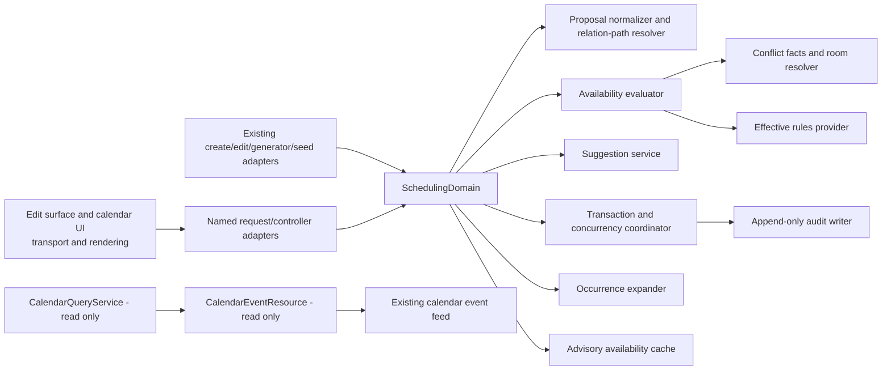

# Interactive Session Scheduling Design

## Overview

This design defines an additive, backend-authoritative Scheduling Domain for creating, editing, previewing, suggesting, recurring, and seeding `ClassSession` records. It preserves the approved calendar lifecycle: persisted `class_sessions` are read through `CalendarQueryService` → `CalendarEventResource` → the existing named event endpoint → the existing FullCalendar normalization and rendering path. Interactive scheduling adds command and decision contracts beside that lifecycle; it does not make the calendar feed a command, generator, reconciler, or candidate source.

### Research and design decisions

This revision was informed by the approved requirements and the completed [`calendar-persisted-session-projection` design](../calendar-persisted-session-projection/design.md). They establish that calendar membership is based only on persisted sessions, date membership is inclusive, approved filters are teacher/student/room, and stable event identity is `class_sessions.id` through every projection boundary. Accordingly, `CalendarQueryService` and `CalendarEventResource` are preserved, read-only components. They must not create sessions, expand recurrence, compute availability, alter IDs, or compensate for a count mismatch.

The requirements also identify existing session creation, editing, conflict, recurrence, room, policy, DTO/resource, and calendar seams. The proposed design gives one Scheduling Domain ownership of decisions while keeping existing public routes and service entry points as compatibility adapters. Exact persistence shape, dependency selections, migration identifiers/timestamps, cache retention, preview rate limits, search granularity, defaults, and performance targets remain implementation-planning decisions. They must be evidence-backed and approved before implementation; this design intentionally does not commit them prematurely.

### Scope and preservation

- **Additive only:** existing session, calendar, notes, room, list, drawer, RTL, responsive, and API/UI contracts remain compatible unless a later investigation records a controlled change and migration path.
- **Single owner:** all availability, conflict, rule, room, recurrence, override, suggestion, and mutation decisions belong to the Scheduling Domain, never Blade, JavaScript, controllers, or a second service.
- **Authoritative mutations:** form edit, drag/drop, resize, recurrence expansion, and Busy Seed construct the same transport-neutral proposal, receive the same decision model, and use one transaction coordinator.
- **Read-only calendar:** the existing feed remains a persisted-session projection. It discovers a new occurrence only after persistence and does zero scheduling writes on every read.
- **No task generation:** the conceptual impact inventory below is a design aid, not a task list or an instruction to modify any listed file.

## Architecture

Dependencies point inward: UI and transport adapters depend on domain contracts; compatibility adapters depend on `SchedulingDomain`; domain orchestration depends on interfaces/value objects; infrastructure implements those interfaces. Evaluation has no dependency on controller, Blade, JavaScript, or calendar projection classes. Mutation is the only component permitted to coordinate scheduling writes. The calendar query/resource path has no dependency on the Scheduling Domain command path.

### Architectural invariants

1. `SchedulingDomain` is the only decision owner; it may compose reusable facts from existing `ConflictDetectionService`, `RoomResolver`, and `RelationPathResolver`, but those services do not independently accept or reject a proposal.
2. A final mutation performs authoritative evaluation against locked current state; preview, suggestion, and cache data are advisory and cannot authorize a write.
3. Every accepted multi-record scheduling change commits session state, concurrency state, required resource-version changes, and one audit record together; any failure rolls all of them back.
4. Transport surfaces receive authorized DTO/resource data only. Blade provides structure and accessibility attributes; JavaScript orchestrates gestures, requests, rendering, pending state, cancellation, and rollback only.
5. The completed projection bugfix remains an independent, preserved specification and is not modified, replaced, or compensated for by this feature.

## Components and Interfaces

All names and paths in this section are **proposed implementation locations**, not generated work items. Existing class names/paths are preserved unless the investigation record demonstrates a compatible boundary change. Public interfaces describe responsibilities and inputs/outputs rather than framework-specific method signatures.

### Domain decision components

| Proposed class and location | Responsibility | Public interface: inputs → outputs | Dependencies and direction |
|---|---|---|---|
| `app/Domain/Scheduling/SchedulingDomain.php` | Single transport-neutral façade for evaluate, preview, suggest, mutate, expand, and seed decisions. | `ScheduleProposal` plus actor/context → `AvailabilityResult`, `SuggestionSet`, `ScheduleMutationResult`, or `OccurrenceExpansionResult`. | Depends inward on normalizer, authorization, evaluator, suggestion service, mutation coordinator, recurrence expander, and domain value objects. No UI/transport dependency. |
| `app/Domain/Scheduling/ScheduleProposalNormalizer.php` | Validates and canonicalizes mutable scheduling intent, timezone, relation path, protected fields, and source. | Untrusted validated request/legacy input + actor scope → immutable `ScheduleProposal` or field errors. | Depends on relation-path facts and effective rules; never writes. |
| `app/Domain/Scheduling/AvailabilityEvaluator.php` | Produces the sole availability decision from current facts. | `ScheduleProposal` + `SchedulingFacts` + `EffectiveSchedulingRules` → `AvailabilityResult`. | Depends on fact providers, rule evaluator, conflict classifier, and room suitability provider; never calls UI or persistence mutation. |
| `app/Domain/Scheduling/ConflictClassifier.php` | Classifies overlap/rule facts as hard, soft, or non-blocking and builds complete reports. | Normalized intervals/resources/statuses → immutable `ConflictReport` collection. | Depends on interval facts and policy catalog only. |
| `app/Domain/Scheduling/AcademyRulesProvider.php` | Resolves one effective, versioned academy rule set and validates proposed rule changes. | Academy identity/current version or rules input → `EffectiveSchedulingRules` or field errors. | Depends on rules repository; evaluation callers depend on it, never the reverse. |
| `app/Domain/Scheduling/RoomSuitabilityService.php` | Resolves requirement, capability, ownership, active-state, ordering, and room availability facts. | Proposal + authorized room facts → room decision/facts and ordered eligible rooms. | Depends on existing room resolver via a fact interface and repositories; does not mutate sessions. |
| `app/Domain/Scheduling/SchedulingAuthorization.php` | Resolves named policy/gate abilities and safe resource visibility before facts are disclosed. | Actor + academy/resource/action → authorized scope or denial. | Depends on `SessionPolicy`/authorization abstraction; invoked before exposed facts. |
| `app/Domain/Scheduling/SuggestionService.php` | Enumerates non-persisting, fully evaluated alternatives and applies deterministic ranking. | Conflicting `ScheduleProposal` + bounded search criteria → immutable `SuggestionSet`. | Depends on evaluator, room suitability, authorization, ranker; never mutation coordinator. |
| `app/Domain/Scheduling/SuggestionRanker.php` | Defines one deterministic ordering of evaluated candidates. | Available `ScheduleSuggestion` collection → ordered collection. | Pure value-object dependency only. |
| `app/Domain/Scheduling/SchedulingMutationCoordinator.php` | Owns transaction boundaries, current-state locking, optimistic version comparison, final evaluation, persistence coordination, and rollback. | Current `ScheduleProposal` + authorized actor → `ScheduleMutationResult` or controlled failure. | Depends on repositories/lock manager/evaluator/audit writer/version manager. It is the only domain write coordinator. |
| `app/Domain/Scheduling/SchedulingLockManager.php` | Acquires/retries deterministic resource/session locks for competing changes. | Affected resource identities + target session → lock scope or controlled lock failure. | Depends on persistence lock abstraction; called only by mutation/expansion paths. |
| `app/Domain/Scheduling/AvailabilityCache.php` | Builds complete advisory cache keys, validates freshness, coordinates bounded single-flight use, and emits safe metrics. | `AvailabilityCacheKey`/current versions → reusable result, miss, or unavailable state. | Depends on cache infrastructure only; evaluator can function without it; mutation bypasses it. |
| `app/Domain/Scheduling/ResourceVersionManager.php` | Reads and advances resource/rule/recurrence availability versions needed for cache safety. | Affected resource identities → version snapshot/update. | Depends on persistence; called within accepted transaction and invalidation flows. |
| `app/Domain/Scheduling/SessionAuditWriter.php` | Creates exactly one append-only audit snapshot for an accepted transition. | `AuditAppendCommand` → immutable audit identity/record. | Depends on audit repository; must be called inside mutation transaction, and its failure aborts that transaction. |
| `app/Domain/Scheduling/OccurrenceExpander.php` | Creates/reconciles eligible recurring occurrences with idempotent identity handling. | Recurring schedule + bounded expansion window → `OccurrenceExpansionResult`. | Depends on proposal normalizer, authorization, evaluator, mutation coordinator; never calendar feed. |
| `app/Domain/Scheduling/BusinessCodeOwner.php` | Allocates/backfills immutable teacher/student codes through one backend owner. | Create/backfill request + owner type → immutable `BusinessCode` or controlled allocation failure. | Depends on protected persistence/uniqueness boundary; scheduling proposals never write codes. |
| `app/Domain/Scheduling/BusySeedService.php` | Safely maps named, deterministic non-production fixture groups to canonical domain proposals. | Authorized environment/safety context + fixture selection → `BusySeedResult`. | Depends on `SchedulingDomain`; no direct session creation path. |

### Compatibility, transport, and presentation components

| Exact existing/proposed location | Responsibility | Public interface: inputs → outputs | Dependencies and direction |
|---|---|---|---|
| `app/Services/SessionCreateService.php` | **Preserved entry point**; adapts compatible creation input to the domain. | Existing create input → existing compatible response/result. | Depends on `SchedulingDomain`; contains no independent availability policy. |
| `app/Services/SessionEditService.php` | **Preserved entry point**; adapts supported edit input to the domain. | Existing edit input/version → compatible edit result. | Depends on `SchedulingDomain`; contains no independent conflict write path. |
| `app/Services/SessionGeneratorService.php` | **Preserved entry point**; delegates recurrence occurrence decisions. | Existing schedule/generation trigger → expansion summary. | Depends on `OccurrenceExpander`; never calendar query. |
| `app/Services/ConflictDetectionService.php` | **Preserved reusable fact provider** for the established interval predicate and statuses. | Existing interval/resource query → interval facts. | Supplies facts to `ConflictClassifier`; must not independently decide final availability. |
| `app/Services/RoomResolver.php` and `app/Services/RoomOptionProvider.php` | **Preserved reusable room fact/compatibility providers**. | Existing room inputs → normalized room/option facts. | Supply `RoomSuitabilityService`; no independent scheduling acceptance decision. |
| `app/Services/RelationPathResolver.php` | **Preserved relation-path fact provider**. | Session/proposal relations → valid direct/enrollment path or integrity error. | Supplies normalizer/evaluator. |
| `app/Http/Controllers/Admin/SchedulingController.php` | Proposed thin additive JSON adapter. | Form requests/route model + actor → resources/responses. | Depends on requests, policy, `SchedulingDomain`, resources; never models for scheduling decisions. |
| `app/Http/Requests/Admin/SchedulePreviewRequest.php`, `ScheduleSuggestionRequest.php`, `ScheduleMutationRequest.php`, `UpdateAcademySchedulingRulesRequest.php`, `ExpandRecurringScheduleRequest.php` | Proposed validation boundaries for additive contracts. | HTTP payload → validated primitives or localized field errors. | Depend on authorization rules and DTO construction; invoke no mutation. |
| `app/Http/Resources/AvailabilityResultResource.php`, `SessionAuditRecordResource.php`, `AcademySchedulingRulesResource.php` | Proposed safe serialization adapters. | Authorized immutable values/models → stable API representation. | Depend only on DTO/value objects and localization; no query/mutation logic. |
| `app/Policies/SessionPolicy.php` | **Preserved policy owner**, extended only with approved named abilities if implementation evidence requires it. | Actor/resource/ability → allow/deny. | Called by authorization service and transport; never depends on UI. |
| `app/DTOs/SessionEditResource.php`, `SessionEditViewData.php`, `SessionDisplayData.php` | **Preserved compatible session/edit presentation DTOs**. | Authoritative session/context → edit/display data. | May receive new server-owned fields compatibly; do not decide availability. |
| `resources/views/admin/sessions/edit.blade.php` | **Preserved edit surface**. | Server DTOs/resources/labels → semantic form/dialog markup. | Depends on server data only; no model queries or scheduling logic. |
| `resources/views/admin/calendar/index.blade.php` and `resources/views/components/event-drawer.blade.php` | **Preserved calendar/drawer surfaces**. | Server presentation data → structure, labels, accessibility attributes. | No scheduling calculation/model query. |
| `resources/js/calendar/scheduling-interactions.js` | Proposed interaction orchestrator. | Gesture/keyboard action + server metadata → request, pending/preview/render/revert commands. | Depends on additive API and existing calendar module; no business decisions. |
| `resources/views/admin/calendar/components/scheduling-dialog.blade.php` and `resources/css/admin/scheduling.css` | Proposed accessible scheduling UI presentation. | DTO labels/state → dialog structure and token-based style hooks. | Depend on UI design system, not domain internals. |
| `resources/lang/fa/admin.php` and `resources/lang/en/admin.php` | Preserved localization resources, extended compatibly if needed. | Stable keys + response codes → localized labels/messages. | Used by resources/UI; no policy logic. |

### Explicitly preserved calendar projection boundary

`app/Services/CalendarQueryService.php` and `app/Http/Resources/CalendarEventResource.php` remain **read-only and preserved**. Their public contract stays: authorized approved filters and persisted `ClassSession` rows → calendar event DTO/resource collection with stable `class_sessions.id`. They must not import `SchedulingDomain`, `OccurrenceExpander`, `AvailabilityEvaluator`, `SuggestionService`, mutation repositories, or cache invalidation. The existing `app/DTOs/CalendarEventData.php`, `app/Services/SessionDisplayMapper.php`, `app/Http/Requests/Admin/CalendarEventRequest.php`, and the existing named calendar feed remain part of the same preserved projection boundary.

## Data Models

The following is a compatibility-first conceptual model. It specifies ownership, relations, lifecycles, and immutability without choosing migration filenames/timestamps, table column implementations, storage engine features, or package dependencies. A future implementation investigation must prove the existing schema and prepare a reversible migration plan before creating persistent structures.

### Persistent entities and ownership

| Entity / proposed location | Owner and relations | Lifecycle, immutability, and compatibility |
|---|---|---|
| Existing `ClassSession` — `app/Models/ClassSession.php` | Owned by one academy boundary once academy scoping is introduced; relates through either the established direct student/teacher/instrument path or the established enrollment-backed path, optional room, optional recurring schedule, and audit history. | Source of truth for one persisted lesson occurrence. Existing fields, primary key, relation paths, notes, status behavior, and calendar projection remain compatible. A scheduling mutation changes only approved fields and advances one concurrency version. |
| Existing `RecurringSchedule` — `app/Models/RecurringSchedule.php` | Belongs to academy and established teacher/student/instrument/enrollment context; has zero or more `ClassSession` occurrences. | Is a source for eligible occurrences, not a calendar-event substitute. Active schedules may expand; inactive/active deletion rules follow approved requirements. Occurrence association stays traceable after an occurrence edit. |
| Existing `Teacher` — `app/Models/Teacher.php` | Academy-scoped scheduling resource; relates to sessions, enrollments, availability version, and immutable operational code. | Existing `teacher_code` remains the canonical `BusinessCode`; no duplicate `business_code` field is introduced. User edits and scheduling payloads cannot change it; only approved data repair may do so. |
| Existing `Student` — `app/Models/Student.php` | Academy-scoped scheduling resource; relates to sessions, enrollments, availability version, and immutable operational code. | Existing `student_code` remains canonical with the same immutability and backfill rules as teacher code. |
| Existing `Room` — `app/Models/Room.php` | Academy-scoped scheduling resource; relates to sessions and optional capabilities. | Existing room identity/name compatibility remains. Active state, authorization, ownership, capabilities, and interval availability become input facts; no client derives suitability. |
| Existing `StudentEnrollment` — existing model/location discovered during implementation investigation | Authoritative enrollment-backed relation path to student/teacher/instrument/session facts. | Remains the established enrollment integrity owner; scheduling does not rewrite protected enrollment/financial state. |
| Existing `User` — `app/Models/User.php` | Authenticated actor, academy membership/scope, policy subject, audit actor. | Provides identity only; authorization is evaluated before protected scheduling facts are exposed. |
| Proposed `Academy` — `app/Models/Academy.php` | Tenant/ownership root for users, teachers, students, rooms, rules, sessions, schedules, locks, versions, and audits. | Added only if investigation confirms no equivalent existing owner. Existing single-academy data requires reversible, deterministic compatibility treatment. |
| Proposed `AcademySchedulingRule` — `app/Models/AcademySchedulingRule.php` | Belongs to academy; produces an effective versioned rule set. | Each effective version is immutable once superseded for historical interpretation; changes validate the complete configuration atomically. |
| Proposed `RoomCapability` — `app/Models/RoomCapability.php` | Catalog value associated with rooms and instrument requirements. | Reference data; lifecycle and relationship storage remain implementation decisions. |
| Proposed `InstrumentRoomRequirement` — `app/Models/InstrumentRoomRequirement.php` | Relates an instrument/session context to required room capability or identity constraint. | Absent requirement preserves legacy room eligibility; a requirement is evaluated identically for all proposal sources. |
| Proposed `SchedulingResourceLock` — `app/Models/SchedulingResourceLock.php` | Durable coordination identity for academy/resource/date or another proven contention scope. | Transactional coordination record only; does not represent a booked session. Exact lock key/database mechanism is deferred, but it must serialize competing accepted changes. |
| Proposed `SchedulingResourceVersion` — `app/Models/SchedulingResourceVersion.php` | Version snapshot for cache-relevant academy/resource/rule/recurrence changes. | Advances only within successful relevant state transitions; version-bypass is preferred to unsafe broad deletion where appropriate. |
| Proposed `SessionAuditRecord` — `app/Models/SessionAuditRecord.php` | Belongs logically to academy and immutable original session identity; references actor by safe identity and captures accepted transition metadata. | Append-only. No update/delete application API. Historical snapshots remain independently readable across later session changes and carry a schema version for future readers. |

### Immutable value objects and domain DTOs

All values below are immutable after construction. They have no database side effects, carry only authorized/safe fields when leaving the domain, and use explicit parsing/serialization contracts.

| Value / proposed location | Contents and relations | Lifecycle and compatibility |
|---|---|---|
| `ScheduleProposal` — `app/Domain/Scheduling/ScheduleProposal.php` | Optional session identity/version; academy/actor scope; one valid relation path; student/teacher/instrument; local date/start/duration; optional room; approved status/notes; source; recurrence scope; optional override instruction. | Canonical command for create/edit/drag/resize/preview/suggest/expand/seed. Excludes protected financial, identity, enrollment, recurrence-identity, and BusinessCode fields. Legacy adapters map existing compatible inputs before construction. |
| `TimeRange` — `app/Domain/Scheduling/TimeRange.php` | Academy-timezone start/end, duration, adjacency/overlap helpers. | Rejects malformed/cross-midnight/invalid ranges according to approved rule semantics; never decides policy itself. |
| `SessionVersion` — `app/Domain/Scheduling/SessionVersion.php` | Opaque current concurrency token. | Read with editable representation; accepted only when equal to locked authoritative value. Legacy compatibility mapping, if retained, is confined to an adapter. |
| `RelationPath` — `app/Domain/Scheduling/RelationPath.php` | Exactly one direct or enrollment-backed association and its validated identities. | Prevents relation mixing and protected association mutation. |
| `EffectiveSchedulingRules` — `app/Domain/Scheduling/EffectiveSchedulingRules.php` | Academy/version/timezone, enabled weekdays, hours, duration bounds, limits, lunch, buffers, and room requirement references. | Effective snapshot includes source/version; defaults and storage representation await planning evidence. |
| `SchedulingConflict` — `app/Domain/Scheduling/SchedulingConflict.php` | Category, hardness, resource category, safe blocking identities/ranges, localized explanation key and parameters. | Immutable fact report. Never exposes unauthorized names, codes, snapshots, or existence details. |
| `ConflictReport` — `app/Domain/Scheduling/ConflictReport.php` | Complete immutable collection of conflicts plus classification summary. | Provides the evidence for availability/override; no mutation authority. |
| `AvailabilityResult` — `app/Domain/Scheduling/AvailabilityResult.php` | Exactly one of `AVAILABLE`, `CONFLICT`, or `INVALID`; canonical proposal echo, conflict report, rules/version/timezone, effective buffers, safe freshness metadata. | Produced by all evaluator paths. A preview result is explicitly non-persisted; a final result is re-evaluated under lock. |
| `OverrideInstruction` — `app/Domain/Scheduling/OverrideInstruction.php` | Explicit confirmation, reason, and requested override context. | Accepted only after authorization and only for documented soft conflicts; cannot weaken hard constraints. |
| `ScheduleSuggestion` — `app/Domain/Scheduling/ScheduleSuggestion.php` | Candidate proposal date/start/duration/room, availability state/explanation, immutable ranking factors. | Never persisted or treated as reservation/authorization; selecting it causes fresh evaluation. |
| `SuggestionSet` — `app/Domain/Scheduling/SuggestionSet.php` | Original availability, deterministically ordered suggestions, empty-set reason when applicable. | Bounded result; preserves no state. |
| `SchedulePreview` — `app/Domain/Scheduling/SchedulePreview.php` | Non-authoritative proposed presentation and `AvailabilityResult`. | Exists only for response rendering; cannot be used as a final-write token. |
| `OccurrenceIdentity` — `app/Domain/Scheduling/OccurrenceIdentity.php` | Recurring schedule identity plus local occurrence date and start time. | Idempotency key for one generated occurrence; maps to at most one persisted session/audit transition. |
| `OccurrenceExpansionResult` — `app/Domain/Scheduling/OccurrenceExpansionResult.php` | Per-identity persisted/skipped result and safe explanation. | An unavailable occurrence remains unpersisted and no synthetic calendar item is emitted. |
| `BusinessCode` — `app/Domain/Scheduling/BusinessCode.php` | Non-empty, non-secret, owner-typed teacher/student operational code. | Wraps existing canonical `teacher_code`/`student_code`; allocated/backfilled once and immutable except approved typed repair. |
| `AvailabilityCacheKey` / `CacheFreshness` — `app/Domain/Scheduling/AvailabilityCacheKey.php`, `CacheFreshness.php` | Academy, actor scope, resources, interval, room, excluded session, rules/resource/recurrence versions and schema/freshness fields. | Incomplete/stale data is non-reusable. Values are safe to use as cache metadata but must not log sensitive payloads. |
| `AuditAppendCommand` / `AuditSnapshot` — `app/Domain/Scheduling/AuditAppendCommand.php`, `AuditSnapshot.php` | Action/source/actor/session identity, prior/resulting versions, changed fields, before/after values, conflict summary, override reason, schema version. | Built only after final acceptance; immutable historical serialization. |
| `ScheduleMutationResult` — `app/Domain/Scheduling/ScheduleMutationResult.php` | Authoritative persisted session representation, result version, availability decision, audit identity. | Returned only after transaction commit. |

### API resources and view DTOs

- `AvailabilityResultResource` serializes exactly one state, stable code, localized safe message, timezone/rule-version context, canonical proposal presentation, complete safe conflict report, and explicit persisted/non-persisted state.
- `SessionEditResource` and `SessionEditViewData` continue to provide permitted values, room/options, policy flags, recurrence association state, localized labels, and `SessionVersion`; they do not expose protected fields.
- `SessionAuditRecordResource` serializes only values authorized for history viewing, in deterministic resulting-version/timestamp order.
- `AcademySchedulingRulesResource` serializes effective configuration, source, and version; invalid inputs use localized field errors rather than partial values.
- `CalendarEventData` and `CalendarEventResource` remain the existing read projection DTO/resource. They may carry policy-authorized, non-authoritative interaction metadata compatibly, but their `id` remains the persisted `ClassSession` identity and they remain zero-write.

### Persistence and compatibility rules

1. New relationships are additive and scoped to an academy only after investigation proves ownership/migration compatibility; existing records need deterministic, reversible backfill treatment.
2. A `ClassSession` preserves the current direct and enrollment-backed paths. A proposal must resolve exactly one and may not change protected relation/financial/identity fields outside the approved edit contract.
3. Audit snapshots retain stable schema versions and immutable original values, independent of later model or serialization changes.
4. Cache locks/versions are operational support records, not sources of business truth. Persisted session/rule/resource facts remain authoritative.
5. Recurrence occurrence uniqueness is conceptual `(recurring_schedule identity, local date, local start time)`; the actual database constraint is selected during implementation planning after existing data preflight.

## Correctness Properties

*A property is a characteristic or behavior that should hold true across all valid executions of a system—essentially, a formal statement about what the system should do. Properties bridge human-readable specifications and machine-verifiable correctness guarantees.*

**Prework and property reflection.** Property-based testing applies to the deterministic scheduling core: normalization, intervals, rule evaluation, conflict classification, suggestion ordering, immutable value serialization, cache-key freshness, recurrence identity, audit transition construction, and projection-boundary diagnostics. It does not replace integration tests for database locking, authorization middleware, cache infrastructure, audit storage grants, browser behavior, or performance measurement.

The completed prework classified every acceptance criterion as property, example, edge case, integration, or smoke. Reflection consolidates overlapping criteria as follows: proposal validation, relation-path protection, and rejected no-write behavior form the proposal-integrity invariant; interval/resource/rule classifications form the scheduling-consistency invariant; override prerequisites and override audit form the narrow-override invariant; current-version acceptance, atomicity, locks, and stale rejection form the mutation-concurrency invariants; recurrence identity and lifecycle are one invariant; cache equivalence and cache-key safety are separated because neither implies the other. Calendar projection is deliberately separate from commands so the completed bugfix stays independently protected. No property is used to infer a UI, infrastructure, or governance outcome that needs example, integration, or smoke validation.

### Property 1: Scheduling Consistency

#### Property 2: Proposal integrity and rejection preservation invariant

For all untrusted scheduling inputs, normalization SHALL accept only one coherent direct or enrollment relation path with permitted editable fields and valid typed scheduling values; protected, malformed, mixed-path, unauthorized, or disallowed inputs SHALL produce a stable rejection and leave the session, BusinessCode, recurrence association, version, counters, and accepted-audit history unchanged.

**Validates: Requirements 2.3, 2.4, 2.5, 2.7, 8.3, 8.4, 16.3, 16.4, 21.3**

#### Property 3: Scheduling consistency and complete conflict invariant

For all normalized proposals and current authorized facts, evaluation SHALL return exactly one of `AVAILABLE`, `CONFLICT`, or `INVALID`; it SHALL report every applicable safe teacher, student, enrollment, room, academy-rule, and recurring-occurrence conflict with academy-local ranges; it SHALL classify physical intersections as conflicts, cancelled sessions as non-blocking, completed historical sessions as blocking, adjacency according to effective buffers, and never `AVAILABLE` when any hard constraint exists.

**Validates: Requirements 4.2, 4.3, 4.4, 4.5, 4.6, 4.7, 4.8, 9.3, 9.4, 9.5, 9.6, 9.7, 10.1, 10.2, 10.3**

#### Property 4: Narrow override invariant

For all blocking proposals, an override SHALL be accepted only when the actor has the dedicated ability, confirmation and a valid non-empty reason are present, and every blocking item is explicitly overridable; any missing prerequisite SHALL return `UNAUTHORIZED_OVERRIDE`, any hard constraint SHALL remain rejecting, and any accepted override SHALL record the actor, reason, conflict identities, and prior version in exactly one accepted audit record.

**Validates: Requirements 5.1, 5.2, 5.3, 5.4, 5.5, 5.6, 5.7, 11.5**

#### Property 10: Effective rules and room suitability invariant

For all rule configurations, session facts, room facts, and proposal sources, only complete non-contradictory effective rules may be applied; out-of-hours, disabled-day, duration, daily, consecutive, lunch, required-room, inactive/foreign/incompatible/occupied-room violations SHALL identify their applicable constraint, while ordered selectable rooms shall be exactly the authorized active suitable available rooms.

**Validates: Requirements 9.1, 9.2, 9.3, 9.4, 9.5, 9.6, 9.7, 9.9, 10.1, 10.2, 10.3, 10.4, 10.5**

### Property 2: Projection Consistency

#### Property 14: Immutable contract round-trip invariant

For all valid `ScheduleProposal`, `AvailabilityResult`, rule, suggestion, audit, and session resource values, serialization followed by parsing SHALL preserve stable value fields and enum meaning; malformed representations SHALL have a stable safe error shape and never coerce into a mutation.

**Validates: Requirements 2.6, 5.7, 17.5, 18.2, 21.3**

#### Property 15: Persisted calendar projection count-and-ID preservation invariant

For all inclusive approved calendar ranges and optional teacher, student, and room filters, every and only matching persisted `ClassSession` SHALL pass once with the same `class_sessions.id` through `CalendarQueryService`, `CalendarEventResource`, endpoint JSON, normalization, and rendering; an empty source remains empty, and every feed request performs zero scheduling writes, generation, synthesis, ID replacement, or count reconciliation.

**Validates: Requirements 13.4, 13.9, 15.7, 17.1, 17.2, 17.3, 17.7, 21.5**

#### Property 16: First-boundary diagnostic invariant

For all pipeline representations with an injected earliest count, identity, or contract mismatch, verification SHALL identify that first responsible boundary with fixture/input, expected value, and observed value, and SHALL not mutate a later representation or compensate through persistence or UI synthesis.

**Validates: Requirements 1.1, 17.1, 21.5, 21.6**

### Property 3: Audit Immutability

#### Property 7: Accepted scheduling transition atomicity invariant

For all valid, current-version accepted create, edit, drag, resize, recurrence, and Busy Seed proposals, the committed result SHALL atomically contain every permitted session change, the authoritative resulting version, required availability-version effects, and exactly one immutable audit record; any failed transition SHALL retain the complete prior persisted snapshot and audit count.

**Validates: Requirements 2.2, 2.6, 11.2, 12.1, 12.2, 12.4, 15.2, 15.4**

#### Property 12: Audit immutability and history consistency invariant

For all accepted transitions, the single audit record’s action, source, actor, session identity, before/after snapshots, changed fields, versions, conflict summary, and override data SHALL correspond to that transition; records shall remain immutable and independently interpretable after later session changes, and authorized history ordered by resulting version then timestamp shall be deterministic.

**Validates: Requirements 12.1, 12.2, 12.3, 12.5**

### Property 4: Backend Authority

#### Property 1: Canonical decision ownership invariant

For all source-equivalent proposals submitted by form editing, calendar drag/resize, recurrence expansion, or Busy Seed, the same `SchedulingDomain` evaluation SHALL produce equivalent authorization-safe normalization, availability, room, rule, and conflict classifications before source-specific presentation or accepted-transition metadata is applied.

**Validates: Requirements 4.1, 10.5, 13.1, 15.1, 18.1, 18.2, 18.6**

#### Property 5: Suggestions are evaluated, ordered, and side-effect free

For all authorized conflicting proposals and bounded search criteria, every returned suggestion SHALL be non-persisted, independently evaluate as available under the same current policy, contain the required proposal/explanation fields, and appear in the same deterministic order for every permutation of equivalent candidate facts; no suggestion operation SHALL alter persistent scheduling state.

**Validates: Requirements 6.1, 6.2, 6.3, 6.4**

#### Property 6: Preview is non-authoritative and non-mutating

For all preview proposals, including invalid, stale, cancelled, or unauthorized domain inputs, preview SHALL create, update, delete, generate, lock-version, invalidate, or audit no `ClassSession` state and SHALL yield only discardable non-authoritative decision/presentation data.

**Validates: Requirements 7.1, 7.2, 7.3, 7.4, 7.7, 14.4**

#### Property 9: BusinessCode uniqueness and immutability invariant

For all teacher/student creation, approved backfill, and ordinary update sequences, a missing canonical code SHALL be allocated once as non-empty and unique within its owner namespace, preserving the primary key and relations; ordinary user-editable and scheduling inputs shall leave the persisted code byte-for-byte unchanged.

**Validates: Requirements 8.1, 8.2, 8.3, 8.4**

### Property 5: Concurrency Safety

#### Property 8: Locking and optimistic concurrency invariant

For all current, missing, malformed, or stale `SessionVersion` values and for every interleaving represented by a deterministic concurrency model, only a proposal matching the locked authoritative version may commit; stale/rejected proposals SHALL return the stable stale outcome with the latest authorized state, shall not increment the accepted version or audit count, and no pair of accepted conflicting transitions may violate final conflict policy.

**Validates: Requirements 11.1, 11.3, 11.6, 11.7**

#### Property 11: Cache safety and decision equivalence invariant

For all identical proposals, authorization scopes, persisted facts, and rule/resource/recurrence versions, cached and uncached evaluation SHALL yield equivalent decision category and safe conflict identities; changing any cache-key dimension or freshness/version proof SHALL produce a distinct or non-reusable entry, and cache absence, incompleteness, or failure SHALL never authorize an unsafe final mutation.

**Validates: Requirements 4.9, 4.10, 14.1, 14.2, 14.3, 14.4, 14.5, 14.6, 14.7**

#### Property 13: Recurrence identity and lifecycle idempotency invariant

For all active recurring schedules, occurrence identities, expansion repetitions, and deterministic expansion interleavings, each eligible identity may produce at most one associated persisted session and one accepted audit record after the same evaluation as manual scheduling; blocked occurrences remain unpersisted with an explanation, single-occurrence and series scope remain distinct, and active/inactive lifecycle guards prevent the specified deletion or generation operations.

**Validates: Requirements 13.1, 13.2, 13.3, 13.4, 13.5, 13.6, 13.7, 13.8**

## Error Handling

Error handling is transport-safe, localized, and fail-closed. Request validation and authorization occur before protected facts are read. Domain failures use stable machine codes for integrations/telemetry and locale-resolved user messages; responses expose only fields and conflict facts that the actor is authorized to see. Logs use correlation ID, safe actor/academy/session identifiers, source, decision code, cache state, and duration only—never notes, override reasons, BusinessCodes, snapshots, names, secrets, or full proposals.

| Condition | Domain/API outcome | Transaction and localized UI behavior |
|---|---|---|
| Missing input, type/date/time/timezone/duration/enum/version error, unknown field, protected field, untrusted HTML, or mass-assignment attempt | Validation boundary returns established field-specific validation response; no domain mutation. | No writes/audit/version change. Persian and English field labels/messages resolve through existing localization resources. |
| Authentication failure, CSRF failure, rate limit, denied policy/gate, foreign academy/resource, or uncertain authorization | Established transport authorization failure with no protected existence/detail disclosure. | No evaluator/mutation call when possible. Calendar disables or discards interaction and keeps last authoritative event state. |
| Ordinary blocking conflict | Stable `CONFLICT` outcome with safe complete `ConflictReport`. | No write. UI reverts drag/resize and presents localized safe explanation; suggestions may be requested separately. |
| Hard rule/resource/relation constraint | Stable `HARD_CONSTRAINT` or safe invalid outcome naming the authorized field/resource category. | No write and no override bypass. UI retains draft separately from authoritative state. |
| Missing override ability, confirmation, recognized soft conflict, or non-empty reason | Stable `UNAUTHORIZED_OVERRIDE`. | No session/audit/version change; localized remediation guidance is returned without disclosing unauthorized records. |
| Missing, malformed, or stale session version | Stable `STALE_VERSION` plus latest **authorized** representation. | No partial write/version increment/audit. Edit/calendar preserve unsaved values separately and offer reload/review. |
| Preview cancellation, timeout, malformed payload, stale response, or out-of-order response | Non-available/discardable preview result or safe transport failure. | No persistence; client aborts/discards preview, announces localized status, and never promotes projected geometry to authoritative state. |
| No eligible suggestion | Successful read response with empty set and localized documented reason. | No write. UI allows the actor to revise criteria/window. |
| Cache miss, stale/incomplete value, cache-lock failure, timeout, or unavailable store | Authoritative re-evaluation; if that cannot complete safely, stable localized `SCHEDULING_UNAVAILABLE`. | Final mutation is never accepted from cache alone. No unsafe state change; safe metrics record condition. |
| Lock acquisition/deadlock/retry exhaustion or stale concurrent resource state | Controlled concurrency/unavailable outcome; final evaluation must not rely on a stale read. | Transaction rolls back completely. UI retains/reverts to authoritative state and offers retry/review, never a false success. |
| Audit append/immutability/integrity failure | Controlled `SCHEDULING_UNAVAILABLE`/integrity failure with no historical details. | Audit failure rolls back session, version, related resource-version, and every other transaction write. |
| Session/rule/resource persistence failure | Controlled localized unavailable result. | Entire transaction rolls back; prior `ClassSession` remains authoritative. |
| Recurrence blocked, duplicate identity, inactive/active lifecycle violation, or unconfirmed series change | Stable conflict/hard-constraint/validation result with safe expansion explanation. | No synthetic calendar event. Only successfully persisted occurrences appear through the preserved feed. |
| Busy Seed prohibited environment or missing approved safety control | Controlled command denial. | Zero writes. An approved non-production run is still audited and uses canonical domain writes. |
| Dependency returns invalid contract or operational instrumentation sees sensitive data | Controlled fail-closed mutation result; monitoring signal contains no new sensitive payload. | Persisted scheduling correctness takes precedence; remediation is operational, not a client-visible data disclosure. |

A mutation coordinator establishes one transaction before lock acquisition/final evaluation and commits only after the authoritative session transition, required version effects, and audit append succeed. It rolls back on any validation-after-lock, authorization, conflict, stale, lock, cache-dependency, audit, or persistence failure. Preview, suggestion, and calendar read paths are forbidden from opening a scheduling mutation transaction.

## Testing Strategy

The suite uses the owner of each behavior: properties for deterministic pure-domain invariants, representative feature/integration tests for database/framework/infrastructure behavior, and browser tests for interaction/accessibility. Selection of an established property-testing library for the target language(s), its exact version, and any new dependency requires implementation-planning approval; no package/version is committed by this design. Each implemented property test will run at least 100 generated cases and carry a comment in the format `Feature: interactive-session-scheduling, Property N: <property title>`.

### Unit and property-based testing

- Implement one property test for each of Properties 1–16 using in-memory deterministic repositories/fakes for normalizer, intervals, conflict classifier, effective rules, room ordering, suggestion ranker, cache key/freshness, audit payload construction, recurrence identity, contract round trips, and first-boundary diagnostics.
- Include generators for valid/invalid timezone-local intervals, physical overlap/adjacency matrices, direct/enrollment paths, permitted/protected fields, rule configurations, rooms/capabilities, conflict mixtures, versions, cache dimensions, recurrence identities, and authorized/denied scopes.
- Use example/unit tests for stable response-code mapping, default-effective-rule behavior once approved, empty suggestion reasons, localized resource examples, legacy compatibility adapters, and exact DTO/resource fields.
- Keep PBT isolated from real database/cache/network calls; test database grants, lock semantics, framework middleware, and cache implementation separately.

### Feature and integration testing

- Exercise named additive preview, suggestion, mutation, history, rule, recurrence, and safe Busy Seed boundaries with authentication, policy/gate, CSRF, rate-limit, academy-scoping, validation, localization, and safe disclosure cases.
- Verify full transaction rollback for validation-after-lock, conflict, stale version, lock timeout/deadlock, audit write failure, cache failure, and persistence failure.
- Verify durable optimistic concurrency and competing-resource coordination with representative parallel mutation/expansion/allocation cases; no accepted final state may violate conflict policy.
- Verify BusinessCode allocation/backfill uniqueness under coordination, byte-for-byte update immutability, authorized disclosure, and user-payload rejection.
- Verify audit append-only behavior, immutable/versioned snapshots, deterministic authorized history, denied-history secrecy, and rollback when audit persistence fails.
- Verify recurrence identity uniqueness, repeated/concurrent idempotency, series confirmation, active/inactive lifecycle guards, and projection only after persistence.
- Verify cache fresh-versus-uncached equivalence, every relevant invalidation/version-bypass category, stale/incomplete-cache rejection, bounded/safe observability, and concurrent single-flight behavior.
- Verify Busy Seed named fixture groups, same-identity idempotency, rule compliance, explicit soft/historical fixture exceptions, production safety refusal, and canonical domain use.

### Browser and accessibility testing

- Cover form edit, pointer drag/drop, resize, and keyboard-equivalent time/duration changes. Assert the same backend proposal/result semantics for pointer and keyboard paths.
- Cover pending/in-flight suppression, preview cancellation/debouncing/latest-response behavior, authoritative success rendering, rejection rollback, timeout/ambiguous-authorization safety, stale reload/review, suggestion selection with fresh evaluation, and explicit override confirmation.
- Validate Persian localization without raw keys, RTL/Jalali display, approved 24-hour and machine-value conventions, visible focus, semantic labels, non-color state indicators, live-region announcements, dialog semantics, focus trap, Escape, and focus restoration.
- Run required responsive checks at 390, 430, 768, 1024, 1366, 1600, and 1920 CSS pixels; assert no horizontal overflow and required touch-target sizing. Use reduced-motion emulation to confirm nonessential preview/transition motion is suppressed without losing feedback.

### Conflict, availability, preview, and suggestions testing

- Build an overlap matrix for teacher, student, enrollment, room, academy-rule, and recurrence facts, including physical intersections, adjacency with/without buffers, cancelled sessions, completed historical sessions, lunch, daily/consecutive limits, working hours, room capability/active/ownership failures, and override eligibility.
- Check that availability always has one state, reports every authorized blocking fact/range, and yields the same category regardless of cache hit/miss under unchanged versions.
- Check preview is zero-write and that final mutation re-evaluates current facts rather than trusting preview or suggestion data.
- Check suggestions are fully evaluated, non-persisting, deterministic under candidate permutation, safely empty when none qualifies, and re-evaluated after user selection.

### Audit, concurrency, performance, and observability testing

- Assert one audit for each accepted action and none for preview/rejected paths; verify full before/after/changed-field/version/source/action/override data and historical immutability.
- Use controlled concurrent fixtures to verify locking, version comparison, retry/failure handling, cache safety, and rollback—not timing-dependent assertions.
- Establish performance and interaction-response baselines during approved implementation planning, then record representative availability, conflict, suggestion, mutation, cache, recurrence, and dependency-failure measurements against that baseline. This design deliberately specifies no fixed numeric target.
- Assert operational metrics include only safe outcome/category/count/duration identifiers and do not expose sensitive user data.

### Preserved projection regression testing

- Keep the completed projection bugfix suite independent. Start with persisted source sessions (or use the existing generator before the read), then compare ordered count and stable IDs at `CalendarQueryService`, `CalendarEventResource`, endpoint JSON, existing normalization, and rendering.
- Cover empty inclusive ranges, inclusive boundaries, approved teacher/student/room filtering, ignored unapproved instrument input, direct and enrollment-backed sessions, cancelled/completed status behavior, and Busy Seed/recurrence records only after persistence.
- Assert zero calendar-feed scheduling writes, no occurrence generation, no synthetic fallback, no candidate injection, no ID substitution, and first-boundary failure reporting without downstream compensation.

After implementation—not in this design-only revision—run focused PHP domain/feature tests, applicable JavaScript tests, configured browser/accessibility tests, static architecture checks, project build validation, and applicable Laravel cache/config validation. Browser suites use their configured environment; no development server, watcher, or interactive process is started by this workflow.

## Conceptual Impact Inventory

This is an exact **conceptual impact inventory**, retained to support investigation and compatibility review. It is not task generation, does not authorize implementation, and does not change any listed file in this revision. The later investigation record must validate each path against the repository and classify any discovered additional consumer before implementation.

| Disposition | Exact paths | Conceptual contract impact |
|---|---|---|
| Proposed add | `app/Domain/Scheduling/SchedulingDomain.php`; `ScheduleProposalNormalizer.php`; `AvailabilityEvaluator.php`; `ConflictClassifier.php`; `AcademyRulesProvider.php`; `RoomSuitabilityService.php`; `SchedulingAuthorization.php`; `SuggestionService.php`; `SuggestionRanker.php`; `SchedulingMutationCoordinator.php`; `SchedulingLockManager.php`; `AvailabilityCache.php`; `ResourceVersionManager.php`; `SessionAuditWriter.php`; `OccurrenceExpander.php`; `BusinessCodeOwner.php`; `BusySeedService.php` | Canonical modular scheduling ownership and immutable domain contracts. |
| Proposed add | `app/Domain/Scheduling/ScheduleProposal.php`; `TimeRange.php`; `SessionVersion.php`; `RelationPath.php`; `EffectiveSchedulingRules.php`; `SchedulingConflict.php`; `ConflictReport.php`; `AvailabilityResult.php`; `OverrideInstruction.php`; `ScheduleSuggestion.php`; `SuggestionSet.php`; `SchedulePreview.php`; `OccurrenceIdentity.php`; `OccurrenceExpansionResult.php`; `BusinessCode.php`; `AvailabilityCacheKey.php`; `CacheFreshness.php`; `AuditAppendCommand.php`; `AuditSnapshot.php`; `ScheduleMutationResult.php` | Immutable proposal, decision, conflict, concurrency, recurrence, cache, and audit values. |
| Proposed add | `app/Models/Academy.php`; `AcademySchedulingRule.php`; `RoomCapability.php`; `InstrumentRoomRequirement.php`; `SchedulingResourceLock.php`; `SchedulingResourceVersion.php`; `SessionAuditRecord.php` | Additive persistence candidates subject to schema investigation and reversible migration design. |
| Proposed add | `app/Enums/AvailabilityStateEnum.php`; `SchedulingDecisionCodeEnum.php`; `SchedulingConflictKindEnum.php`; `ScheduleSourceEnum.php`; `SessionAuditActionEnum.php`; `RecurrenceScopeEnum.php` | Stable machine classifications, subject to confirming existing equivalent enums. |
| Proposed add | `app/Http/Controllers/Admin/SchedulingController.php`; `app/Http/Requests/Admin/SchedulePreviewRequest.php`; `ScheduleSuggestionRequest.php`; `ScheduleMutationRequest.php`; `UpdateAcademySchedulingRulesRequest.php`; `ExpandRecurringScheduleRequest.php`; `app/Http/Resources/AvailabilityResultResource.php`; `SessionAuditRecordResource.php`; `AcademySchedulingRulesResource.php` | Thin, named additive transport contracts with existing auth/CSRF/JSON conventions. |
| Proposed add | `resources/views/admin/calendar/components/scheduling-dialog.blade.php`; `resources/js/calendar/scheduling-interactions.js`; `resources/css/admin/scheduling.css` | Accessible presentation and gesture orchestration only; no scheduling policy. |
| Proposed add | Migration, factory, seeder, and test paths are intentionally **not named as implementation work** here. | Their exact names and only-necessary scope are deferred to approved investigation/planning; this revision creates none. |
| Potential compatible change | `routes/web.php`; `app/Providers/AppServiceProvider.php`; `app/Policies/SessionPolicy.php` | Register only additive named routes, bindings/limiters, and approved abilities after consumer review. |
| Potential compatible change | `app/Services/SessionCreateService.php`; `SessionEditService.php`; `SessionGeneratorService.php`; `ConflictDetectionService.php`; `RoomResolver.php`; `RoomOptionProvider.php`; `RelationPathResolver.php` | Keep current public entry points/fact behavior while removing duplicate decision ownership through delegation. |
| Potential compatible change | `app/Models/ClassSession.php`; `RecurringSchedule.php`; `Room.php`; `Teacher.php`; `Student.php`; `User.php`; `app/DTOs/SessionEditResource.php`; `SessionEditViewData.php`; `SessionDisplayData.php` | Add only compatible relations/casts/authorized metadata needed for the approved contract; preserve existing fields and BusinessCode columns. |
| Potential compatible change | `app/Http/Controllers/Admin/ClassSessionController.php`; `CalendarController.php`; `SettingsController.php`; `TeacherController.php`; `StudentController.php`; `app/Actions/Admin/TeacherAction.php`; `StudentAction.php`; `RoomAction.php` | Thin delegation/presentation updates only after Investigation_Record proves current ownership and consumers. |
| Potential compatible change | `app/Http/Requests/Admin/SessionCreateRequest.php`; `SessionEditRequest.php`; `UpdateSessionNotesRequest.php`; `resources/views/admin/sessions/edit.blade.php`; `resources/views/admin/calendar/index.blade.php`; `resources/views/components/calendar-layout.blade.php`; `resources/views/components/event-drawer.blade.php`; `resources/js/app.js`; `resources/js/calendar/calendar-app.js`; `fullcalendar.js`; `drawer.js`; `resources/css/admin/calendar.css`; `resources/lang/fa/admin.php`; `resources/lang/en/admin.php`; `vite.config.js` | Compatible version/policy/endpoint presentation and accessibility composition; preserve current observable page/feed behavior. |
| Preserve, read-only | `app/Services/CalendarQueryService.php`; `app/Http/Resources/CalendarEventResource.php`; `app/DTOs/CalendarEventData.php`; `app/Services/SessionDisplayMapper.php`; `app/Http/Requests/Admin/CalendarEventRequest.php` | Existing persisted-session projection, approved filters, stable IDs, empty result behavior, and zero-write reads remain authoritative. |
| Preserve | `app/Services/SessionNotesService.php`; `app/Services/SessionNotesNormalizer.php`; `resources/js/calendar/filters.js`; `sidebar.js`; `utils/jalali.js`; `resources/views/components/calendar-header.blade.php`; `day-timeline.blade.php`; `event-filters.blade.php`; `week-sidebar.blade.php`; `resources/css/admin/glass.css` | Existing notes, calendar composition, filters, Jalali/RTL behavior, and design system remain intact unless formally proven otherwise. |
| Preserve | `.kiro/specs/interactive-session-scheduling/.config.kiro`; `.kiro/specs/interactive-session-scheduling/requirements.md`; `.kiro/specs/calendar-persisted-session-projection/requirements.md`; `design.md`; `tasks.md` | Approved requirements/configuration and completed projection bugfix specification remain unchanged. |
| Out of scope | `app/Http/Controllers/Admin/AttendanceReportController.php`; `InvoiceController.php`; `InvoicePaymentController.php`; `LeadController.php`; `TeacherReportController.php`; `app/Models/Invoice.php`; `InvoiceItem.php`; `InvoicePayment.php`; `Lead.php`; `ClassAttendance.php`; `Subscription.php`; `resources/views/admin/invoices`; `resources/views/admin/leads`; `resources/views/admin/reports` | Finance, attendance, leads, reporting, and unrelated UI are not redesigned by scheduling. |
| Out of scope | FullCalendar replacement; new calendar feed; external calendar synchronization; plugin/microservice architecture; destructive schema rewrite; dependency/package selection; modification of the completed projection bugfix spec or its tasks. | Preserve modular-monolith architecture and approved source-of-truth boundaries. |

## Design Completion Notes

This design retains every approved requirement as a constraint, explicitly preserves the calendar projection and completed bugfix, and defines the scheduling ownership, models, invariants, failures, and verification approach without changing application code, migrations, seeders, tests, configuration, dependencies, requirements, `tasks.md`, or the completed projection specification. If a later investigation exposes an incompatible existing contract or a missing ownership fact, return to requirements clarification and update the design before any implementation planning or task generation.
