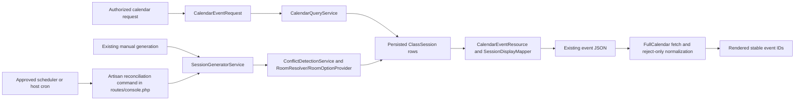

## Overview

This design extends only the approved existing scheduling owners and preserves the approved requirements, provenance boundaries, non-goals, compatibility constraints, stable IDs, legacy room strings, routes, HTTP methods, DTO/resource JSON shapes, and policy boundaries. It relies only on `.kiro/specs/scheduling-system-completion/requirements.md` and the approved inventory; no external research or unverified behavior is assumed.

The calendar remains a read-only persisted-`ClassSession` projection: `CalendarController` delegates validated feeds to `CalendarQueryService`, then `CalendarEventResource` and `SessionDisplayMapper` serialize the established event shape for `fullcalendar.js`. No calendar read generates, repairs, substitutes, or writes sessions. (Approved owners: `app/Http/Controllers/Admin/CalendarController.php`, `app/Services/CalendarQueryService.php`, `app/Http/Resources/CalendarEventResource.php`, `app/Services/SessionDisplayMapper.php`, `resources/js/calendar/fullcalendar.js`.)

The verified current missing-row cause remains upstream missing persistence: `SessionGeneratorService` has a manual eight-week invocation and no verified rolling reconciliation invoker. It is not a calendar-read defect. The owner has approved the rolling-reconciliation architecture: one Artisan reconciliation command is registered through the existing `routes/console.php` boundary and is executed by an explicitly approved scheduler or host cron. It delegates exclusively to `SessionGeneratorService`, preserves manual generation and `SessionPolicy::generate`, and introduces neither a parallel scheduler nor a recurrence engine. (Current evidence: `app/Services/SessionGeneratorService.php`, `app/Http/Controllers/Admin/ClassSessionController.php`, `routes/console.php`; owner decision: rolling reconciliation Option 1.)

## Architecture

The seven provenance boundaries are ordered and instrumented without compensation: (1) persisted `ClassSession` result, (2) `CalendarQueryService`/scopes-Eloquent result, (3) `CalendarEventResource` result, (4) endpoint JSON, (5) fetch payload, (6) FullCalendar normalized collection, and (7) rendered event identity. Each trace carries the inclusive range, six filters, count, ordered stable IDs, and an explicit rejection reason. (Approved owners: `app/Services/CalendarQueryService.php`, `app/Http/Resources/CalendarEventResource.php`, `resources/js/calendar/fullcalendar.js`; approved requirement: Requirement 1.)

A missing identifier at boundary 1 is upstream missing persistence. A persisted row removed at boundary 2 by a supplied inclusive date, teacher, student, instrument, room, or status predicate is intentional query exclusion, with its predicate and reason recorded. A relation-path fault at boundary 3 remains the existing explicit relation error, not a silent drop. Sending the selected day as both transport bounds is selected-day frontend range narrowing that produces upstream query exclusion and is distinct from normalization. A malformed event at boundary 6 is malformed reject-only normalization; it is recorded and never repaired. A count or ordered-ID difference after those cases is reported only at its first later boundary, as downstream disappearance or duplication. (Approved owners: `app/Http/Controllers/Admin/CalendarController.php`, `app/Http/Requests/Admin/CalendarEventRequest.php`, `app/Services/RelationPathResolver.php`, `resources/js/calendar/fullcalendar.js`.)

The existing named calendar GET routes, admin middleware, FullCalendar and Blade contracts, `CalendarEventData` keys, legacy room strings, stable session IDs, relation authority, and `SessionPolicy` abilities remain compatible. (Approved owners: `routes/web.php`, `resources/views/admin/calendar/index.blade.php`, `app/DTOs/CalendarEventData.php`, `app/Models/ClassSession.php`, `app/Policies/SessionPolicy.php`.)

## Components and Interfaces

- **Calendar feed:** `CalendarEventRequest` validates the six supported filters and maximum range; `CalendarQueryService` applies inclusive range plus canonical teacher/student/instrument relation scopes, legacy string-room matching, and enum status before materialization. `CalendarEventResource` and `SessionDisplayMapper` retain the established JSON shape; omitted supported filters impose no restriction. (Approved owners: `app/Http/Requests/Admin/CalendarEventRequest.php`, `app/Services/CalendarQueryService.php`, `app/Models/Concerns/ScopesForSessionFilters.php`, `app/Http/Resources/CalendarEventResource.php`, `app/Services/SessionDisplayMapper.php`.)
- **Frontend transport:** `calendar-app.js` remains the composition owner. `fullcalendar.js` passes FullCalendar's complete visible start/end range, serializes only supported filters, retains accepted events, and rejects malformed events with explicit trace data. (Approved owners: `resources/js/calendar/calendar-app.js`, `resources/js/calendar/fullcalendar.js`.)
- **Recurrence:** the existing manual generation flow and the owner-approved Artisan reconciliation command use the same `SessionGeneratorService` and one effective whole-day horizon (default 30; accepted configuration 1–365), never from a calendar read. The command is registered only through the existing `routes/console.php` boundary and executed only by the explicitly approved scheduler or host cron; it adds no scheduler or recurrence engine. Disabled schedules retain history and stop or roll back in-progress generation. (Approved owners: `app/Http/Controllers/Admin/ClassSessionController.php`, `routes/console.php`, `app/Services/SessionGeneratorService.php`, `app/Models/RecurringSchedule.php`.)
- **Conflict and room ownership:** `ConflictDetectionService` remains the only overlap algorithm and gains the approved status semantics: cancelled rows are non-blocking and completed rows remain blocking historical evidence. The owner-approved reversible compatibility mapping for Violin→`101`, Piano→`103`, Voice→`102`, Guitar→`102`, and Drums→`104` resides only inside the existing `RoomResolver`/`RoomOptionProvider` boundary. That boundary remains the sole room-selection owner for active compatible options, interval availability, numeric fallback, and exact legacy-string preservation; it does not assert that any current room record is compatible or available. Existing room CRUD and every manual-create, edit, generation, availability, and seeding caller remain on that boundary; no room engine, room domain, or parallel selection architecture is introduced. (Approved owners: `app/Services/ConflictDetectionService.php`, `app/Services/RoomResolver.php`, `app/Services/RoomOptionProvider.php`, `database/seeders/DemoSeeder.php`; approved requirement: Requirement 5.)
- **Availability boundary:** `ClassSessionController::store` delegates the existing POST route to `SessionCreateService::create` after `SessionCreateRequest` validation and the existing `create` policy check. `ClassSessionController::update` delegates the existing PUT/PATCH routes to `SessionEditService::update` after `SessionEditRequest` validation and the existing `update` policy check. Those two services are the sole server-owned `Availability_Result` computation boundary: the existing create/edit flows call it before their final mutation and lock-safe recheck. Pre-save presentation or transport beyond these existing form and mutation contracts is not evidenced and is not designed; no route, endpoint, DTO, adapter, or response contract is added. (Approved owners: `app/Http/Controllers/Admin/ClassSessionController.php`, `app/Http/Requests/Admin/SessionCreateRequest.php`, `app/Http/Requests/Admin/SessionEditRequest.php`, `app/Services/SessionCreateService.php`, `app/Services/SessionEditService.php`, `app/Policies/SessionPolicy.php`.)
- **Audit adapter:** the smallest compatible extension is a lifecycle-specific method, or equivalent bounded extension, at the existing `AuditRecordService`/`AuditRecord` boundary. Called within the caller's existing mutation transaction, it writes exactly one `AuditRecord` whose existing `metadata` JSON carries the approved lifecycle data: session identity, action, source surface, changed fields, and safe before/after values. The existing bulk-execution and rejected-operation methods, including their restrictive metadata whitelist, remain unchanged. This is not a new audit subsystem and proposes no audit-table migration. (Approved owners: `app/Services/AuditRecordService.php`, `app/Models/AuditRecord.php`, `database/migrations/2026_07_24_000001_create_audit_records_table.php`.)

## Data Models

`ClassSession` remains the sole persisted occurrence and public stable-ID owner; its enrollment-backed or direct relation path remains authoritative and is never mixed. Its `room` remains the legacy string contract, and existing `SessionStatusEnum` values remain the accepted status vocabulary. (Approved owners: `app/Models/ClassSession.php`, `app/Services/RelationPathResolver.php`, `app/Enums/SessionStatusEnum.php`.)

`RecurringSchedule` remains the weekly source with enrollment, weekday, start time, duration, room, and active state. The effective rolling horizon is a whole-day rule, defaulting to 30 absent a setting; setting storage and ownership are not evidenced and stay within approved existing ownership. (Approved owners: `app/Models/RecurringSchedule.php`, `app/Services/SessionGeneratorService.php`, `database/migrations/0001_01_01_000007b_create_recurring_schedules_table.php`.)

`Occurrence_Key` is the approved duplicate identity comprising schedule/scheduling identity, local date, and start time. It is an invariant for generation and `DemoSeeder` and preserves current session IDs and historical room strings. For the owner-approved MySQL 8 production architecture, generation begins a transaction, locks the existing `RecurringSchedule` row, then evaluates current conflict and room state and writes the final `ClassSession`. At the existing scheduling persistence boundary, additive database-enforced uniqueness protects the `Occurrence_Key`, and retry identity is persisted there so an identical retry returns its original outcome while changed input is rejected. The exact physical column or constraint representation is intentionally not invented by this design. No in-memory fallback, idempotency ledger, new persistence owner, parallel scheduler, recurrence engine, or duplicate business logic is introduced. The generation or mutation transaction applies any existing related counter and lifecycle audit atomically; any failure rolls back all writes. (Approved owners: `app/Services/SessionGeneratorService.php`, `app/Models/RecurringSchedule.php`, `app/Models/ClassSession.php`, `app/Services/SessionCreateService.php`, `app/Services/SessionEditService.php`, `app/Services/AuditRecordService.php`; owner decision: occurrence safety Option 1.)

### Owner-Approved Architecture Decisions

**Resolved — Room compatibility (Option 1):** A reversible mapping is implemented only within the existing `RoomResolver`/`RoomOptionProvider` boundary. It uses the approved Requirement 5 preference values—Violin→`101`, Piano→`103`, Voice→`102`, Guitar→`102`, Drums→`104`—then delegates compatibility, active-state, interval availability, and lowest-numeric fallback decisions to that same boundary. The design neither asserts unverified current room records nor adds a room engine, room domain, parallel architecture, or room-CRUD change. Legacy `ClassSession.room` strings remain exact persisted strings.

**Resolved — Rolling reconciliation (Option 1):** One Artisan reconciliation command is registered through the existing `routes/console.php` boundary. An explicitly approved scheduler or host cron executes that command; the command delegates exclusively to `SessionGeneratorService`. Existing manual generation and `SessionPolicy::generate` remain intact. This is not a second scheduler, recurrence engine, or generation path.

**Resolved — Occurrence safety (Option 1, MySQL 8 production):** The existing `RecurringSchedule` row lock is held within the generation transaction. Additive database-enforced uniqueness at the existing scheduling persistence boundary protects `Occurrence_Key`, and persisted retry identity at that boundary preserves idempotent retry behavior. The design deliberately specifies neither unapproved physical columns nor a new persistence owner, idempotency ledger, scheduler, recurrence engine, or duplicate business logic.

**DESIGN OPEN — Evidence-backed index strategy (non-blocking deferred evidence gate):** existing schema and index migrations establish date, enrollment, direct-identity, hardening, and reporting indexes, but no measurement or approved workload evidence selects an additive index for calendar, conflict, legacy-room, or occurrence dimensions. No index name, physical shape, or schema change is decided here. This gate is deferred evidence only and does not block task generation after design diagnostics pass. (Approved evidence: `database/migrations/0001_01_01_000008_create_class_sessions_table.php`, `database/migrations/2026_07_05_000000_decouple_class_sessions_from_enrollment.php`, `database/migrations/2026_06_28_191206_add_indexes_for_production_hardening.php`, `database/migrations/2026_06_28_200000_add_report_covering_indexes.php`.)

### Approved Inventory Dispositions

| Disposition | Approved existing file(s) | Concrete rationale |
|---|---|---|
| CHANGE | `app/Http/Controllers/Admin/CalendarController.php` | Retain the named read endpoints and add only approved projection tracing; never generate or repair during a read. |
| CHANGE | `app/Http/Requests/Admin/CalendarEventRequest.php` | Preserve compatible date validation and add only approved filter and range validation. |
| CHANGE | `app/Services/CalendarQueryService.php`; `app/Models/Concerns/ScopesForSessionFilters.php` | Apply all six pre-materialization filters through the existing query and canonical relation paths. |
| PRESERVE/ADAPTER | `app/Http/Resources/CalendarEventResource.php`; `app/Services/SessionDisplayMapper.php`; `app/DTOs/CalendarEventData.php` | Preserve the persisted-event JSON shape, stable IDs, and provenance; no synthetic event representation. |
| CHANGE | `resources/js/calendar/fullcalendar.js` | Correct visible-range transport and retain reject-only normalization. |
| PRESERVE/CHANGE | `resources/js/calendar/calendar-app.js`; `resources/views/admin/calendar/index.blade.php` | Preserve FullCalendar, RTL, focus, and current composition contracts while consuming only established data. |
| PRESERVE | `routes/web.php` | Preserve existing names, middleware, routes, and HTTP methods; no availability route is proposed. |
| CHANGE | `app/Services/SessionCreateService.php`; `app/Services/SessionEditService.php` | Keep the only server-owned availability computation, final recheck, atomic mutation, and audit integration in the existing create/edit services. |
| CHANGE | `app/Http/Controllers/Admin/ClassSessionController.php` | Preserve controller delegation, existing POST and PUT/PATCH session routes, and policy checks; make delete use the approved existing mutation boundary. |
| CHANGE | `app/Services/ConflictDetectionService.php` | Keep the single conflict owner and add the approved status-aware classification and structured details. |
| CHANGE | `app/Services/RoomResolver.php`; `app/Services/RoomOptionProvider.php` | Keep the single room owner for exact legacy-string preservation, active options, the owner-approved reversible Requirement 5 preference mapping, compatibility, availability, and numeric fallback; do not assert current room records or alter room CRUD. |
| PRESERVE/CHANGE | `app/Models/ClassSession.php`; `app/Models/RecurringSchedule.php`; `app/Enums/SessionStatusEnum.php` | Preserve identifiers, relation authority, active semantics, legacy rooms, and current status vocabulary; use the existing `RecurringSchedule`/`ClassSession` persistence boundary for owner-approved transactional locking, uniqueness, and retry identity without specifying physical columns here. |
| CHANGE | `app/Http/Requests/Admin/SessionCreateRequest.php`; `app/Http/Requests/Admin/SessionEditRequest.php` | Validate current create/edit inputs without changing established form contracts. |
| PRESERVE | `app/Policies/SessionPolicy.php` | Reuse current create, update, delete, view, and generate authorization abilities. |
| CHANGE | `app/Services/SessionGeneratorService.php` | Retain the sole generation owner for manual and reconciliation invocation, rolling horizon, MySQL 8 transaction/`RecurringSchedule` locking, recheck, additive database enforcement, and persisted retry identity. |
| CHANGE | `routes/console.php` | Register the owner-approved reconciliation Artisan command beside existing console commands; an explicitly approved scheduler or host cron executes it, and it delegates only to `SessionGeneratorService`. |
| INSPECT/PRESERVE | `database/migrations/0001_01_01_000007b_create_recurring_schedules_table.php` | Preserve the recurring schedule schema and its weekday, timing, room, active-state, and existing scheduling indexes; no migration is proposed by this design update. |
| INSPECT/PRESERVE | `database/migrations/0001_01_01_000008_create_class_sessions_table.php`; `database/migrations/2026_07_05_000000_decouple_class_sessions_from_enrollment.php` | Preserve historical `ClassSession` fields, legacy room strings, session IDs, enrollment/direct-relation compatibility, and existing indexes. The owner-approved additive occurrence enforcement is at this existing persistence boundary, but this design deliberately specifies no physical column or constraint shape. |
| INSPECT/PRESERVE | `database/migrations/2026_06_28_191206_add_indexes_for_production_hardening.php` | Preserve the existing hardening indexes, including `student_enrollments.teacher_id` and `class_sessions.enrollment_id`, and avoid duplicate indexes. |
| INSPECT/PRESERVE | `database/migrations/2026_06_28_200000_add_report_covering_indexes.php` | Preserve report covering indexes and use measured evidence before any additive index proposal. |
| ADAPTER | `app/Models/AuditRecord.php`; `app/Services/AuditRecordService.php` | Add only the bounded lifecycle writer at the existing audit boundary; bulk and rejected-operation behavior remains intact. |
| INSPECT/PRESERVE | `database/migrations/2026_07_24_000001_create_audit_records_table.php` | Preserve the existing `audit_records` metadata JSON schema that carries the lifecycle adapter data; no audit migration is proposed. |
| CHANGE | `database/seeders/DemoSeeder.php` | Produce approved persisted demo coverage through shared scheduling owners, without replacing unrelated fixtures. |
| PRESERVE | `database/seeders/TestDataSeeder.php` | Preserve its deterministic, idempotent test and E2E fixture contract, including stable natural keys, fixed dates, and the isolated E2E admin seeding entry point. |
| EXTEND | `tests/Feature/Admin/CalendarControllerTest.php` | Retain compatible route/resource behavior and add approved projection, filtering, range, and read-only assertions. |
| PRESERVE | `tests/js/properties/calendar-persisted-session-projection.property.test.js` | Preserve the established JavaScript property-test convention for calendar projection behavior. |

## Correctness Properties

*A property is a characteristic that holds across all valid executions: a machine-verifiable statement bridging the approved requirements and their implementation.* Property-based testing applies to projection comparisons, filter semantics, occurrence calculations, deterministic room selection, availability classification, and seeded-fixture calculations. It does not replace transaction, lock, authorization, browser, accessibility, or database-capability integration tests. (Approved owners: `app/Services/CalendarQueryService.php`, `app/Services/SessionGeneratorService.php`, `resources/js/calendar/fullcalendar.js`; approved requirements: Requirements 1–12.)

**Property reflection.** The projection membership, inclusive-range, canonical relation, legacy-room, status, omitted-filter, and query-exclusion candidates are consolidated into Property 1 because one ordered-query membership invariant subsumes them. Malformed rejection candidates are consolidated into Property 5. Default horizon, explicit schema/approval gates, individual status examples, and database/browser operations remain example, smoke, or integration tests rather than artificial properties. No remaining property implies another: each covers a distinct projection, transport, recurrence, idempotency, room, availability, relation, seed, or validation invariant.

### Property 1: Filtered persisted membership

For any valid inclusive range, supported six-filter combination, and persisted `ClassSession` collection, the ordered query IDs equal exactly the rows satisfying every supplied date, canonical identity, exact legacy-room, and enum-status predicate; omitting a filter adds no predicate, and every excluded row has its failing predicate recorded.

**Validates: Requirements 1.2, 2.1, 2.2, 2.3, 2.4, 2.5, 2.7, 2.9.** Evidence basis: `app/Services/CalendarQueryService.php`, `app/Models/Concerns/ScopesForSessionFilters.php`.

### Property 2: Read-only projection identity

For any valid feed request and persisted matching session, the stable session ID appears exactly once, with equivalent persisted date, local start, duration, status, relation display, and room metadata through each projection boundary; the read creates no `ClassSession` and no synthetic event.

**Validates: Requirements 1.7, 9.1, 9.2, 12.5.** Evidence basis: `app/Http/Resources/CalendarEventResource.php`, `app/Services/SessionDisplayMapper.php`, `app/Services/RelationPathResolver.php`.

### Property 3: Earliest provenance difference

For any seven-boundary trace with a count or ordered-ID difference, the reported differing boundary is the first boundary after its equal predecessor, contains range, six filters, count, IDs, and reason, and has no downstream compensation or invented upstream cause.

**Validates: Requirements 1.4, 1.5, 1.6.** Evidence basis: `tests/Feature/Admin/CalendarControllerTest.php`.

### Property 4: Visible-range transport preservation

For any FullCalendar visible start/end range and selected day, the endpoint request has the same inclusive start/end range and the selected day cannot narrow either bound.

**Validates: Requirements 2.8.** Evidence basis: `resources/js/calendar/fullcalendar.js`, `resources/js/calendar/calendar-app.js`.

### Property 5: Reject-only normalization

For any mixed endpoint payload, normalization retains every valid mapped persisted event with its original ID and rejects each malformed event with an explicit reason; it never creates, repairs, substitutes, or hides a valid persisted ID.

**Validates: Requirements 1.8, 2.10.** Evidence basis: `resources/js/calendar/fullcalendar.js`, `app/DTOs/CalendarEventData.php`.

### Property 6: Rolling-horizon coverage

For any active schedule and accepted whole-day horizon, reconciliation covers every eligible weekly occurrence in successive date blocks within the effective horizon, including month crossings; values outside 1–365 create no rows.

**Validates: Requirements 3.1, 3.3, 3.4.** Evidence basis: `app/Models/RecurringSchedule.php`, `app/Services/SessionGeneratorService.php`.

### Property 7: Idempotent occurrence identity

For any valid occurrence input and persisted retry identity at the existing scheduling persistence boundary, repeated identical generation returns the original successful outcome and commits at most one `ClassSession`; reusing that identity with changed input is rejected without changing scheduling rows, including under concurrent MySQL 8 attempts protected by the locked `RecurringSchedule` row and database-enforced `Occurrence_Key` uniqueness.

**Validates: Requirements 4.1, 4.2, 4.3, 4.5, 4.6, 4.7.** Evidence basis: `app/Services/SessionGeneratorService.php`, `app/Models/RecurringSchedule.php`, `app/Models/ClassSession.php`; owner decision: occurrence safety Option 1.

### Property 8: Failed recurrence decisions persist nothing

For any eligible occurrence whose locked evaluation finds a conflict or no compatible room, generation returns its controlled failure and persists neither `ClassSession` nor calendar event.

**Validates: Requirements 3.8, 5.4.** Evidence basis: `app/Services/SessionGeneratorService.php`, `app/Services/ConflictDetectionService.php`, `app/Services/RoomResolver.php`.

### Property 9: Deterministic room choice and legacy preservation

For any proposal for Violin, Piano, Voice, Guitar, or Drums, the sole room boundary maps its preferred room respectively to `101`, `103`, `102`, `102`, or `104`; when that preferred room is active, compatible, and available, selection returns it, otherwise any nonempty active compatible available candidate set returns its lowest numeric room value, while any carried legacy room string remains byte-for-byte the persisted string.

**Validates: Requirements 5.1, 5.2, 5.3, 5.4, 5.5.** Evidence basis: `app/Services/RoomResolver.php`, `app/Services/RoomOptionProvider.php`; owner decision: room compatibility Option 1.

### Property 10: Availability and status-aware blocking

For any authorized valid proposal, availability is exactly one of `AVAILABLE` or `CONFLICT`; when conflict exists it includes every applicable extant detail, an overlap with only cancelled rows is non-blocking, and an overlap with completed rows is blocking historical evidence.

**Validates: Requirements 6.1, 6.3, 6.4, 6.5.** Evidence basis: `app/Services/ConflictDetectionService.php`, `app/Enums/SessionStatusEnum.php`.

### Property 11: Edit equals fresh evaluation

For any conflict-relevant edit of a persisted session, its availability result equals a fresh evaluation of the proposed current state that excludes only that session from self-overlap.

**Validates: Requirements 6.2, 6.6.** Evidence basis: `app/Services/SessionEditService.php`, `app/Services/ConflictDetectionService.php`.

### Property 12: Deterministic demo fixture validity

For any nonzero ordered demo population, generated dates are Saturday–Thursday only, operating-day slots cover 09:00–21:00 adjacently, and exactly `floor(N/100)` deterministic every-100th positions are 60 minutes while all remaining positions are 30 minutes; zero population creates no session.

**Validates: Requirements 8.1, 8.2, 8.3, 8.4.** Evidence basis: `database/seeders/DemoSeeder.php`.

### Property 13: Repeat-safe demo seeding

For any successful demo fixture population, rerunning the same seed preserves manual rows and leaves the persisted `Occurrence_Key` set unchanged.

**Validates: Requirements 8.6, 8.9.** Evidence basis: `database/seeders/DemoSeeder.php`, `app/Models/ClassSession.php`.

### Property 14: Invalid range is read-only

For any requested calendar span exceeding the supported maximum, the feed returns compatible validation and preserves the complete persisted `ClassSession` set.

**Validates: Requirements 2.6, 9.7.** Evidence basis: `app/Http/Requests/Admin/CalendarEventRequest.php`.

## Error Handling

Malformed or unsupported feed filters, reversed or excessive ranges, invalid identities, invalid status, or invalid legacy-room filters return the existing compatible validation response and perform neither generation nor session writes. Existing relation-path failures remain explicit 409 responses with stable-ID diagnostics; unexpected calendar failures remain generic 500 responses without internal details. (Approved owners: `app/Http/Requests/Admin/CalendarEventRequest.php`, `app/Http/Controllers/Admin/CalendarController.php`, `app/Services/RelationPathResolver.php`.)

The frontend treats malformed event payloads as reject-only: it retains valid events, records the malformed rejection at the normalization boundary, and never synthesizes a replacement. The selected-day transport defect is corrected at request construction, not hidden by a frontend event constructor. (Approved owner: `resources/js/calendar/fullcalendar.js`.)

Mutation and generation failures—including disabled schedule, conflict, no room, validation, authorization, stale edit, audit, lock, persistence, or retry failure—return a controlled compatible non-success outcome after rolling back the relevant atomic transaction. Authorization failure exposes neither availability or conflict details nor protected scheduling identities. Availability remains within the existing form and mutation failure contracts; no separate presentation or transport envelope is designed. (Approved owners: `app/Services/SessionCreateService.php`, `app/Services/SessionEditService.php`, `app/Policies/SessionPolicy.php`, `app/Http/Controllers/Admin/ClassSessionController.php`.)

`DemoSeeder` reports success only after its complete intended batch commits; interruption or failure rolls back its run-created schedules and sessions while preserving pre-existing data. Its transaction work remains bounded by the existing seeder and shared scheduling owners, not a new seeding engine. (Approved owners: `database/seeders/DemoSeeder.php`, `app/Services/ConflictDetectionService.php`, `app/Services/RoomResolver.php`.)

## Testing Strategy

Retain and extend the existing calendar feature suite for compatible GET routes, event keys, direct/enrollment relation paths, inclusive ranges, read-only behavior, eager loading, relation errors, and generic errors. Add trace assertions for all seven provenance boundaries and separate cases for upstream missing persistence, intentional query exclusion, explicit relation error, selected-day range narrowing, and malformed reject-only normalization. (Approved owners: `tests/Feature/Admin/CalendarControllerTest.php`, `routes/web.php`, `app/DTOs/CalendarEventData.php`.)

Use example, integration, and smoke tests for authorization and secrecy, request validation, existing route/verb/resource compatibility, relation errors, transaction rollback, MySQL 8 `RecurringSchedule` lock and database-uniqueness behavior, persisted retry identity, reconciliation-command registration and delegation, explicitly approved scheduler/host-cron invocation, audit atomicity and immutability, cancelled/completed examples, performance/query-count baseline, and browser accessibility, RTL, and responsive behavior. Browser coverage includes keyboard/focus equivalence, semantic availability feedback, reduced motion, contrast/non-color cues, 44px targets, and 390/430/768/1024/1366/1600/1920 viewport fit gating. (Approved owners: `app/Policies/SessionPolicy.php`, `routes/console.php`, `app/Services/SessionGeneratorService.php`, `resources/js/calendar/calendar-app.js`, `resources/views/admin/calendar/index.blade.php`.)

Implement one property test for each numbered property above, with at least 100 iterations and the required comment tag `Feature: scheduling-system-completion, Property N: <property title>`. The existing pinned `fast-check` 4.3.0 in `package.json`, together with `tests/js/properties/calendar-persisted-session-projection.property.test.js`, establishes the project convention: `fc.assert` with 100 runs. Use generated valid and malformed payloads, date ranges, relation paths, proposal intervals, room candidate sets, recurrence horizons, and seed populations; database calls are mocked only for pure owner logic and covered separately by integration tests. No dependency is proposed. (Approved evidence: `package.json`, `tests/js/properties/calendar-persisted-session-projection.property.test.js`.)

**Readiness gate:** The owner has resolved the three architecture decisions: room compatibility, rolling reconciliation, and MySQL 8 occurrence safety. The Evidence-backed index strategy remains the sole non-blocking **DESIGN OPEN** and deferred evidence gate; no index is invented. Once this design document passes diagnostics, task generation is allowed. This update creates no tasks, requirements, code, migration, route, test, seeder, configuration, or dependency change, and retains current routes, HTTP methods, DTO/resource JSON shapes, policies, stable IDs, legacy room strings, direct/enrollment relation authority, and service ownership. (Approved requirements: Requirements 12 and 13.)
