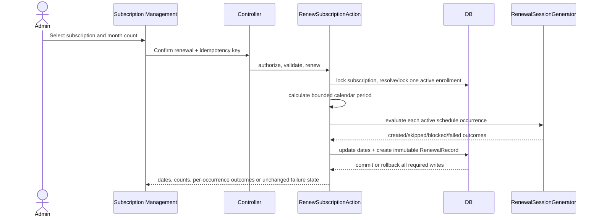

# Subscription Renewal — Technical Design

## Overview

This feature adds an administrator-controlled renewal workflow to the existing `student-subscription` MVP. A renewal extends the one existing active, non-deleted `StudentEnrollment` matched by the Subscription's `(student_id, teacher_id, instrument_id)` tuple, updates only the enrollment end date and Subscription renewal date, writes one immutable audit record, and evaluates the enrollment's active recurring schedules for the inclusive renewal period.

The design deliberately supersedes the MVP's reset-style renewal behavior. Renewal does **not** reset `sessions_used`, `sessions_allocated`, `monthly_fee`, `payment_status`, or `notes`; it does not create a new enrollment; and it does not mutate existing invoices, invoice payments, legacy payments, attendance, completed sessions, or report-source rows. Existing Calendar, Dashboard, and Bulk modules remain unchanged and continue consuming their existing contracts.

### Investigated baseline and constraints

- `Subscription` is unique by student, teacher, and instrument but has no enrollment foreign key.
- `StudentEnrollment` is soft-deletable, owns recurring schedules, enrollment-backed sessions, and invoices, and exposes the `active()` scope.
- `SessionGeneratorService` currently generates a fixed number of weekly occurrences from tomorrow, skips duplicate enrollment/date/time rows, and silently skips conflicts. Its existing eight-week API remains unchanged.
- `ClassSession` has two identity paths: renewal-generated sessions must use `enrollment_id` and `recurring_schedule_id`; manually created direct sessions remain untouched.
- Attendance, Student History, and teacher reports rely on enrollment-backed session relationships. This design preserves those relationships.
- No documented upper bound exists for a positive whole-month count. Validation therefore requires an integer `>= 1` and does not invent a maximum.

Repository evidence used for these decisions includes [`Subscription`](../../../app/Models/Subscription.php), [`StudentEnrollment`](../../../app/Models/StudentEnrollment.php), [`RecurringSchedule`](../../../app/Models/RecurringSchedule.php), [`ClassSession`](../../../app/Models/ClassSession.php), [`SessionGeneratorService`](../../../app/Services/SessionGeneratorService.php), [`ConflictDetectionService`](../../../app/Services/ConflictDetectionService.php), [`StudentHistoryService`](../../../app/Services/StudentHistoryService.php), [`AttendanceReportService`](../../../app/Services/Reports/AttendanceReportService.php), [`TeacherReportService`](../../../app/Services/Reports/TeacherReportService.php), and the existing [`student-subscription design`](../student-subscription/design.md).

### Renewal lifecycle



## Architecture

Use the existing modular-monolith layering: named route → thin controller → Form Request and Policy → renewal Action/Service → pure date calculator and bounded session-generation service → Eloquent models/migrations. No business logic is placed in Blade, and no invoice/payment service is called by renewal.

### Boundaries

1. **Subscription Management boundary** owns request validation, authorization, linked-enrollment resolution, date calculation, renewal audit, and renewal result presentation.
2. **Enrollment scheduling boundary** owns occurrence calculation, identity lookup, conflict detection, recoverable outcome capture, and creation of scheduled enrollment-backed sessions.
3. **Historical records boundary** is read-only during renewal. Existing `ClassSession`, `ClassAttendance`, `Invoice`, `InvoicePayment`, legacy `Payment`, report-source rows, and completed records are never updated, deleted, re-parented, or recreated.
4. **Protected module boundary** excludes Calendar rendering/API/resource/view changes, Dashboard controller/service/view changes, and Bulk routes/services/dependency semantics. Successful renewal only makes future sessions naturally visible to existing queries.

### Transaction and locking model

- Validate the month count and authorize the actor before opening the mutation transaction. Invalid input and unauthorized requests cannot create a RenewalRecord or alter persistent state.
- In one outer `DB::transaction`, lock the target Subscription with `lockForUpdate()`, then query matching `StudentEnrollment` rows with `where student_id/teacher_id/instrument_id`, `active()`, `whereNull(deleted_at)`, and `lockForUpdate()`.
- Require exactly one matching enrollment. Zero rows returns `NO_ENROLLMENT`; multiple rows returns `MULTIPLE_ENROLLMENTS` with the matching IDs. Both outcomes occur before any update or audit insert.
- The subscription lock serializes renewals for the same Subscription. The enrollment lock serializes occurrence creation for the same enrollment. Different subscriptions with different matching enrollments do not share these locks and can proceed in parallel.
- Calculate dates only from the locked, current rows. The transaction therefore observes the preceding committed renewal for repeated or concurrent renewal requests.
- Update the enrollment and Subscription, generate sessions, and insert the RenewalRecord in the same outer transaction. Any required-write exception is a persistent failure and aborts the outer transaction, restoring all changes.
- Each occurrence is evaluated in a nested transaction/savepoint. A recoverable generation failure is caught, its occurrence-level writes are rolled back to the pre-attempt state, and processing continues. A database/durability failure while writing a required row is rethrown so the outer transaction rolls back.
- Do not use a long-running lock around unrelated subscriptions. Do not use `migrate:fresh`, destructive cleanup, or historical-row rewriting to make renewal work.

### Date arithmetic

The application business timezone supplies the confirmation date and timestamp. The pure calculator receives an explicit confirmation date so tests do not depend on wall-clock time.

1. `start = max(confirmation_date, subscription.renewal_date when non-null, enrollment.ended_at + 1 day when non-null)`.
2. Advance one calendar month at a time. Each step retains the current day number when valid in the target month; otherwise it clamps to that target month's last day. This makes multi-month behavior deterministic, including end-of-month starts.
3. `end = advance_by_months(start, month_count) - 1 day`.
4. `next_renewal_date = end + 1 day`.
5. The renewal period is inclusive: `[start, end]`. Occurrences on either boundary are eligible.

For example, a start on January 31 advances to February 28 for one month; a subsequent month advance applies the same rule to the current date. The calculator returns value objects/immutable dates and never mutates the Eloquent date instances used as inputs.

### Idempotency strategy

There are two separate guarantees:

- **Occurrence idempotency:** `(enrollment_id, session_date, start_time)` is the canonical identity. Under the enrollment lock, renewal locks/queries that identity before creation. Existing rows are never changed and produce a `skipped` duplicate outcome. Add a non-unique composite index on these columns for bounded lookup and locking; do not add a unique constraint that could fail against preserved historical duplicates or affect nullable manual-session rows.
- **Request idempotency:** the confirmation form supplies a server-issued UUID idempotency key. `renewal_records.request_uuid` is unique. Retrying the same committed request returns the existing immutable RenewalRecord/result reference without a second extension. A new deliberate renewal uses a new key and creates a distinct RenewalRecord, even if its month count is the same.

## Components and Interfaces

### HTTP and authorization

- `SubscriptionController::renew(SubscriptionRenewalRequest $request, Subscription $subscription)` remains thin and delegates to the action. It returns the existing subscription-management redirect/view contract with a structured success or failure payload.
- Add named routes under `admin/subscriptions`, with the renewal mutation route named `admin.subscriptions.renew`. Keep the existing `auth` and admin middleware, and call a dedicated `renew` Policy ability rather than relying only on middleware.
- `SubscriptionRenewalRequest` validates `months` as a required integer `min:1` (rejecting missing, zero, negative, fractional, and non-numeric values), a UUID `request_uuid`, and an explicit confirmation date only if the UI submits one. The server normalizes the confirmation timestamp in the configured business timezone.
- `SubscriptionPolicy::renew(User $user, Subscription $subscription)` is the single authorization seam. Unauthenticated users fail middleware; authenticated users without the ability receive `UNAUTHORIZED` through the same application error mapping. No partial state is written before the check.

### Renewal application service

`RenewSubscriptionAction` is the orchestration boundary:

```text
RenewSubscriptionAction::execute(
    Subscription $subscription,
    int $months,
    CarbonImmutable $confirmedAt,
    string $requestUuid,
    User $actor
): RenewalResult
```

Responsibilities, in order:

1. Re-check authorization/validated invariants at the action boundary.
2. Acquire locks and resolve exactly one linked enrollment.
3. Return a prior result for a previously committed `request_uuid`.
4. Calculate the renewal dates with `RenewalPeriodCalculator`.
5. Load active schedules and delegate each bounded occurrence to `RenewalSessionGenerator`.
6. Update only `enrollment.ended_at` and `subscription.renewal_date`.
7. Create one immutable `RenewalRecord` containing the required snapshot and actor fields.
8. Return dates, counts, per-occurrence outcomes, and the audit identifier.

The action must not increment or reset subscription session usage, create invoices/payments, modify attendance, or call the manual-session path.

### Pure services and DTOs

- `RenewalPeriodCalculator`: pure date arithmetic; accepts immutable dates and a positive integer; returns `RenewalPeriodData { startDate, endDate, nextRenewalDate }`.
- `LinkedEnrollmentResolver`: locked exact-tuple lookup; returns one enrollment or a typed rejection containing `NO_ENROLLMENT` or `MULTIPLE_ENROLLMENTS` and matching IDs.
- `RenewalSessionGenerator`: bounded replacement/addition to the existing generator service. It accepts an enrollment, active schedule, inclusive period, and conflict detector, and returns `OccurrenceGenerationResult` entries rather than silently discarding reasons. The existing `generateForSchedule($schedule, 8)` behavior remains unchanged for current callers.
- `RenewalResult`: immutable DTO containing period dates, `created`, `skipped`, `blocked`, `failed` counts, per-occurrence outcome details, `renewal_record_id`, and whether the response came from an idempotent retry.
- `OccurrenceOutcome`: immutable DTO containing schedule ID, enrollment ID, date, start time, status (`created|skipped|blocked|failed`), reason code/message, and optional created session ID.

### Generation rules

For every active `RecurringSchedule` belonging to the locked enrollment, enumerate only dates whose weekday matches the schedule and that fall in the inclusive renewal period. The enumerator is lazy and advances one week at a time, so a large positive month count does not require an arbitrary validation cap or an in-memory date list. Load active schedules once, batch-load existing identity keys for the bounded date window where practical, and use the composite identity index for remaining checks. Conflict checks must use the existing eager-loaded enrollment path and indexed date/time predicates rather than introducing per-row relationship queries.

For each `(schedule, date, start_time)`:

1. Lock/check existing sessions by canonical identity. If present, do not modify it; return `skipped` with `DUPLICATE_SESSION_IDENTITY`.
2. Run teacher, room, and enrollment overlap checks using the existing conflict semantics. A conflict returns `blocked` with a stable reason and no write.
3. Create exactly one `Scheduled` `ClassSession` with `enrollment_id`, `recurring_schedule_id`, date, time, duration, and room. Keep direct `student_id`, `teacher_id`, and `instrument_id` unset as the existing recurring path does; the enrollment relationship remains canonical.
4. Catch only failures classified as recoverable before persistent state changes, return `failed`, and continue. Re-throw persistence/transaction failures to trigger outer rollback.

If there are no active schedules, the action still extends the enrollment and Subscription, creates the RenewalRecord, and returns zero for all occurrence counts.

### UI/result contract

Subscription Management offers a positive whole-month input and confirmation step. A successful response displays start date, end date, next renewal date, and created/skipped/blocked/failed counts, with detailed blocking/failure reasons. A rejection/failure displays its reason code/message and reloads the unchanged renewal state. No Calendar, Dashboard, Bulk, invoice, payment, or attendance UI is added as a renewal side effect.

## Data Models

### Existing models retained

- `Subscription`: retain all existing fields and casts. Add a non-mutating `renewalRecords(): HasMany` relationship; do not add `enrollment_id` because the approved link is the unique active exact-tuple resolution and the current schema has no canonical FK.
- `StudentEnrollment`: retain soft deletes, original `id`, tuple identifiers, `started_at`, and active status. Renewal changes only `ended_at` after identity/status/start-date invariants are verified.
- `RecurringSchedule`: unchanged schema and relation; only `active()` schedules for the resolved enrollment participate.
- `ClassSession`: existing rows and fields remain unchanged. Renewal creates only scheduled rows with both `enrollment_id` and `recurring_schedule_id`.
- `ClassAttendance`, `Invoice`, `InvoicePayment`, legacy `Payment`, and report consumers are read-only dependencies of this feature.

### New `renewal_records` table/model

Add an additive `RenewalRecord` model with `$fillable` restricted to creation fields and casts for dates/timestamps/integers. The table contains:

| Field | Type/constraint | Purpose |
|---|---|---|
| `id` | bigint primary | Immutable audit identity |
| `request_uuid` | UUID, unique | Safe retry/idempotency key |
| `subscription_id` | FK, indexed, restrict on delete | Renewed Subscription |
| `enrollment_id` | FK, indexed, restrict on delete | Same linked enrollment snapshot |
| `months` | unsigned integer | Positive whole-month count |
| `renewal_start_date` | date | Calculated start |
| `renewal_end_date` | date | Calculated end |
| `next_renewal_date` | date | Calculated next date |
| `confirmed_at` | timestamp with timezone-safe application serialization | Confirmation instant |
| `confirmed_by` | FK to users, indexed, restrict on delete | Confirming administrator |
| `created_at`, `updated_at` | timestamps | Audit persistence metadata |

The record is immutable: no update/delete route, no mass-assignment path after creation, policy denies mutation, and model events reject updates/deletes. Existing RenewalRecords remain untouched when a later request fails. The record stores the required request/result facts, not mutable copies of invoices, payments, attendance, or sessions.

### Indexes and identity support

Add a non-unique composite index on `class_sessions(enrollment_id, session_date, start_time)` to make identity checks and row locking bounded without imposing a uniqueness constraint on existing/manual nullable rows. Add indexes on `renewal_records(subscription_id, created_at)`, `renewal_records(enrollment_id, created_at)`, and the unique `request_uuid`.

No existing historical record is backfilled, deleted, re-parented, or rewritten. Foreign-key deletion behavior for the new audit rows is restrictive so an accidental parent deletion cannot silently erase renewal history; normal Subscription/enrollment deletion remains outside this feature.

## Correctness Properties

*A property is a characteristic or behavior that should hold true across all valid executions of a system—essentially, a formal statement about what the system should do. Properties serve as the bridge between human-readable specifications and machine-verifiable correctness guarantees.*

The feature has meaningful pure and stateful invariants over dates, enrollment identity, historical graphs, schedule occurrences, and transaction outcomes. Property-based testing therefore applies to the renewal service and bounded generator. UI rendering, database lock scheduling, and protected-module contracts are covered separately with example-based integration tests.

### Property 1: Duration and Same-Enrollment State Preservation

**For all** valid Subscription/enrollment states, confirmation dates, and Positive Whole-Month Counts, a successful renewal retains the same Linked Enrollment identifier, student/teacher/instrument identifiers, `started_at`, active status, Subscription allocation, usage, fee, payment status, and notes; sets the renewal start to the documented maximum; sets `ended_at` to the calculated Renewal End Date; and sets `renewal_date` to the calculated Next Renewal Date.

**Validates: Requirements 1.5, 1.6, 2.1, 2.4, 2.6, 2.7, 2.8**

### Property 2: Historical Preservation and Report Stability

**For all** valid renewal fixtures containing arbitrary invoices, invoice payments, legacy payments, attendance entries, completed ClassSessions, and report-source records, every pre-request historical row retains its identifier, relationships, and stored values after success or failure, and every report result for a range ending before the Confirmation Date remains equal before and after the operation.

**Validates: Requirements 3.1, 3.2, 3.3**

### Property 3: Complete Bounded Future Occurrence Evaluation

**For all** valid renewals with conflict-free active recurring schedules and no injected failures, the set of persisted renewal-created Session Identities equals the set of applicable schedule occurrences in the inclusive Renewal Period, unioned with the pre-existing identities; each newly eligible occurrence has exactly one scheduled ClassSession linked to the existing enrollment and source schedule, and every created session date lies within the period.

**Validates: Requirements 4.1, 4.3, 4.8**

### Property 4: Session Identity Idempotency

**For all** valid renewals with arbitrary pre-existing sessions and repeated requests, each `(enrollment_id, session_date, start_time)` identity has at most one renewal-created row; an existing identity is retained unchanged and reported as skipped/rejected duplicate creation; repeated evaluation creates no additional row or changes to the original row.

**Validates: Requirements 4.2, 5.4**

### Property 5: Sequential Renewal Composition and Audit Distinctness

**For all** valid Subscription states and two Positive Whole-Month Counts, applying two successful renewals in order retains one Linked Enrollment identifier, calculates the second start from the dates persisted by the first, produces two distinct immutable RenewalRecords, and produces a final Next Renewal Date equal to applying the documented month-by-month rules sequentially.

**Validates: Requirements 5.1, 5.2, 3.4, 3.6**

### Property 6: Rejection and Persistent-Write Atomicity

**For all** invalid Renewal Requests and all generated valid requests with an injected Persistent Write Failure at any required write boundary, the persisted Subscription, Linked Enrollment, Historical Record Set, RenewalRecord set, and ClassSession set equal the complete pre-request snapshot; invalid requests produce no RenewalRecord and use the applicable rejection code.

**Validates: Requirements 1.3, 2.5, 3.5, 4.6, 5.3, 5.5, 6.2**

### Property 7: Recoverable Per-Occurrence Failure Continuation

**For all** valid renewal fixtures and arbitrary subsets of eligible occurrences configured to raise a Recoverable Generation Failure, each failed occurrence retains its Pre-Attempt State and reports its failure reason, while every remaining occurrence is evaluated and each remaining eligible occurrence is persisted at most once.

**Validates: Requirements 4.4, 4.5**

## Error Handling

| Condition | Handling and state guarantee |
|---|---|
| Missing, zero, negative, fractional, or non-numeric `months` | Form Request/action rejects with `INVALID_MONTH_COUNT`; no transaction mutation and no audit row. |
| Guest, invalid actor, or failed `SubscriptionPolicy::renew` ability | Reject with `UNAUTHORIZED` before required writes; do not leak subscription/enrollment details to an unauthorized response. |
| Subscription not found or unavailable | Return the existing not-found response without starting a renewal mutation. |
| No exact active, non-deleted linked enrollment | Roll back/no-op and return `NO_ENROLLMENT`. |
| Multiple exact active, non-deleted linked enrollments | Roll back/no-op and return `MULTIPLE_ENROLLMENTS` plus all matching enrollment IDs for administrator resolution. |
| Invalid/missing confirming administrator at action boundary | Return `UNAUTHORIZED`; do not create a RenewalRecord or change dates. |
| Existing Session Identity | Do not create or update a ClassSession; record `skipped` with `DUPLICATE_SESSION_IDENTITY`. This satisfies the requirement to reject duplicate creation while preserving the existing row. |
| Teacher, room, or enrollment overlap | Do not create a row; record `blocked` with a stable conflict reason and occurrence coordinates. |
| Recoverable validation/business/availability/unexpected generation failure | Roll back only the occurrence savepoint, record `failed` with a safe reason, and continue with later occurrences. Do not include exception traces or sensitive data in the response. |
| Persistent failure updating Subscription/enrollment, inserting a session or RenewalRecord, or committing | Re-throw to the outer transaction; restore all request changes including newly created sessions and dates. Preserve all pre-existing audit/history rows. |
| Repeated request with an already committed `request_uuid` | Return the existing immutable result/audit reference; do not extend dates or create sessions a second time. |
| Concurrent same-subscription renewal | Row locks serialize the requests; the later transaction recalculates from the latest committed dates. A lock timeout/deadlock is treated as a persistent failure and returned as an unchanged-state retryable error. |
| No active recurring schedules | Complete date extension and audit insertion; report zero created, skipped, blocked, and failed occurrences. |

All user-facing messages are translated at the presentation boundary, while machine-readable reason codes remain stable for tests and clients. Validation uses Form Requests, authorization uses Policy/Gate, queries use Eloquent/query-builder bindings, and no raw SQL concatenation is introduced.

## Testing Strategy

### Test layers

1. **Pure unit tests** use fixed dates and a reference implementation for `RenewalPeriodCalculator`, including leap years, short months, month-end starts, one-month and multi-month counts, null candidates, and inclusive boundaries.
2. **Property-based tests** use Eris with PHPUnit 12. Each of P1–P7 is implemented by one property test with at least 100 generated applicable cases, `RefreshDatabase`/transaction isolation, factories for the complete historical graph, and deterministic random seeds captured in failure output. Eris shrinking reduces failures to a minimal state; the suite adapter emits one unified counterexample report containing Subscription state, linked enrollment state, count, confirmation date, schedule set, and seed.
3. **Feature tests** cover named route/controller/Form Request/policy behavior, rejection codes, response payloads, idempotency-key retries, no-schedule renewal, multiple-enrollment diagnostics, and immutable RenewalRecord access.
4. **Integration tests** run against the production MySQL engine for row-lock behavior, concurrent same-subscription serialization, concurrent different-subscription progress, transaction rollback, and composite identity lookup. SQLite `RefreshDatabase` remains appropriate for deterministic unit/property state tests but is not the authority for lock scheduling.
5. **Protected-module regression examples** run after a successful renewal: existing Calendar event feed/render contracts and eager-loading/resource fields, Dashboard response/report/render contracts, and Bulk authorization/dependency/audit contracts. These tests assert existing behavior and do not modify those modules.
6. **Smoke checks** verify P1–P7 are configured for at least 100 cases, property tests run in isolated persistent state, the idempotency key has a unique database constraint, and immutable RenewalRecord mutation paths are unavailable.

### Required property test tags

Each property test carries the exact design traceability comment:

```text
Feature: subscription-renewal, Property 1: Duration and Same-Enrollment State Preservation
```

The same format is used for Properties 2–7. P8 is intentionally not a property test: it is a deterministic integration regression suite for Calendar, Dashboard, and Bulk.

### Fixtures and snapshots

Factories/generators create valid and invalid month counts, business-timezone dates, active/inactive/soft-deleted enrollments, multiple schedules, existing duplicate identities, conflicts, invoices, invoice payments, legacy payments, attendance, completed sessions, and prior RenewalRecords. A normalized snapshot records table names, primary keys, foreign keys, and stored values before the operation. Assertions compare snapshots rather than model object identity so timestamps and casts are handled intentionally.

The generated session identity oracle is keyed by enrollment ID, ISO session date, and normalized start time. The expected occurrence set is generated independently from the service under test, preventing the property test from merely reproducing implementation logic. Recoverable failures are injected at occurrence scope; persistent failures are injected at each required-write boundary.

### Non-goals verified by tests

Tests must explicitly assert that renewal does not reset Subscription usage/payment fields, create or mutate invoices/payments, alter attendance, alter completed sessions, create a new enrollment, alter Calendar rendering, alter Dashboard rendering, or add Bulk endpoints/semantics. Existing manual direct-field session creation tests remain unchanged and continue to prove that renewal does not force enrollment linkage onto the manual path.
