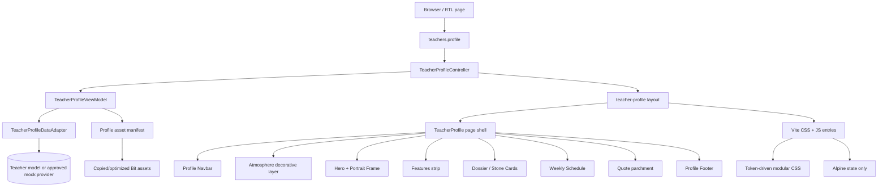
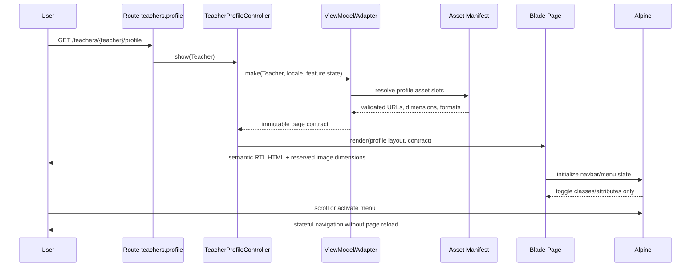
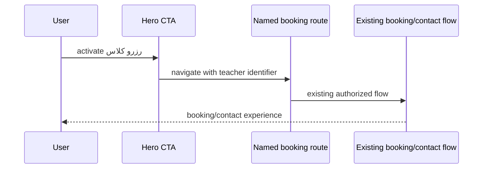

# Design Document: Teacher Profile Page

## Overview

این spec یک صفحه مستقل پروفایل استاد برای Laravel اصلی پروژه تعریف می‌کند که از تجربه بصری `bit.cloud/academy/apps/parsian-profile` به‌عنوان source design و source asset استفاده می‌کند، اما React را کپی نمی‌کند. خروجی با Blade، CSS modular موجود پروژه، Alpine.js فقط برای state و Vite ساخته می‌شود و در مسیر/namespace مستقل با صفحه فعلی `teachers.show` هم‌زیست خواهد بود.

صفحه از شش روایت بصری تشکیل می‌شود: navbar/atmosphere، hero سینمایی، نوار مهارت‌ها، dossier زندگی‌نامه و اطلاعات حرفه‌ای، برنامه هفتگی، quote parchment و footer. داده از Controller/ViewModel/DTO می‌آید؛ Blade فقط semantic structure و composition را رندر می‌کند. هیچ query یا business logic در Blade، inline style/JS، hardcoded color/radius/font یا artwork جدید مجاز نیست.

**Detail level:** High-Level Design + Low-Level Design  
**Notation:** Mathematical Pseudocode  
**Target stack:** Laravel, Blade, modular token-driven CSS, Alpine.js, Vite, RTL

## 2. Scope and Non-Goals

### In scope

- صفحه مستقل پروفایل استاد با mapping کامل اجزای Bit به Blade.
- استفاده امن از سه asset مرجع `hall-backdrop.png`, `maestro-portrait.png`, `parchment.png`.
- قرارداد داده برای teacher، features، biography، professional info، schedule، quote، navigation و footer.
- responsive behavior در 390، 430، 768، 1024، 1366، 1600 و 1920 پیکسل.
- Alpine state برای scroll-aware navbar و mobile menu؛ افکت‌های بصری با CSS.
- route/page جدا و feature flag/rollback برای rollout آزمایشی.
- validation بصری، accessibility، performance، security و coexistence.

### Out of scope

- تغییر `teacher-hero-visual-foundation` یا معماری Frozen Hero آن.
- تغییر route یا markup صفحه فعلی `teachers.show`.
- کپی React، React Router، CSS Modules syntax یا dependency جدید frontend.
- تولید artwork جدید، تغییر محتوای Bit بدون تصمیم محتوایی، migration schema بدون approval.
- ساخت `requirements.md` یا `tasks.md` در این مرحله.

## 3. Design Decisions and Boundaries

| Decision | Choice | Rationale |
|---|---|---|
| Page boundary | `teacher-profile-page` مستقل | جلوگیری از شکستن Frozen Hero و امکان مقایسه/rollback |
| Route | named `teachers.profile` | URL و contract مستقل از `teachers.show` |
| Layout owner | `teacher-profile/page-shell` | تنها wrapper مسئول page grid و stacking است |
| Data source | `TeacherProfileViewModel` + DTO/adapter | حذف query و mapping از Blade، سازگار با mock فعلی و DB آینده |
| State | Alpine `x-data` فقط برای `scrolled`, `menuOpen`, `activeSection` | عدم استفاده Alpine برای styling/business logic |
| Appearance | `resources/css/teacher-profile/*.css` | namespace مستقل، token-driven و قابل coexistence |
| Assets | manifest + canonical copied assets | تعویض asset بدون تغییر component و rollback ساده |
| Frozen hero | untouched | هر تغییر layout فعلی فقط در spec جدا و با تصمیم جدید مجاز است |

## Architecture



### Layer ownership

1. **Route layer:** فقط نام route، binding و optional feature gate.
2. **Controller layer:** دریافت `Teacher` و ساخت ViewModel؛ بدون محاسبه presentation در Blade.
3. **ViewModel/DTO layer:** normalize، validate، fallback و آماده‌سازی asset URLs؛ بدون query اضافی.
4. **Page shell:** ترتیب sectionها، `dir="rtl"` inheritance، landmarks و page-level Alpine scope.
5. **Leaf components:** فقط مسئول rendering داخلی خود؛ layout صفحه را کنترل نمی‌کنند.
6. **CSS:** تمام appearance، responsive layout، transitions، layers و reduced-motion.
7. **Alpine:** state و event binding؛ نه رنگ، class-driven business logic یا layout calculation.

### Coexistence with Frozen Hero

- `teachers.show` و همه selectorهای `teacher-*` فعلی unchanged می‌مانند.
- صفحه جدید زیر `teacher-profile-*` و `teacher-profile__*` namespace قرار می‌گیرد؛ selector عمومی `.hero`, `.page`, `.section`, `.row` استفاده نمی‌شود.
- assetهای صفحه جدید مسیر جدا دارند و manifest Frozen Hero را مصرف یا mutate نمی‌کنند.
- profile route از layout/page shell مستقل استفاده می‌کند؛ هیچ include از `teacher-hero-area`, `hero-left`, `hero-right` یا `#teacher-background-slot` ندارد.
- اگر reuse primitive عمومی لازم شد، فقط API آن primitive مصرف می‌شود؛ ownership و CSS Frozen Hero تغییر نمی‌کند.

## 5. Main Flow



### Booking CTA flow (initial page)



CTA مقصد باید named route باشد؛ در صورت نبود endpoint نهایی، ViewModel مقدار `null` و component آن را به لینک disabled-looking تبدیل نمی‌کند، بلکه action را به مسیر approved contact fallback می‌فرستد. دکمه fake بدون رفتار ممنوع است.

## Components and Interfaces

| Bit source | React responsibility | Blade target | Data/state contract |
|---|---|---|---|
| `parsian-profile.tsx` `TeacherProfile` | page composition، RTL، ordered sections | `resources/views/teachers/profile.blade.php` + `components/ui/teacher-profile/page-shell.blade.php` | `TeacherProfileViewModel`; no React router |
| `parsian-profile.tsx` `ParsianProfile` | route `/` | named Laravel route `teachers.profile` | route model binding/feature gate |
| `parts/atmosphere.tsx` | decorative fog/glow/dust/vignette | `ui/teacher-profile/atmosphere.blade.php` | `moteCount` token/config only; CSS deterministic, `aria-hidden` |
| `parts/navbar.tsx` | brand, nav links، scroll state، burger | `ui/teacher-profile/navbar.blade.php` | `menuOpen`, `scrolled`; Alpine state فقط |
| `sections/hero.tsx` | backdrop، identity، actions، portrait، badge | `ui/teacher-profile/hero.blade.php` | teacher identity, action URLs, experience |
| `parts/portrait-frame.tsx` | frame، photo، crest، rosettes، plate | `ui/teacher-profile/portrait-frame.blade.php` | portrait asset URL/alt/dimensions; decorative marks hidden |
| `parts/icons.tsx` | feature/contact icons | existing `ui.icon` variant or approved short icon component | key-to-icon map in ViewModel/config, not Blade business logic |
| `parts/ornaments.tsx` `SectionMark` | divider + eyebrow | `ui/teacher-profile/section-mark.blade.php` | label, decorative dividers |
| `parts/ornaments.tsx` `Crest`/`GoldDivider` | brand/divider SVG | reusable brand/divider primitive; no long inline SVG in Blade | named approved asset/short primitive |
| `parts/stone-card.tsx` | card shell/header | `ui/teacher-profile/stone-card.blade.php` and `stone-card-header.blade.php` | title/kicker/icon/slot |
| `sections/features.tsx` | four capability cards | `ui/teacher-profile/features.blade.php` + feature-item | `features[]` normalized list |
| `sections/dossier.tsx` | biography + credentials columns | `ui/teacher-profile/dossier.blade.php` | `biography[]`, `professionalInfo[]`, teacher signature |
| `sections/schedule.tsx` | weekly rows/status | `ui/teacher-profile/schedule.blade.php` | `schedule[]`, availability enum; mobile card layout CSS |
| `sections/quote.tsx` | semantic figure/blockquote/wax seal | `ui/teacher-profile/quote-card.blade.php` | quote text/author; parchment asset |
| `sections/footer.tsx` | brand/explore/contact/footer | `ui/teacher-profile/footer.blade.php` | footer navigation/contact contract |
| each `*.module.css` | component visual ownership | `resources/css/teacher-profile/*.css` | CSS custom properties from existing token layers |
| `content.ts` | static content source | approved provider/DTO fixture, not Blade | production source later may be Eloquent/config |

**Rule:** React filenames are reference mapping only. No `.tsx`, React import, React Router or CSS Module import enters Laravel implementation.

## 7. File and Entry-Point Plan

### Blade/view paths

- `resources/views/layouts/teacher-profile.blade.php` — dedicated document layout; reuses global head conventions without changing `layouts/public.blade.php` behavior.
- `resources/views/teachers/profile.blade.php` — page composition only; receives immutable `$profile` contract.
- `resources/views/components/ui/teacher-profile/page-shell.blade.php` — single page layout owner.
- `resources/views/components/ui/teacher-profile/atmosphere.blade.php`
- `resources/views/components/ui/teacher-profile/navbar.blade.php`
- `resources/views/components/ui/teacher-profile/hero.blade.php`
- `resources/views/components/ui/teacher-profile/portrait-frame.blade.php`
- `resources/views/components/ui/teacher-profile/section-mark.blade.php`
- `resources/views/components/ui/teacher-profile/stone-card.blade.php`
- `resources/views/components/ui/teacher-profile/stone-card-header.blade.php`
- `resources/views/components/ui/teacher-profile/features.blade.php`
- `resources/views/components/ui/teacher-profile/dossier.blade.php`
- `resources/views/components/ui/teacher-profile/schedule.blade.php`
- `resources/views/components/ui/teacher-profile/quote-card.blade.php`
- `resources/views/components/ui/teacher-profile/footer.blade.php`

Each component has a header comment containing responsibility, props, phase and slots. Blade uses semantic tags and `{{ }}` escaping. Complex mapping, key lookup and fallback stay in ViewModel.

### Backend paths

- `app/Http/Controllers/Teacher/TeacherProfileController.php` — thin `show` action.
- `app/View/Teacher/TeacherProfileViewModel.php` — immutable page contract builder.
- `app/DTOs/TeacherProfileData.php` — normalized typed data shape (or project-equivalent DTO convention).
- `app/Services/Teacher/TeacherProfileDataAdapter.php` — model/mock/source adapter; eager-loads all required relations once.
- `config/features.php` or existing feature config — `teacher_profile_page.enabled` and optional rollout mode.
- `config/teacher-profile.php` — asset manifest key, navigation fallback and content defaults if config convention permits.
- `routes/web.php` — one named route only; preserve existing `teachers.show` block.

### CSS paths

- `resources/css/teacher-profile.css` — page entry importing only profile modules.
- `resources/css/teacher-profile/tokens.css` — semantic aliases only; no duplicate primitive tokens.
- `resources/css/teacher-profile/page.css` — root, content owner and overflow boundary.
- `resources/css/teacher-profile/atmosphere.css`
- `resources/css/teacher-profile/navbar.css`
- `resources/css/teacher-profile/hero.css`
- `resources/css/teacher-profile/portrait-frame.css`
- `resources/css/teacher-profile/features.css`
- `resources/css/teacher-profile/dossier.css`
- `resources/css/teacher-profile/schedule.css`
- `resources/css/teacher-profile/quote.css`
- `resources/css/teacher-profile/footer.css`

All imports precede Tailwind directives in the profile entry. Classes use BEM-like `teacher-profile__...` naming and logical properties.

### JS/Vite paths

- `resources/js/teacher-profile.js` — registers page Alpine data/component and nothing else.
- Existing `resources/js/app.js` remains the global Alpine bootstrap and focus plugin owner unless implementation confirms a shared registration is required.
- `vite.config.js` adds the two profile entries only through the dedicated layout/page asset list; do not force profile CSS into every page unless bundle analysis proves it is acceptable.

## 8. Source Asset Inventory and Migration Strategy

### Source assets inspected

| Source | Role | Required treatment |
|---|---|---|
| `bit.cloud/.../assets/hall-backdrop.png` | Hero backdrop | copy as source, optimize to AVIF/WebP with PNG fallback, preserve focal crop metadata |
| `bit.cloud/.../assets/maestro-portrait.png` | Portrait photo | copy as source, optimize responsive variants, preserve semantic alt contract |
| `bit.cloud/.../assets/parchment.png` | Quote card texture | copy as source, optimize WebP/AVIF where supported, CSS background fallback |
| inline SVG in `portrait-frame.tsx` | crest/rosette/engraving | do not copy React; implement approved short primitive/assets or CSS/accessible decorative asset; `aria-hidden` |
| inline SVG in `ornaments.tsx`/`icons.tsx` | marks/icons | reuse existing icon/brand primitives where present; no long inline SVG in Blade |

### Canonical destination

Use a page-owned, versioned asset namespace, for example:

- source archive: `resources/assets/teacher-profile/parsian-profile/source/`
- optimized build inputs: `resources/assets/teacher-profile/parsian-profile/optimized/`
- manifest: `resources/assets/teacher-profile/parsian-profile/manifest.json`
- public/runtime path: `storage/app/public/ui/teacher-profile/parsian-profile/`

The exact repository convention may choose `public/images/teacher-profile/` instead, but the contract must expose only manifest URLs, never source filesystem paths. The existing Frozen Hero storage namespace `storage/app/public/ui/teacher/hero/...` must not be reused.

### Safe migration steps

1. Verify each source file checksum and record source path, dimensions, MIME and license/provenance in the manifest.
2. Copy, do not move, Bit files into the source archive; Bit remains reference-only/read-only.
3. Generate optimized derivatives using the project-approved image pipeline; never generate new artwork.
4. Keep an original fallback only when derivative conversion fails or browser compatibility requires it.
5. Assign stable logical slots: `backdrop`, `portrait`, `parchment`; ViewModel resolves URLs from manifest.
6. Store intrinsic width/height and responsive `sizes` values to prevent layout shift.
7. Validate that only approved extensions, local paths and expected checksums are exposed.
8. Publish a manifest version; a new asset set creates a new versioned directory, not an in-place destructive overwrite.
9. Remove an old version only after rollback window and cache invalidation checks complete.

### Asset loading policy

- Hero backdrop and portrait are above the fold: preload only the selected hero-critical derivative, with explicit dimensions and `fetchpriority="high"` for the portrait/backdrop as appropriate.
- Parchment, footer and below-fold decorative assets use lazy loading or CSS background loading after first paint.
- Use `srcset`/`sizes` for raster image elements; `object-fit`/`object-position` values are CSS tokens or manifest metadata.
- Decorative layers use `alt=""` or `aria-hidden="true"`; portrait uses a localized descriptive alt.

## Data Models

### ViewModel contract

```pascal
TYPE TeacherProfilePage = RECORD
  locale: String
  canonicalUrl: URL
  seo: SeoData
  teacher: TeacherIdentity
  hero: HeroData
  features: Sequence<FeatureItem>
  biography: Sequence<BiographyParagraph>
  professionalInfo: Sequence<ProfessionalRow>
  schedule: Sequence<ScheduleRow>
  quote: QuoteData
  navigation: NavigationData
  footer: FooterData
  assets: ProfileAssetManifest
END RECORD
```

### Normalized entities

```pascal
TYPE TeacherIdentity = RECORD
  id: Identifier
  slug: String
  name: String
  latinName: Optional<String>
  role: String
  tagline: Optional<String>
  experienceYears: NonNegativeInteger
  status: TeacherStatus
END RECORD

TYPE HeroData = RECORD
  eyebrow: String
  primaryAction: ActionLink
  secondaryAction: Optional<ActionLink>
  portraitAlt: String
END RECORD

TYPE FeatureItem = RECORD
  key: FeatureKey
  title: String
  description: String
  iconKey: IconKey
END RECORD

TYPE BiographyParagraph = RECORD
  id: Identifier
  title: Optional<String>
  body: SafePlainText
END RECORD

TYPE ProfessionalRow = RECORD
  label: String
  value: SafePlainText
  link: Optional<URL>
END RECORD

TYPE ScheduleRow = RECORD
  day: String
  topic: String
  time: String
  availability: Availability
  bookingUrl: Optional<URL>
END RECORD

TYPE QuoteData = RECORD
  text: SafePlainText
  author: String
END RECORD

TYPE ProfileAssetManifest = RECORD
  version: String
  backdrop: AssetSlot
  portrait: AssetSlot
  parchment: AssetSlot
END RECORD
```

`SafePlainText` یعنی متن escape‌شده در output و فاقد HTML خام؛ اگر rich text در آینده لازم شد باید sanitizer و contract جدا داشته باشد. `FeatureKey`, `TeacherStatus` و `Availability` enum/allow-list هستند؛ statusهای خارج از allow-list به fallback امن تبدیل می‌شوند.

### Source mapping

- Current mock `name` → `teacher.name`.
- `role` → `teacher.role`.
- `experience_years` یا parsed approved numeric value → `teacher.experienceYears`.
- `instruments`/`specialties` → feature/identity chips according to adapter rules.
- `biography`, `quote`, `quote_author` → corresponding normalized arrays/quote.
- `background_image`, `photo_image`, frame/asset manifest → `assets`; no raw path in Blade.
- Future Eloquent fields follow `19_CONTENT_MODEL.md`; absent optional fields render an approved empty state or omit an independent section, never an invalid placeholder.

## 10. Layering and Z-Index Contract

Use semantic aliases to the existing z-index scale; no raw numeric z-index in component CSS.

| Layer | Semantic token | Responsibility | Pointer events |
|---|---|---|---|
| page base | `--z-base` | page background | normal |
| hero backdrop | `--teacher-profile-z-backdrop` → base | image and dark overlays | none |
| atmosphere | `--teacher-profile-z-atmosphere` → decorative tier | fog/glow/dust/vignette | none |
| content | `--teacher-profile-z-content` → dropdown tier | sections and cards | normal |
| portrait decoration | `--teacher-profile-z-portrait` → sticky tier | frame, crest, badge | none unless semantic control |
| navigation | `--teacher-profile-z-navigation` → fixed tier | navbar and mobile drawer | normal |
| drawer/backdrop | existing modal aliases | menu overlay and focus trap | normal |

The profile token file may alias existing primitives but must not redefine global `--z-*` values. `isolation: isolate` belongs to page shell and portrait frame boundaries to prevent stacking-context leakage into Frozen Hero.

## 11. Responsive Behavior

| Viewport | Composition |
|---|---|
| 390 | single column; compact navbar with burger; centered hero text; portrait below/near identity according to available height; feature cards one column; schedule rows become cards; quote padding reduced |
| 430 | same mobile structure with larger portrait/text clamp and safe inline padding; no horizontal overflow |
| 768 | tablet two-column feature grid; dossier stacks if readability requires; hero may retain centered cinematic composition; schedule card rows preserve day/status separation |
| 1024 | laptop transition: hero two-column with bounded max width; dossier two columns; schedule row grid enabled if each cell remains readable |
| 1366 | full cinematic composition; content max width; four feature cards; portrait and badge remain within shell |
| 1600 | same composition with max-width, increased negative space via clamp; no stretching of assets |
| 1920 | bounded content and backdrop cover; no fixed-width growth beyond token max; footer/grid remains readable |

Rules:

- Mobile-first CSS, breakpoints aligned with project: `<768`, `768–1023`, `1024–1279`, `>=1280`.
- Use `clamp()` and existing spacing/type tokens; no raw color/radius/font values.
- Every image has intrinsic dimensions/max-width; no cumulative layout shift.
- Logical properties (`margin-inline`, `padding-block`, `inset-inline`) preserve RTL.
- Touch targets are at least the project minimum 44×44 token on mobile.
- Mobile menu is a real `nav`/dialog pattern, not a CSS-only visual toggle.

## 12. Alpine State Contract

```pascal
STATE TeacherProfileUi = RECORD
  scrolled: Boolean
  menuOpen: Boolean
  activeSection: Optional<String>
END RECORD

FUNCTION profileUi(): TeacherProfileUi
  PRECONDITION: browser environment is available only after Alpine initialization
  POSTCONDITION: scrolled = (scrollY > configuredThreshold)
  POSTCONDITION: menuOpen = false
  POSTCONDITION: no business data or CSS value is computed in state
END FUNCTION
```

- Navbar uses `x-data="profileUi()"`, passive scroll listener through component initialization, and cleanup on teardown.
- Burger uses a semantic button with `aria-expanded` and `aria-controls`.
- Drawer uses `role="dialog"`, `aria-modal="true"`, `x-trap`, Escape handling and focus return; `@alpinejs/focus` is already an approved dependency.
- Scroll state changes a semantic modifier class/attribute; CSS owns appearance.
- No inline `style`, no `x-bind:style`, no hardcoded color/layout in Alpine.

## 13. Mathematical Pseudocode: Rendering and Validation

```pascal
ALGORITHM BuildTeacherProfilePage(input)
INPUT: input containing teacher source, locale, route context, feature state
OUTPUT: page of type TeacherProfilePage OR ErrorPage

PRECONDITION: input.teacher exists
PRECONDITION: input.locale is supported
PRECONDITION: profile feature is enabled for the current request

source ← LoadTeacherOnce(input.teacher)
normalized ← NormalizeTeacher(source, input.locale)
assets ← ResolveAndValidateManifest(normalized.assetManifest)

IF normalized.status ≠ Active THEN
  RETURN ErrorPage(NotFoundOrUnavailable)
END IF

IF assets.isValid = false THEN
  RETURN ErrorPage(AssetConfigurationError)
END IF

page ← ComposeProfileContract(normalized, assets, input.routeContext)

ASSERT page.teacher.name ≠ Empty
ASSERT page.canonicalUrl is a named-route URL
ASSERT EveryInteractiveActionIsNamedRoute(page)
ASSERT EveryImageHasDimensions(page.assets)
ASSERT NoQueryIsEmbeddedInBladeContract(page)

RETURN page
END ALGORITHM
```

```pascal
ALGORITHM ResolveAndValidateManifest(manifest)
INPUT: manifest of type ProfileAssetManifest
OUTPUT: validated manifest or AssetConfigurationError

REQUIRED ← {backdrop, portrait, parchment}

FOR each slot IN REQUIRED DO
  ASSERT AllPreviouslyCheckedSlotsAreValid()
  IF slot.path is not local OR slot.mime is not allow-listed THEN
    RETURN AssetConfigurationError(slot)
  END IF
  IF slot.width ≤ 0 OR slot.height ≤ 0 THEN
    RETURN AssetConfigurationError(slot)
  END IF
  IF slot.checksum does not match recorded source THEN
    RETURN AssetConfigurationError(slot)
  END IF
END FOR

RETURN manifest
END ALGORITHM
```

```pascal
ALGORITHM NormalizeSchedule(rows)
INPUT: sequence of raw schedule rows
OUTPUT: sequence of ScheduleRow

result ← EmptySequence()
seenDays ← EmptySet()

FOR each raw IN rows DO
  ASSERT EveryPreviouslyNormalizedRowHasAllowedAvailability()
  IF raw.day = Empty OR raw.topic = Empty OR raw.time = Empty THEN
    CONTINUE
  END IF
  IF raw.day IN seenDays THEN
    RETURN ValidationError(DuplicateScheduleDay)
  END IF
  availability ← MapAvailability(raw.open, raw.status)
  Append(result, ScheduleRow(raw.day, raw.topic, raw.time, availability, SafeBookingUrl(raw)))
  Add(seenDays, raw.day)
END FOR

RETURN result
END ALGORITHM
```

## 14. Key Functions with Formal Specifications

### `TeacherProfileController.show`

```pascal
FUNCTION show(teacher: BoundTeacher, request: Request): HttpResponse
```

**Preconditions:** route binding resolves one teacher; feature gate is evaluated before rendering.  
**Postconditions:** returns profile view with one immutable ViewModel, or a named 404/redirect; never runs a relation query in Blade.  
**Loop invariant:** N/A.  
**Side effects:** read-only data access only.

### `TeacherProfileDataAdapter.make`

```pascal
FUNCTION make(teacher: BoundTeacher, locale: Locale): TeacherProfilePage
```

**Preconditions:** teacher is authorized for public display and required relations are eager-loaded.  
**Postconditions:** all fields satisfy allow-lists and nullability rules; asset URLs come only from validated manifest; optional sections are either complete or omitted.  
**Loop invariant:** every normalized collection item is escaped-safe and schema-valid.

### `renderPortraitFrame`

```pascal
FUNCTION renderPortraitFrame(asset: AssetSlot, alt: String): SemanticFigure
```

**Preconditions:** asset has validated URL, positive dimensions and non-empty descriptive alt.  
**Postconditions:** figure has stable dimensions, one meaningful image, decorative layers hidden from assistive technology, no layout shift.  
**Loop invariant:** N/A.

### `toggleMobileMenu`

```pascal
FUNCTION toggleMobileMenu(state: TeacherProfileUi): TeacherProfileUi
```

**Preconditions:** state belongs to the profile page Alpine scope.  
**Postconditions:** `menuOpen` is boolean inverse; `aria-expanded` and dialog visibility correspond; focus is trapped only while open.  
**Loop invariant:** no page data, style value or route is mutated.

### `renderSchedule`

```pascal
FUNCTION renderSchedule(rows: Sequence<ScheduleRow>, viewport: Viewport): SemanticSchedule
```

**Preconditions:** rows are normalized and availability is allow-listed.  
**Postconditions:** desktop rows expose day/topic/time/status; mobile exposes the same information as readable cards; status text and color are not the sole information channel.  
**Loop invariant:** all rendered rows preserve source order and unique day identity.

## 15. Example Usage (Mathematical Pseudocode)

```pascal
LET route = NamedRoute("teachers.profile", teacher.slug)
LET response = GET(route)

MATCH response WITH
  | ProfilePage(page) →
      ASSERT page.teacher.name ≠ Empty
      ASSERT page.assets.portrait.width > 0
      RenderBlade("teachers.profile", page)
  | NotFound(error) → RenderNamedError(error)
END MATCH
```

```pascal
LET ui = profileUi()
WHEN UserActivates("profile-menu-button") DO
  ui ← toggleMobileMenu(ui)
  ASSERT Attribute("aria-expanded") = ui.menuOpen
END WHEN
```

## 16. Accessibility

- صفحه یک `main`، یک `h1` برای نام استاد و heading hierarchy `h2`/`h3` دارد.
- `html` از layout با `lang="fa"` و `dir="rtl"` می‌آید؛ componentها direction را با flex hack عوض نمی‌کنند.
- nav links واقعی `<a>` با URL named route هستند؛ active item `aria-current="page"` دارد.
- burger دارای label فارسی، `aria-expanded` و `aria-controls` است؛ drawer دارای dialog semantics، ESC، focus trap و focus return است.
- decorative atmosphere، crest، rosette، engraving، divider و wax seal `aria-hidden="true"` هستند.
- portrait alt از teacher name/role ساخته می‌شود؛ backdrop/parchment decoration alt خالی دارد.
- focus-visible ring از token؛ `outline: none` بدون جایگزین ممنوع.
- contrast باید با automated axe و manual keyboard review در هر breakpoint بررسی شود.
- reduced motion همه bob/float/drift/cue/hover transformها را حذف یا به transition کمینه تبدیل می‌کند؛ اطلاعات بدون animation قابل دسترس می‌ماند.
- schedule status متن‌دار (`ظرفیت آزاد`/`تکمیل`) و نه فقط رنگ است.

## Error Handling

| Scenario | Boundary | Response | Recovery |
|---|---|---|---|
| Teacher not found/inactive | route/controller | named 404 or unavailable page; no partial profile | navigate to `teachers.index` |
| Missing optional tagline/quote | ViewModel | omit independent block or use approved neutral copy | page remains valid |
| Invalid asset manifest/checksum | adapter | fail closed for affected image; use approved local fallback/placeholder | log non-sensitive config error; rollback manifest version |
| Missing portrait | component contract | accessible placeholder with fixed dimensions and alt; never broken image icon | restore asset version |
| Empty schedule | ViewModel | empty-state message and booking CTA | user can contact academy |
| Booking destination absent | action contract | use named contact fallback | configure route before enabling CTA |
| Mobile menu state error | Alpine boundary | menu defaults closed; navigation remains keyboard accessible | reload does not corrupt server data |
| DB relation failure | controller/service | 5xx error handler without sensitive detail | inspect server logs; no N+1 retry loop |

No raw exception, filesystem path, secret or user PII is rendered. `{{ }}` is default output escaping.

## 18. Performance

- One controller read path with eager loading for teacher relations; no N+1 and no query in Blade.
- Cache immutable profile manifest and normalized public content with a versioned key; invalidate on approved content/asset publish.
- Vite builds/minifies profile CSS/JS; profile entries are loaded only by profile layout unless bundle analysis justifies global inclusion.
- Alpine bundle remains shared; profile JS only registers a small state component.
- Above-fold image dimensions/preload prevent CLS; below-fold images lazy load.
- Avoid random client-side particles: atmosphere must be deterministic CSS or server-provided bounded data, unlike the React `Math.random` implementation.
- Verify profile chunk sizes and Core Web Vitals; no blocking script in head.

## 19. Security and Privacy

- Use route model binding and public-display policy/scope; inactive/draft teachers are not exposed.
- Asset manifest accepts only local allow-listed paths and expected MIME/checksum; reject traversal and remote injection.
- All dynamic text is escaped; no unsanitized HTML contract.
- CTA URLs are generated by named routes and validated; no arbitrary URL from content source.
- No secrets in config/view/asset manifest; environment-only values remain outside page contract.
- If schedule/booking becomes a write flow, use Form Request, CSRF, authorization and rate limit in a separate change.

## Testing Strategy

### Static and build validation

- `npm run build` after CSS/Vite changes.
- `php artisan optimize:clear` after Blade/config/route changes.
- Laravel route list confirms `teachers.profile` and unchanged `teachers.show`.
- Blade/component lint and PHP static analysis according to repository tooling.
- Search gate: no React imports, `.tsx`, inline style/event handlers, raw hex/radius/font, query in Blade, `console.log`, `dd`, or unscoped generic selectors in profile files.

### Automated tests

- Controller/feature tests: named route, active/inactive behavior, DTO contract, no duplicate relation queries where query assertions are available.
- View tests: one h1, landmarks, escaped content, asset dimensions, action URLs, empty states.
- Alpine tests/smoke: menu toggle, Escape, focus trap, `aria-expanded`, scroll modifier.
- Accessibility: axe/Playwright keyboard pass, focus-visible and reduced-motion contexts.
- Property tests (library selected by repository test convention): for every valid normalized teacher contract, render has exactly one h1, every meaningful image has alt/dimensions, every action has named/local URL, and every schedule row has text status.

### Visual validation matrix

Capture and inspect at exactly: `390x844`, `430x932`, `768x1024`, `1024x768`, `1366x768`, `1600x900`, `1920x1080`. Check no horizontal overflow, hero focal crop, portrait frame, card stacking, schedule readability, footer wrapping, and coexistence route separately from current show page.

## 21. Rollout, Feature Flag and Rollback

### Recommended rollout

1. Add `teachers.profile` as a new named route behind `teacher_profile_page.enabled=false` by default.
2. Ship assets, ViewModel, isolated CSS/JS and tests without changing `teachers.show`.
3. Enable for an internal allow-list or explicit preview route, e.g. `teachers.profile.preview`, using the same page contract.
4. Compare visual/a11y/performance results at all required viewports.
5. Enable canonical route for selected teachers, then broaden rollout.

### Rollback

- Disable feature flag; existing `teachers.show` remains the fallback and is not modified.
- Repoint manifest version to the previous validated asset directory; do not delete current files during incident response.
- Revert only the profile route/layout bundle if necessary; no database rollback is required for this page-only change.
- Record any architecture decision in `17_DECISION_LOG.md`; never edit frozen hero files as an emergency shortcut.

## 22. Dependencies and Decisions Needed Before Implementation

- Existing Alpine and `@alpinejs/focus` are sufficient; no React dependency or new UI framework.
- Existing design tokens, semantic tokens, site z-index, public typography and Vite are the base; profile aliases may be added without duplicating primitives.
- Confirm the repository's preferred image optimizer and whether `storage:link` is already part of deployment.
- Confirm final booking/contact named route before enabling primary CTA.
- Confirm whether `Teacher` DB fields/relations can represent full Bit content; otherwise use an explicitly temporary adapter/fixture with a migration decision later.
- Confirm whether adding optional Vite entries to the public layout is preferred over a dedicated profile layout; dedicated layout is the default isolation recommendation.

## 23. Acceptance Summary for Requirements Derivation

The implementation is complete only when the independent profile route renders the full mapped page from a validated ViewModel, all Bit source assets are copied/optimized through a manifest without new artwork, all required responsive sizes and accessibility checks pass, profile selectors/assets do not affect Frozen Hero, and feature flag disablement returns users to the unchanged existing experience. No `requirements.md` or `tasks.md` is created in this design phase.

## Correctness Properties

برای هر contract معتبر `P` و هر viewport مجاز `W`، خواص زیر باید برقرار باشند:

### Property 1: Profile contract and route are independent

**Validates: Requirements 1.1, 1.2**

```pascal
PROPERTY P1_IndependentRoute
FOR ALL teacher IN ActiveTeachers:
  URL(teachers.profile, teacher) ≠ URL(teachers.show, teacher)
  AND Render(teachers.profile, teacher) does not mutate FrozenHeroFiles
END PROPERTY

PROPERTY P2_ContractCompleteness
FOR ALL page IN ValidTeacherProfilePages:
  page.teacher.name ≠ Empty
  AND page.assets.backdrop.isValidated = true
  AND page.assets.portrait.isValidated = true
  AND EveryRequiredSectionHasStableBoundary(page)
END PROPERTY

PROPERTY P3_SemanticHeading
FOR ALL page IN RenderedProfilePages:
  Count(page, h1) = 1
  AND EverySectionHeadingHasValidHierarchy(page)
END PROPERTY

PROPERTY P4_AssetSafety
FOR ALL asset IN RenderedAssets:
  asset.path ∈ LocalAllowListedPaths
  AND asset.mime ∈ ApprovedImageMimes
  AND asset.width > 0
  AND asset.height > 0
END PROPERTY

PROPERTY P5_ResponsiveContainment
FOR ALL W IN {390, 430, 768, 1024, 1366, 1600, 1920}:
  HorizontalOverflow(Render(page, W)) = false
  AND InteractiveTargetSize(page, W) ≥ MobileTargetMinimum WHEN W < 768
END PROPERTY

PROPERTY P6_AccessibleInteraction
FOR ALL interactiveElement IN ProfileInteractiveElements:
  KeyboardReachable(interactiveElement) = true
  AND HasVisibleFocus(interactiveElement) = true
  AND HasNamedActionOrControl(interactiveElement) = true
END PROPERTY

PROPERTY P7_ScheduleInformationPreservation
FOR ALL row IN ValidScheduleRows:
  MobileRender(row).day = row.day
  AND MobileRender(row).topic = row.topic
  AND MobileRender(row).time = row.time
  AND VisibleStatusText(MobileRender(row)) ≠ Empty
END PROPERTY

PROPERTY P8_ReducedMotion
FOR ALL page WITH prefersReducedMotion = true:
  DecorativeAnimation(page) = DisabledOrInstant
  AND ContentAvailability(page) = Normal
END PROPERTY

PROPERTY P9_NoBladeQuery
FOR ALL renderedBladeTemplate IN TeacherProfileTemplates:
  DatabaseQuery(renderedBladeTemplate) = None
  AND BusinessRule(renderedBladeTemplate) = None
END PROPERTY

PROPERTY P10_FlagRollback
FOR ALL request WITH teacher_profile_page.enabled = false:
  ResolveProfileExperience(request) = ExistingUnchangedExperienceOrNamedFallback
END PROPERTY
```

این خواص پایه acceptance criteria و تست‌های example/property/integration مرحله requirements خواهند بود؛ در این مرحله فقط به‌عنوان invariant طراحی ثبت شده‌اند.
